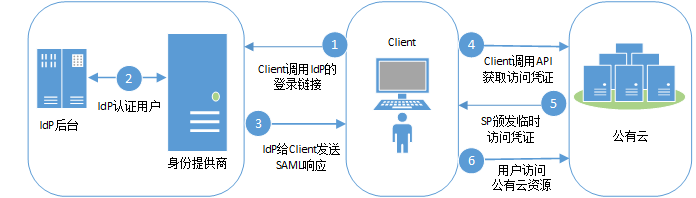
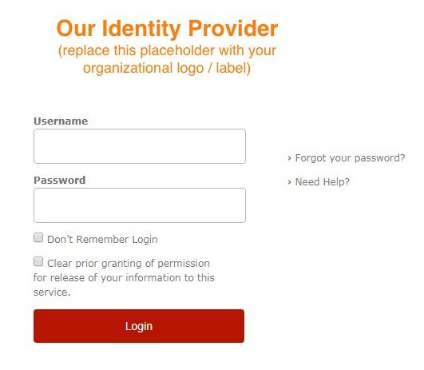
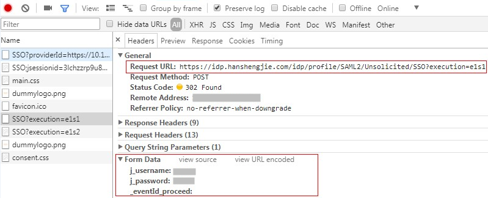
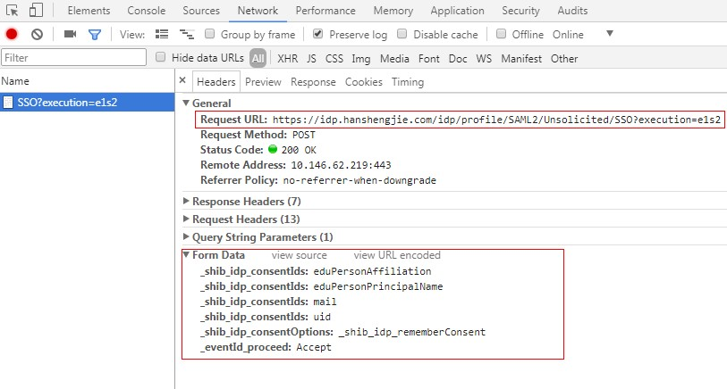

# IdP initiated方式<a name="iam_02_0002"></a>

本章以“Client4ShibbolethIdP”脚本为例，介绍IdP initiated方式获取联邦认证Token的方法。“Client4ShibbolethIdP”脚本模拟用户在浏览器上登录企业IdP系统，通过呈现浏览器提交的表单数据和客户端实现的对比，帮助用户开发本企业IdP系统的客户端脚本。

## 前提条件<a name="section48708258144634"></a>

-   企业IdP服务器支持IdP Initiated方式的联邦认证。
-   客户端需要安装python模块beautifulsoup4。

## 流程图<a name="section564187174136"></a>

IdP initiated联邦认证的流程如下图所示。

**图 1**  流程图（IdP initiated方式）<a name="fig563751422"></a>  


## 步骤说明<a name="section13188540101541"></a>

1.  Client调用IdP提供的基于IdP initiated方式的登录链接，并在登录链接中设置公有云的地址，即公有云Metadata文件中的“entityID”。
2.  Client获取IdP的登录页面，用户通过Client提交身份信息给IdP进行认证。
3.  用户认证成功后，IdP构建携带用户身份信息的断言发送SAML Response，请求经过中间媒介Client。
4.  Client对SAML Response进行重新封装后转发SAML Response，调用公有云提供的“通过IdP initiated方式获取联邦token”接口。
5.  公有云对断言进行校验和认证，并根据用户在身份提供商配置的身份转换规则生成临时访问凭证。
6.  用户根据分配的权限访问公有云资源。

## 客户端实现<a name="section27488823174127"></a>

“Client4ShibbolethIdP.py”脚本（仅供参考），实现本企业IdP到本系统的API/CLI侧联邦认证的脚本。

1.  配置企业IdP的登录连接。

    **表 1**  常用IdP产品的登录URL

    <a name="table22155984174553"></a>
    <table><thead align="left"><tr id="row47284103174553"><th class="cellrowborder" valign="top" width="23.18%" id="mcps1.2.4.1.1"><p id="p43264414174553"><a name="p43264414174553"></a><a name="p43264414174553"></a>IdP</p>
    </th>
    <th class="cellrowborder" valign="top" width="27.32%" id="mcps1.2.4.1.2"><p id="p14756651174553"><a name="p14756651174553"></a><a name="p14756651174553"></a>URL中标记SP的参数</p>
    </th>
    <th class="cellrowborder" valign="top" width="49.5%" id="mcps1.2.4.1.3"><p id="p54438101174553"><a name="p54438101174553"></a><a name="p54438101174553"></a>登录URL示例</p>
    </th>
    </tr>
    </thead>
    <tbody><tr id="row20180864174553"><td class="cellrowborder" valign="top" width="23.18%" headers="mcps1.2.4.1.1 "><p id="p24037279174553"><a name="p24037279174553"></a><a name="p24037279174553"></a>ADFS</p>
    </td>
    <td class="cellrowborder" valign="top" width="27.32%" headers="mcps1.2.4.1.2 "><p id="p29271455174744"><a name="p29271455174744"></a><a name="p29271455174744"></a>logintorp</p>
    </td>
    <td class="cellrowborder" valign="top" width="49.5%" headers="mcps1.2.4.1.3 "><p id="p2916699817486"><a name="p2916699817486"></a><a name="p2916699817486"></a>https://adfs-server.contoso.com/adfs/ls/IdpInitiatedSignon.aspx?logintorp=https://iam.example.com</p>
    </td>
    </tr>
    <tr id="row24861241174553"><td class="cellrowborder" valign="top" width="23.18%" headers="mcps1.2.4.1.1 "><p id="p494601174553"><a name="p494601174553"></a><a name="p494601174553"></a>Shibboleth</p>
    </td>
    <td class="cellrowborder" valign="top" width="27.32%" headers="mcps1.2.4.1.2 "><p id="p18864399174749"><a name="p18864399174749"></a><a name="p18864399174749"></a>providerId</p>
    </td>
    <td class="cellrowborder" valign="top" width="49.5%" headers="mcps1.2.4.1.3 "><p id="p52181416174814"><a name="p52181416174814"></a><a name="p52181416174814"></a>https://idp.example.org/idp/profile/SAML2/Unsolicited/SSO?providerId=iam.example.com</p>
    </td>
    </tr>
    <tr id="row13347950174553"><td class="cellrowborder" valign="top" width="23.18%" headers="mcps1.2.4.1.1 "><p id="p7442185174553"><a name="p7442185174553"></a><a name="p7442185174553"></a>SimpleSAMLphp</p>
    </td>
    <td class="cellrowborder" valign="top" width="27.32%" headers="mcps1.2.4.1.2 "><p id="p9906613174756"><a name="p9906613174756"></a><a name="p9906613174756"></a>spentityid</p>
    </td>
    <td class="cellrowborder" valign="top" width="49.5%" headers="mcps1.2.4.1.3 "><p id="p11716400174821"><a name="p11716400174821"></a><a name="p11716400174821"></a>https://idp.example.org/simplesaml/saml2/idp/SSOService.php?spentityid=iam.example.com</p>
    </td>
    </tr>
    </tbody>
    </table>

    配置完成后，在浏览器里输入登录URL，浏览器会呈现如下登录页面：

    **图 2**  登录页面<a name="fig18437552204714"></a>  
    

    Client4ShibbolethIdP脚本实现：

    ```
    import sys
    import requests
    import getpass
    import re
    from bs4 import BeautifulSoup
    from urlparse import urlparse
    
    # SSL certificate verification: Whether or not strict certificate
    # verification is done, False should only be used for dev/test
    sslverification = True
    
    # Get the federated credentials from the user
    print "Username:",
    username = raw_input()
    password = getpass.getpass()
    print ''
    
    session = requests.Session()
    
    # The initial url that starts the authentication process.
    idp_entry_url = 'https://idp.example.com/idp/profile/SAML2/Unsolicited/SSO?providerId=https://iam.example.com'
    
    # Programmatically get the SAML assertion,open the initial IdP url# and follows all of the HTTP302 redirects, and gets the resulting# login page
    formresponse = session.get(idp_entry_url, verify=sslverification)
    # Capture the idp_authform_submit_url,which is the final url after# all the 302s
    idp_authform_submit_url = formresponse.url
    ```


1.  客户端提交认证信息。客户端通过beautifulsoup4模块解析登录页面，捕获用户信息输入框、请求action，构造请求的参数，发起向IdP的身份认证。

    通过浏览器获取登录页面提交的所有表单数据。

    **图 3**  认证信息（1）<a name="fig1887664312288"></a>  
    

    Client4ShibbolethIdP脚本实现：

    ```
    # Parse the response and extract all the necessary values in order to build a dictionary of all of the form values the IdP expects
    formsoup = BeautifulSoup(formresponse.text.decode('utf8'), "lxml")
    payload = {}
    
    for inputtag in formsoup.find_all(re.compile('(INPUT|input)')):
        name = inputtag.get('name', '')
        value = inputtag.get('value', '')
        if "username" in name.lower():
            payload[name] = username
        elif "password" in name.lower():
            payload[name] = password
        else:
            payload[name] = value
    
    for inputtag in formsoup.find_all(re.compile('(FORM|form)')):
        action = inputtag.get('action')
        if action:
            parsedurl = urlparse(idp_entry_url)
            idp_authform_submit_url = parsedurl.scheme + "://" + parsedurl.netloc + action
    
    # please test on browser first, add other parameters in payload
    payload["_eventId_proceed"] = ""
    
    formresponse = session.post(
        idp_authform_submit_url, data=payload, verify=sslverification)
    ```

2.  客户端解析下一页（部分企业IdP会有展示用户属性的页面）。

    通过浏览器获取登录页面提交的所有表单数据。

    **图 4**  认证信息（2）<a name="fig179001019556"></a>  
    

    Client4ShibbolethIdP脚本实现：

    ```
    # In shebbleth IdP v3, browser will show attributes page for user,# so we need parse the page
    formsoup = BeautifulSoup(formresponse.text.decode('utf8'), "lxml")
    payload = {}
    
    # Add other form data required from browser to payload
    _shib_idp_consentIds = []
    for inputtag in formsoup.find_all(re.compile('input')):
        name = inputtag.get("name")
        value = inputtag.get("value")
        if name == "_shib_idp_consentIds":
            _shib_idp_consentIds.append(value)
    payload["_shib_idp_consentIds"] = _shib_idp_consentIds
    payload["_shib_idp_consentOptions"] = "_shib_idp_rememberConsent"
    payload["_eventId_proceed"] = "Accept"
    
    # user can get the action url from the html file
    nexturl = "https://idp.example.com/idp/profile/SAML2/Unsolicited/SSO?execution=e1s2"
    
    for inputtag in formsoup.find_all(re.compile('(FORM|form)')):
        action = inputtag.get('action')
        if action:
            parsedurl = urlparse(idp_entry_url)
            nexturl = parsedurl.scheme + "://" + parsedurl.netloc + action
    
    response = session.post(
        nexturl, data=payload, verify=sslverification)
    ```

3.  客户端解析IdP的响应。客户端提交用户信息给企业IdP系统认证，IdP认证用户信息成功后，发送响应给客户端，客户端解析出SAMLResponse参数。

    Client4ShibbolethIdP脚本实现：

    ```
    # Decode the response and extract the SAML assertion
    soup = BeautifulSoup(response.text.decode('utf8'), "lxml")
    SAMLResponse = ''
    
    # Look for the SAMLResponse attribute of the input tag
    for inputtag in soup.find_all('input'):
        if (inputtag.get('name') == 'SAMLResponse'):
            SAMLResponse = inputtag.get('value')
    
    # Better error handling is required for production use.
    if (SAMLResponse == ''):
        print 'Response did not contain a valid SAML assertion, please troubleshooting in Idp side.'
        sys.exit(0)
    ```

4.  获取Unscoped token。参考[获取联邦认证unscoped token\(IdP initiated\)](获取联邦认证unscoped-token(IdP-initiated).md)

    Client4ShibbolethIdP脚本实现：

    ```
    # Set headers
    headers = {}
    headers["X-Idp-Id"] = "test_local_idp"
    
    # IAM API url: get unscoped token on IDP initiated mode
    sp_unscoped_token_url = "https://iam.example.com/v3.0/OS-FEDERATION/tokens"
    
    # Set form data
    payload = {}
    payload["SAMLResponse"] = SAMLResponse
    response = session.post(
        sp_unscoped_token_url, data=payload, headers=headers, verify=sslverification)
    
    # Debug only
    print(response.text)
    print "Status Code: " + str(response.status_code)
    if response.status_code != 201:
        sys.exit(1)
    
    unscoped_token = response.headers.get("X-Subject-Token") if "X-Subject-Token" in response.headers.keys() else None
    if unscoped_token:
        print ">>>>>>X-Subject-Token: " + unscoped_token
    ```

5.  获取Scoped token。参考[获取联邦认证scoped token](获取联邦认证scoped-token.md)

    Client4ShibbolethIdP脚本实现：

    ```
    payload = {
        "auth": {
            "identity": {
                "methods": ["token"],
                "token": {
                    "id": unscoped_token
                }
            },
            "scope": {
                "project": {
                    "name": "{region_id}_test1"
                }
            }
        }
    }
    
    sp_scoped_token_url = "https://10.120.171.90:31943/v3/auth/tokens"
    
    response = session.post(
        sp_scoped_token_url, json=payload, verify=sslverification)
    
    # Debug only
    print "Status Code: " + str(response.status_code)
    if response.status_code != 201:
        print response.text
        sys.exit(1)
    
    scoped_token = response.text if response.status_code == 201 else None
    if scoped_token:
        print ">>>>>>Scoped Token:" + scoped_token
    ```

6.  获取临时访问密钥。参考[获取临时AK/SK和securitytoken](获取临时AK-SK和securitytoken.md)。

    Client4ShibbolethIdP脚本实现：

    ```
    # Set form data
    payload = {
        "auth": {
            "identity": {
                "methods": ["token"],
                "token": {
                    "duration-seconds": "900"
                }
            }
        }
    }
    
    # Set headers
    headers = {}
    headers["X-Auth-Token"] = unscoped_token
    
    sp_STS_token_url = "https://10.120.171.90:31943/v3.0/OS-CREDENTIAL/securitytokens"
    
    response = session.post(
        sp_STS_token_url, json=payload, headers=headers, verify=sslverification)
    
    # Debug only
    print "Status Code: " + str(response.status_code)
    if response.status_code != 201:
        print response.text
        sys.exit(1)
    
    sts_token = response.text if response.status_code == 201 else None
    if sts_token:
        print ">>>>>>STS Token:" + sts_token
    ```


