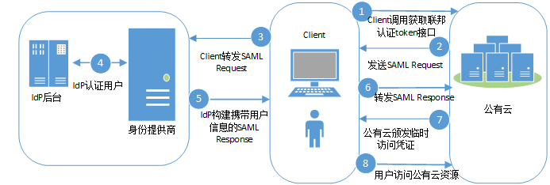

# SP initiated方式<a name="ZH-CN_TOPIC_0117430799"></a>

Openstack和Shibboleth是被广泛使用的一套开源联邦身份认证解决方案，提供了强大的单点登录能力，将用户连接到企业内外的各种应用服务。本章介绍通过Openstack Client和Shibbleth ECP Client获取联邦认证Token的方法。

## 流程图<a name="section59576151105219"></a>

SP initiated联邦认证的流程如下图所示。

**图 1**  流程图（SP initiated方式）<a name="fig28153389558"></a>  


## 步骤说明<a name="section27567425105336"></a>

1.  Client调用公有云系统提供的“通过SP initiated方式获取联邦token”接口。
2.  公有云系统根据URL中的用户及IdP信息查找Metadata文件，发送SAML Request，请求经过中间媒介Client。
3.  Client对SAML Request进行重新封装后转发SAML Request给IdP。
4.  用户输入用户名和密码完成身份认证。
5.  用户认证成功后，IdP构建携带用户身份信息的断言发送SAML Response，请求经过中间媒介Client。
6.  Client对SAML Response进行重新封装后转发SAML Response给公有云。
7.  公有云对断言进行校验和认证，并根据用户在身份提供商配置的身份转换规则生成临时访问凭证。
8.  用户根据分配的权限访问公有云资源。

## Openstack Client<a name="section4882433491913"></a>

统一命令行客户端工具的安装需要使用root权限，以下配置Openstack Client的操作只需要普通用户权限。

> **注意：**   
>接口调用操作应该在一个安全的网络环境中进行（在VPN或者在租户的云服务器中），如果在不安全的网络环境中，可能会收到中间人攻击。  

1.  使用文本编辑器创建环境变量文件，在文件中设置用户名、密码、区域、SAML协议版本、IAM地址和端口等信息。参数说明如[表1](#table2616118811159)所示。

    示例如下：

    **export OS\_IDENTITY\_API\_VERSION=3**

    **export OS\_AUTH\_TYPE=v3samlpassword**

    **export OS\_AUTH\_URL=https://iam.cn-north-1.myhwclouds.com:443/v3**

    **export OS\_IDENTITY\_PROVIDER=idpid**

    **export OS\_PROTOCOL=saml**

    **export OS\_IDENTITY\_PROVIDER\_URL=https://idp.example.com/idp/profile/SAML2/SOAP/ECP**

    **export OS\_USERNAME=username**

    **export OS\_PASSWORD=userpassword**

    **export OS\_DOMAIN\_NAME=example-domain-name**

    **表 1**  环境变量文件参数说明

    <a name="table2616118811159"></a>
    <table><thead align="left"><tr id="row964009311159"><th class="cellrowborder" valign="top" width="41.410000000000004%" id="mcps1.2.3.1.1"><p id="p2459196311159"><a name="p2459196311159"></a><a name="p2459196311159"></a>参数名称</p>
    </th>
    <th class="cellrowborder" valign="top" width="58.589999999999996%" id="mcps1.2.3.1.2"><p id="p3186528411159"><a name="p3186528411159"></a><a name="p3186528411159"></a>说明</p>
    </th>
    </tr>
    </thead>
    <tbody><tr id="row6315442511159"><td class="cellrowborder" valign="top" width="41.410000000000004%" headers="mcps1.2.3.1.1 "><p id="p6145384811159"><a name="p6145384811159"></a><a name="p6145384811159"></a>OS_IDENTITY_API_VERSION</p>
    </td>
    <td class="cellrowborder" valign="top" width="58.589999999999996%" headers="mcps1.2.3.1.2 "><p id="p141497811159"><a name="p141497811159"></a><a name="p141497811159"></a>认证接口版本，固定值为<span class="parmvalue" id="parmvalue1346523719320"><a name="parmvalue1346523719320"></a><a name="parmvalue1346523719320"></a>“3”</span>。</p>
    </td>
    </tr>
    <tr id="row4912462111159"><td class="cellrowborder" valign="top" width="41.410000000000004%" headers="mcps1.2.3.1.1 "><p id="p1770061211159"><a name="p1770061211159"></a><a name="p1770061211159"></a>OS_AUTH_TYPE</p>
    </td>
    <td class="cellrowborder" valign="top" width="58.589999999999996%" headers="mcps1.2.3.1.2 "><p id="p2195067811159"><a name="p2195067811159"></a><a name="p2195067811159"></a>认证类型，固定值为v3samlpassword。</p>
    </td>
    </tr>
    <tr id="row6006483511159"><td class="cellrowborder" valign="top" width="41.410000000000004%" headers="mcps1.2.3.1.1 "><p id="p3868335311159"><a name="p3868335311159"></a><a name="p3868335311159"></a>OS_AUTH_URL</p>
    </td>
    <td class="cellrowborder" valign="top" width="58.589999999999996%" headers="mcps1.2.3.1.2 "><p id="p5892303511159"><a name="p5892303511159"></a><a name="p5892303511159"></a>格式为“https://<em id="i2750327711159"><a name="i2750327711159"></a><a name="i2750327711159"></a>IAM</em><em id="i3624195911159"><a name="i3624195911159"></a><a name="i3624195911159"></a>地址</em>:<em id="i3948471511159"><a name="i3948471511159"></a><a name="i3948471511159"></a>端口号</em>/<em id="i947279811159"><a name="i947279811159"></a><a name="i947279811159"></a>接口版本</em>”。</p>
    <a name="ul6607261211159"></a><a name="ul6607261211159"></a><ul id="ul6607261211159"><li>端口号：固定值为<span class="parmvalue" id="parmvalue56593349324"><a name="parmvalue56593349324"></a><a name="parmvalue56593349324"></a>“443”</span>。</li><li>接口版本：固定值为<span class="parmvalue" id="parmvalue1856511407327"><a name="parmvalue1856511407327"></a><a name="parmvalue1856511407327"></a>“v3”</span>。</li></ul>
    </td>
    </tr>
    <tr id="row670881411159"><td class="cellrowborder" valign="top" width="41.410000000000004%" headers="mcps1.2.3.1.1 "><p id="p6258503011159"><a name="p6258503011159"></a><a name="p6258503011159"></a>OS_IDENTITY_PROVIDER</p>
    </td>
    <td class="cellrowborder" valign="top" width="58.589999999999996%" headers="mcps1.2.3.1.2 "><p id="zh-cn_topic_0117430799_p673860111159"><a name="zh-cn_topic_0117430799_p673860111159"></a><a name="zh-cn_topic_0117430799_p673860111159"></a>用户在本系统创建的身份提供商的名称。例如：Publiccloud-Shibboleth。</p>
    </td>
    </tr>
    <tr id="row5188181311159"><td class="cellrowborder" valign="top" width="41.410000000000004%" headers="mcps1.2.3.1.1 "><p id="p2864808511159"><a name="p2864808511159"></a><a name="p2864808511159"></a>OS_DOMAIN_NAME</p>
    </td>
    <td class="cellrowborder" valign="top" width="58.589999999999996%" headers="mcps1.2.3.1.2 "><p id="p191566411159"><a name="p191566411159"></a><a name="p191566411159"></a>待认证的租户名称。</p>
    </td>
    </tr>
    <tr id="row352821311159"><td class="cellrowborder" valign="top" width="41.410000000000004%" headers="mcps1.2.3.1.1 "><p id="p710320411159"><a name="p710320411159"></a><a name="p710320411159"></a>OS_PROTOCOL</p>
    </td>
    <td class="cellrowborder" valign="top" width="58.589999999999996%" headers="mcps1.2.3.1.2 "><p id="p331103911159"><a name="p331103911159"></a><a name="p331103911159"></a>SAML协议版本，固定值为<span class="parmvalue" id="parmvalue11193114433214"><a name="parmvalue11193114433214"></a><a name="parmvalue11193114433214"></a>“saml”</span>。</p>
    </td>
    </tr>
    <tr id="row4918301011159"><td class="cellrowborder" valign="top" width="41.410000000000004%" headers="mcps1.2.3.1.1 "><p id="p3501460111159"><a name="p3501460111159"></a><a name="p3501460111159"></a>OS_IDENTITY_PROVIDER_URL</p>
    </td>
    <td class="cellrowborder" valign="top" width="58.589999999999996%" headers="mcps1.2.3.1.2 "><p id="p5623476111318"><a name="p5623476111318"></a><a name="p5623476111318"></a>Identity Provider处理通过客户端代理机制（ECP）发起的认证请求的地址。</p>
    </td>
    </tr>
    <tr id="row5886868711159"><td class="cellrowborder" valign="top" width="41.410000000000004%" headers="mcps1.2.3.1.1 "><p id="p1132443811159"><a name="p1132443811159"></a><a name="p1132443811159"></a>OS_USERNAME</p>
    </td>
    <td class="cellrowborder" valign="top" width="58.589999999999996%" headers="mcps1.2.3.1.2 "><p id="p4587034311159"><a name="p4587034311159"></a><a name="p4587034311159"></a>用户在Identity Provide认证时使用的用户名。</p>
    </td>
    </tr>
    <tr id="row6598712211159"><td class="cellrowborder" valign="top" width="41.410000000000004%" headers="mcps1.2.3.1.1 "><p id="p2199843211159"><a name="p2199843211159"></a><a name="p2199843211159"></a>OS_PASSWORD</p>
    </td>
    <td class="cellrowborder" valign="top" width="58.589999999999996%" headers="mcps1.2.3.1.2 "><p id="p4795367211159"><a name="p4795367211159"></a><a name="p4795367211159"></a>用户在Identity Provide认证时使用的密码。</p>
    </td>
    </tr>
    </tbody>
    </table>

2.  执行如下命令，设置环境变量。

    **source keystonerc**

3.  执行如下命令，获取token。

    **openstack token issue**

    ```
    >>openstack token issue 
    command: token issue -> openstackclient.identity.v3.token.IssueToken (auth=True)
    Using auth plugin: v3samlpassword
    +-----------------------------------------------------------------------------------------------------------
    | Field   | Value
    | expires | 2018-04-16T03:46:51+0000                              
    | id      | MIIDbQYJKoZIhvcNAQcCoIIDXjCCA1oCAQExDTALBglghkgBZQMEAgEwggG7BgkqhkiG9w0BBwGgggGsBIIBqHsidG9rZW4iOnsiZXhwaXJlc19hdCI6IjIwMTgtMDQtMTZUMDM6NDY6NTEuMDA2MDAwWiIsIm1ldGhvZHMiOlsibWFwcGVkIl0sImlzc3VlZF9hdCI6IjIwMTgtMDQtMTVUMDM6NDY6NTEuMDA2MDAwWiIsInVzZXIiOnsiT1MtRkVERVJBVElPTiI6eyJpZGVudGl0eV9wcm92aWRlciI6eyJpZCI6ImlkcF9uZXRfaGFuc2hlbmdqaWVfY29tIn0sInByb3RvY29sIjp7ImlkIjoic2FtbCJ9LCJncm91cHMiOlt7Im5hbWUiOiJhZG1pbiIsImlkIjoiN2ZlOWU3OTNkYzNlNGE0NzllNDAxYzAyMDFjNzY1ZWEifV19LCJkb21haW4iOnsibmFtZSI6InRlc3RoYW5zaiIsImlkIjoiZTY1MDU2MzA2NThlNDk2NDk3ODQ3NTljZGYyNTFhZjQifSwibmFtZSI6IkZlZGVyYXRpb25Vc2VyIiwiaWQiOiI5QjdDSnk1TUUxNGYwZlFLaGI2SEpWUWRwOTlSUWxKRCJ9fX0xggGFMIIBgQIBATBcMFcxCzAJBgNVBAYTAlVTMQ4wDAYDVQQIDAVVbnNldDEOMAwGA1UEBwwFVW5zZXQxDjAMBgNVBAoMBVVuc2V0MRgwFgYDVQQDDA93d3cuZXhhbXBsZS5jb20CAQEwCwYJYIZIAWUDBAIBMA0GCSqGSIb3DQEBAQUABIIBAJZvoBTPG8Fpv3in4k320+odnd3Z5wTmoxcUXa2BGKyu1f1hwWIcwjpCNjRZrKiWyTkm-sicO7WW4Qp3A0HyIijAoeAnFlEOhBYwmBG+0pfVc2MCsSniyrLkw1f9jNYr14vVUwVnAZfhG8AQaRvkwnZHsq+dS0HHpmxlW7t3zIRCqJ1eO2MMm+lucLt5qIePezg+a1CxjwSA6xpgYIRcBNgqeL31MhRlHva48UN8GSq-PmJSpJx3Ozig+FeNJgOOdoPXXWaBdfX7xGxycgNlVTY1aLDc34cbrQQ7mkqX-NvpyUQEkwdtNKjvsJCfT-Lm65h9Jf8jdqoR7Q6SnEkpT5c=
    | user_id | 9B7CJy5ME14f0fQKhb6HJVQdp99RQlJD
    ```

    回显信息中id为获取到的联邦认证token


## Shibbleth ECP Client<a name="section4918283814425"></a>

1.  在Shibbleth IdP v3中配置metadata-providers.xml文件，并将metadata.xml文件放置在对应路径下。

    ```
    <MetadataProvider id="LocalMetadata1"xsi:type="FilesystemMetadataProvider" metadataFile="C:\Program Files (x86)\Shibboleth\IdP\metadata\web_metadata.xml"/>
    <MetadataProvider id="LocalMetadata2"xsi:type="FilesystemMetadataProvider" metadataFile="C:\Program Files (x86)\Shibboleth\IdP\metadata\api_metadata.xml"/>
    ```

    > **说明：**   
    >-   MetadataProvider id：下载的SP系统的元数据文件名称。  
    >-   metadataFile：SP的元数据文件在企业IdP系统中放置的路径。  

2.  在Shibbleth IdP v3中配置attribute-filter.xml文件。

    ```
    <afp:AttributeFilterPolicy id="example1">
        <afp:PolicyRequirementRule xsi:type="basic:AttributeRequesterString" value="https://auth.example.com/" />
        <afp:AttributeRule attributeID="eduPersonPrincipalName">
            <afp:PermitValueRule xsi:type="basic:ANY" />
        </afp:AttributeRule>
        <afp:AttributeRule attributeID="uid">
            <afp:PermitValueRule xsi:type="basic:ANY" />
        </afp:AttributeRule>
        <afp:AttributeRule attributeID="mail">
            <afp:PermitValueRule xsi:type="basic:ANY" />
        </afp:AttributeRule>
    </afp:AttributeFilterPolicy>
    
    <afp:AttributeFilterPolicy id="example2">
        <afp:PolicyRequirementRule xsi:type="basic:AttributeRequesterString" value="https://iam.{region_id}.example.com" />
        <afp:AttributeRule attributeID="eduPersonPrincipalName">
            <afp:PermitValueRule xsi:type="basic:ANY" />
        </afp:AttributeRule>
        <afp:AttributeRule attributeID="uid">
            <afp:PermitValueRule xsi:type="basic:ANY" />
        </afp:AttributeRule>
        <afp:AttributeRule attributeID="mail">
            <afp:PermitValueRule xsi:type="basic:ANY" />
        </afp:AttributeRule>
    </afp:AttributeFilterPolicy>
    ```

    > **说明：**   
    >AttributeFilterPolicy id：下载的SP系统元数据文件名称。  
    >value：SP系统元数据文件中的EntityID。  

3.  在ecp.py脚本中配置企业IdP系统的终端节点地址。

    ```
    # mapping from user friendly names or tags to IdP ECP enpoints
    IDP_ENDPOINTS = {
        "idp1": "https://idp.example.com/idp/profile/SAML2/SOAP/ECP"
    }
    ```

4.  执行ecp.py脚本获取联邦认证token。

    ```
    >>python ecp.py
    Usage: ecp.py [options] IdP_tag target_url login
    >>python ecp.py -d idp1 https://iam.{region_id}.example.com/v3/OS-FEDERATION/identity_providers/idp_example/protocols/saml/auth {username}
    X-Subject-Token: MIIDbQYJKoZIhvcNAQcCoIIDXjCCA1oCAQExDTALBglghkgBZQMEAgEwggG7BgkqhkiG9w0BBwGgggGsBIIBqHsidG9rZW4iOnsiZXhwaXJlc19hdCI6IjIwMTgtMDQtMTZUMDU6NDU6MjAuMjExMDAwWiIsIm1ldGhvZHMiOlsibWFwcGVkIl0sImlzc3VlZF9hdCI6IjIwMTgtMDQtMTVUMDU6NDU6MjAuMjExMDAwWiIsInVzZXIiOnsiT1MtRkVERVJBVElPTiI6eyJpZGVudGl0eV9wcm92aWRlciI6eyJpZCI6ImlkcF9uZXRfaGFuc2hlbmdqaWVfY29tIn0sInByb3RvY29sIjp7ImlkIjoic2FtbCJ9LCJncm91cHMiOlt7Im5hbWUiOiJhZG1pbiIsImlkIjoiN2ZlOWU3OTNkYzNlNGE0NzllNDAxYzAyMDFjNzY1ZWEifV19LCJkb21haW4iOnsibmFtZSI6InRlc3RoYW5zaiIsImlkIjoiZTY1MDU2MzA2NThlNDk2NDk3ODQ3NTljZGYyNTFhZjQifSwibmFtZSI6IkZlZGVyYXRpb25Vc2VyIiwiaWQiOiI5QjdDSnk1TUUxNGYwZlFLaGI2SEpWUWRwOTlSUWxKRCJ9fX0xggGFMIIBgQIBATBcMFcxCzAJBgNVBAYTAlVTMQ4wDAYDVQQIDAVVbnNldDEOMAwGA1UEBwwFVW5zZXQxDjAMBgNVBAoMBVVuc2V0MRgwFgYDVQQDDA93d3cuZXhhbXBsZS5jb20CAQEwCwYJYIZIAWUDBAIBMA0GCSqGSIb3DQEBAQUABIIBALtU9RzcFzm7OX6jjVsSsE8pAEE-qeXkefEPjdWsNSc89bCgPsE7O31EGxJql-uZEaa7uyFdiwU+TQjnS0N8G8B3WlZk0KOaUlaqcnarWWLguggzW2Y14gpbKEN67xnzV-UZKpHIltmN7pNQol1UaL3WsI1n9UcM5TAogcdBt+TTh-hRKTdd0Hep7mrKBkrhypD53iLtqPEd58F5rLbUv7MzDt6xXsEMpgbCfyhUdYpwKAooe8hJ9pIWnjH+Ji4Gk-iBeMIPCqOSeCr7rupY1-rps3f6s5JppFAetV0vMuWJqA+9l-HFJz6HuGYMV4xwvxRDf0gWzggoGgjhpPea70o=
    ```

    X-Subject-Token为获取到联邦认证token。


