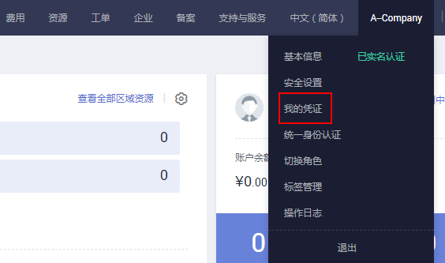
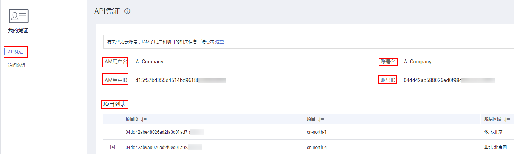
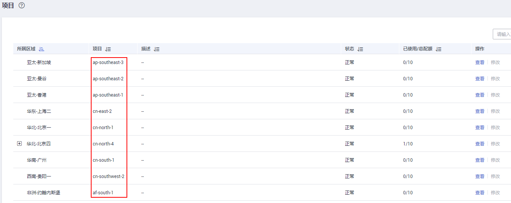

# 获取IAM用户、项目、用户组的名称和ID<a name="zh-cn_topic_0057845624"></a>

## 获取IAM用户、项目名称和ID<a name="section13960118204914"></a>

-   从控制台获取用户名、用户ID、项目名称、项目ID

    在调用接口时，部分URI以及请求体中需要填入项目编号，项目编号获取步骤如下：

    1.  在华为云首页右上角，点击“控制台”。
    2.  在右上角的用户名中选择“我的凭证“。

        

    3.  在“我的凭证”界面，API凭证页签中，查看用户名、用户ID、项目名称、项目ID。

        


-   调用API获取项目ID

    项目ID还用通过调用[查询指定条件下的项目信息](https://support.huaweicloud.com/api-iam/zh-cn_topic_0057845625.html)API获取。

    获取项目ID的接口为“GET https://\{Endpoint\}/v3/projects/”，其中\{Endpoint\}为IAM的终端节点，可以从[地区和终端节点](https://developer.huaweicloud.com/endpoint?IAM)获取。接口的认证鉴权请参见[认证鉴权](认证鉴权.md)。

    响应示例如下，其中projects下的“id”即为项目ID。

    ```
    { 
        "projects": [ 
            { 
                "domain_id": "65382450e8f64ac0870cd180d14e684b", 
                "is_domain": false, 
                "parent_id": "65382450e8f64ac0870cd180d14e684b", 
                "name": "cn-north-4", 
                "description": "", 
                "links": { 
                    "next": null, 
                    "previous": null, 
                    "self": "https://www.example.com/v3/projects/a4a5d4098fb4474fa22cd05f897d6b99" 
                }, 
                "id": "a4a5d4098fb4474fa22cd05f897xxxx", 
                "enabled": true 
            } 
        ], 
        "links": { 
            "next": null, 
            "previous": null, 
            "self": "https://www.example.com/v3/projects" 
        } 
    }
    ```


## 获取用户组名称和ID<a name="section79181350155213"></a>

1.  登录华为云，进入IAM控制台，选择“用户组”页签。
2.  单击需要查询的用户组前的下拉框，即可查询用户组名称、用户组ID。

## 获取区域ID<a name="section14125113011553"></a>

1.  登录华为云，进入IAM控制台，选择“项目”页签。
2.  “项目”列的内容即为所属区域对应的ID。

    


