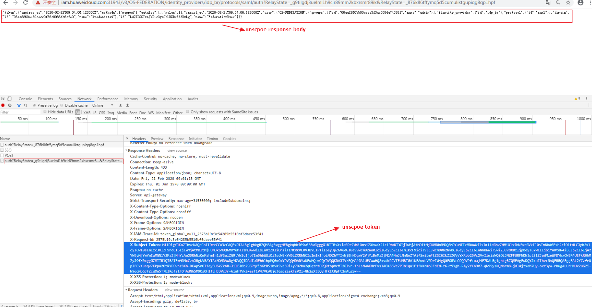

# 获取联邦认证unscoped token\(SP initiated\)<a name="iam_13_0602"></a>

## 功能介绍<a name="zh-cn_topic_0224276699_section10446123518509"></a>

该接口可以用于通过SP initiated的联邦认证方式获取unscoped token。

Unscoped token不能用来鉴权，若联邦用户需要使用token进行鉴权，请参考[获取联邦认证scoped token](获取联邦认证scoped-token.md)获取scoped token。

该接口可以使用全局区域的Endpoint和其他区域的Endpoint调用。IAM的Endpoint请参见：[地区和终端节点](https://developer.huaweicloud.com/endpoint?IAM)。

> **说明：** 
>-   该接口支持通过页面单点认证 （WebSSO）和增强客户端代理（ECP）两种方式获取token。通过不同的请求header区分，具体使用请参考Request Header参数说明。
>-   不建议直接调用该接口，请使用openstackclient获取token。
>-   该接口需要通过浏览器跳转。

## URI<a name="zh-cn_topic_0224276699_section8453835195015"></a>

GET /v3/OS-FEDERATION/identity\_providers/\{idp\_id\}/protocols/\{protocol\_id\}/auth

**表 1**  路径参数

<a name="zh-cn_topic_0224276699_table3455113565010"></a>
<table><thead align="left"><tr id="zh-cn_topic_0224276699_row2454335105011"><th class="cellrowborder" valign="top" width="20%" id="mcps1.2.5.1.1"><p id="zh-cn_topic_0224276699_p18455133555020"><a name="zh-cn_topic_0224276699_p18455133555020"></a><a name="zh-cn_topic_0224276699_p18455133555020"></a>参数</p>
</th>
<th class="cellrowborder" valign="top" width="10%" id="mcps1.2.5.1.2"><p id="zh-cn_topic_0224276699_p9456153517500"><a name="zh-cn_topic_0224276699_p9456153517500"></a><a name="zh-cn_topic_0224276699_p9456153517500"></a>是否必选</p>
</th>
<th class="cellrowborder" valign="top" width="20%" id="mcps1.2.5.1.3"><p id="zh-cn_topic_0224276699_p20456235105016"><a name="zh-cn_topic_0224276699_p20456235105016"></a><a name="zh-cn_topic_0224276699_p20456235105016"></a>参数类型</p>
</th>
<th class="cellrowborder" valign="top" width="50%" id="mcps1.2.5.1.4"><p id="zh-cn_topic_0224276699_p1645713353504"><a name="zh-cn_topic_0224276699_p1645713353504"></a><a name="zh-cn_topic_0224276699_p1645713353504"></a>描述</p>
</th>
</tr>
</thead>
<tbody><tr id="zh-cn_topic_0224276699_row1145423517500"><td class="cellrowborder" valign="top" width="20%" headers="mcps1.2.5.1.1 "><p id="zh-cn_topic_0224276699_p10458143514501"><a name="zh-cn_topic_0224276699_p10458143514501"></a><a name="zh-cn_topic_0224276699_p10458143514501"></a>idp_id</p>
</td>
<td class="cellrowborder" valign="top" width="10%" headers="mcps1.2.5.1.2 "><p id="zh-cn_topic_0224276699_p445818351509"><a name="zh-cn_topic_0224276699_p445818351509"></a><a name="zh-cn_topic_0224276699_p445818351509"></a>是</p>
</td>
<td class="cellrowborder" valign="top" width="20%" headers="mcps1.2.5.1.3 "><p id="zh-cn_topic_0224276699_p154598358502"><a name="zh-cn_topic_0224276699_p154598358502"></a><a name="zh-cn_topic_0224276699_p154598358502"></a>String</p>
</td>
<td class="cellrowborder" valign="top" width="50%" headers="mcps1.2.5.1.4 "><p id="zh-cn_topic_0224276699_p84591035175017"><a name="zh-cn_topic_0224276699_p84591035175017"></a><a name="zh-cn_topic_0224276699_p84591035175017"></a>身份提供商的ID。</p>
</td>
</tr>
<tr id="zh-cn_topic_0224276699_row2454143585018"><td class="cellrowborder" valign="top" width="20%" headers="mcps1.2.5.1.1 "><p id="zh-cn_topic_0224276699_p7460173514509"><a name="zh-cn_topic_0224276699_p7460173514509"></a><a name="zh-cn_topic_0224276699_p7460173514509"></a>protocol_id</p>
</td>
<td class="cellrowborder" valign="top" width="10%" headers="mcps1.2.5.1.2 "><p id="zh-cn_topic_0224276699_p19461143555015"><a name="zh-cn_topic_0224276699_p19461143555015"></a><a name="zh-cn_topic_0224276699_p19461143555015"></a>是</p>
</td>
<td class="cellrowborder" valign="top" width="20%" headers="mcps1.2.5.1.3 "><p id="zh-cn_topic_0224276699_p20462103519506"><a name="zh-cn_topic_0224276699_p20462103519506"></a><a name="zh-cn_topic_0224276699_p20462103519506"></a>String</p>
</td>
<td class="cellrowborder" valign="top" width="50%" headers="mcps1.2.5.1.4 "><p id="zh-cn_topic_0224276699_p1546283525018"><a name="zh-cn_topic_0224276699_p1546283525018"></a><a name="zh-cn_topic_0224276699_p1546283525018"></a>协议ID。</p>
</td>
</tr>
</tbody>
</table>

## 请求参数<a name="zh-cn_topic_0224276699_section114631935135011"></a>

**表 2**  请求Header参数

<a name="zh-cn_topic_0224276699_HeaderParameter"></a>
<table><thead align="left"><tr id="zh-cn_topic_0224276699_row204641359506"><th class="cellrowborder" valign="top" width="20%" id="mcps1.2.5.1.1"><p id="zh-cn_topic_0224276699_p17465183510507"><a name="zh-cn_topic_0224276699_p17465183510507"></a><a name="zh-cn_topic_0224276699_p17465183510507"></a>参数</p>
</th>
<th class="cellrowborder" valign="top" width="20%" id="mcps1.2.5.1.2"><p id="zh-cn_topic_0224276699_p194651356502"><a name="zh-cn_topic_0224276699_p194651356502"></a><a name="zh-cn_topic_0224276699_p194651356502"></a>是否必选</p>
</th>
<th class="cellrowborder" valign="top" width="10%" id="mcps1.2.5.1.3"><p id="zh-cn_topic_0224276699_p44667353504"><a name="zh-cn_topic_0224276699_p44667353504"></a><a name="zh-cn_topic_0224276699_p44667353504"></a>参数类型</p>
</th>
<th class="cellrowborder" valign="top" width="50%" id="mcps1.2.5.1.4"><p id="zh-cn_topic_0224276699_p046717357504"><a name="zh-cn_topic_0224276699_p046717357504"></a><a name="zh-cn_topic_0224276699_p046717357504"></a>描述</p>
</th>
</tr>
</thead>
<tbody><tr id="zh-cn_topic_0224276699_row13464123585014"><td class="cellrowborder" valign="top" width="20%" headers="mcps1.2.5.1.1 "><p id="zh-cn_topic_0224276699_p16467193510504"><a name="zh-cn_topic_0224276699_p16467193510504"></a><a name="zh-cn_topic_0224276699_p16467193510504"></a>Accept</p>
</td>
<td class="cellrowborder" valign="top" width="20%" headers="mcps1.2.5.1.2 "><p id="zh-cn_topic_0224276699_p144681135155012"><a name="zh-cn_topic_0224276699_p144681135155012"></a><a name="zh-cn_topic_0224276699_p144681135155012"></a>否</p>
</td>
<td class="cellrowborder" valign="top" width="10%" headers="mcps1.2.5.1.3 "><p id="zh-cn_topic_0224276699_p146812352507"><a name="zh-cn_topic_0224276699_p146812352507"></a><a name="zh-cn_topic_0224276699_p146812352507"></a>String</p>
</td>
<td class="cellrowborder" valign="top" width="50%" headers="mcps1.2.5.1.4 "><a name="zh-cn_topic_0224276699_ul6469133565018"></a><a name="zh-cn_topic_0224276699_ul6469133565018"></a><ul id="zh-cn_topic_0224276699_ul6469133565018"><li>通过页面单点认证 （WebSSO）方式获取token时，不需要该参数。</li><li>通过增强客户端代理（ECP）方式获取token时，该字段需取值如下：application/vnd.paos+xml</li></ul>
</td>
</tr>
<tr id="zh-cn_topic_0224276699_row154648356503"><td class="cellrowborder" valign="top" width="20%" headers="mcps1.2.5.1.1 "><p id="zh-cn_topic_0224276699_p1247013514508"><a name="zh-cn_topic_0224276699_p1247013514508"></a><a name="zh-cn_topic_0224276699_p1247013514508"></a>PAOS</p>
</td>
<td class="cellrowborder" valign="top" width="20%" headers="mcps1.2.5.1.2 "><p id="zh-cn_topic_0224276699_p1947118350500"><a name="zh-cn_topic_0224276699_p1947118350500"></a><a name="zh-cn_topic_0224276699_p1947118350500"></a>否</p>
</td>
<td class="cellrowborder" valign="top" width="10%" headers="mcps1.2.5.1.3 "><p id="zh-cn_topic_0224276699_p20471103595014"><a name="zh-cn_topic_0224276699_p20471103595014"></a><a name="zh-cn_topic_0224276699_p20471103595014"></a>String</p>
</td>
<td class="cellrowborder" valign="top" width="50%" headers="mcps1.2.5.1.4 "><a name="zh-cn_topic_0224276699_ul1347233565016"></a><a name="zh-cn_topic_0224276699_ul1347233565016"></a><ul id="zh-cn_topic_0224276699_ul1347233565016"><li>通过页面单点认证 （WebSSO）方式获取token时，不需要该参数。</li><li>增强客户端代理（ECP）获取token时，该字段需取值如下：urn:oasis:names:tc:SAML:2.0:profiles:SSO:ecp</li></ul>
</td>
</tr>
</tbody>
</table>

## 响应参数<a name="zh-cn_topic_0224276699_section0474153512504"></a>

**表 3**  响应Header参数

<a name="zh-cn_topic_0224276699_ResponseHeaderParameter"></a>
<table><thead align="left"><tr id="zh-cn_topic_0224276699_row1548118457515"><th class="cellrowborder" valign="top" width="30%" id="mcps1.2.4.1.1"><p id="zh-cn_topic_0224276699_p8481164515117"><a name="zh-cn_topic_0224276699_p8481164515117"></a><a name="zh-cn_topic_0224276699_p8481164515117"></a>参数</p>
</th>
<th class="cellrowborder" valign="top" width="20%" id="mcps1.2.4.1.2"><p id="zh-cn_topic_0224276699_p124817454511"><a name="zh-cn_topic_0224276699_p124817454511"></a><a name="zh-cn_topic_0224276699_p124817454511"></a>参数类型</p>
</th>
<th class="cellrowborder" valign="top" width="50%" id="mcps1.2.4.1.3"><p id="zh-cn_topic_0224276699_p14482194515516"><a name="zh-cn_topic_0224276699_p14482194515516"></a><a name="zh-cn_topic_0224276699_p14482194515516"></a>描述</p>
</th>
</tr>
</thead>
<tbody><tr id="zh-cn_topic_0224276699_row12481194519515"><td class="cellrowborder" valign="top" width="30%" headers="mcps1.2.4.1.1 "><p id="zh-cn_topic_0224276699_p448294565111"><a name="zh-cn_topic_0224276699_p448294565111"></a><a name="zh-cn_topic_0224276699_p448294565111"></a>X-Subject-Token</p>
</td>
<td class="cellrowborder" valign="top" width="20%" headers="mcps1.2.4.1.2 "><p id="zh-cn_topic_0224276699_p948214514515"><a name="zh-cn_topic_0224276699_p948214514515"></a><a name="zh-cn_topic_0224276699_p948214514515"></a>string</p>
</td>
<td class="cellrowborder" valign="top" width="50%" headers="mcps1.2.4.1.3 "><p id="zh-cn_topic_0224276699_p84820457512"><a name="zh-cn_topic_0224276699_p84820457512"></a><a name="zh-cn_topic_0224276699_p84820457512"></a>签名后的unscoped token。</p>
</td>
</tr>
</tbody>
</table>

**表 4**  响应Body参数

<a name="zh-cn_topic_0224276699_responseParameter"></a>
<table><thead align="left"><tr id="zh-cn_topic_0224276699_row148318453517"><th class="cellrowborder" valign="top" width="20%" id="mcps1.2.4.1.1"><p id="zh-cn_topic_0224276699_p148354517513"><a name="zh-cn_topic_0224276699_p148354517513"></a><a name="zh-cn_topic_0224276699_p148354517513"></a>参数</p>
</th>
<th class="cellrowborder" valign="top" width="20%" id="mcps1.2.4.1.2"><p id="zh-cn_topic_0224276699_p94831453516"><a name="zh-cn_topic_0224276699_p94831453516"></a><a name="zh-cn_topic_0224276699_p94831453516"></a>参数类型</p>
</th>
<th class="cellrowborder" valign="top" width="60%" id="mcps1.2.4.1.3"><p id="zh-cn_topic_0224276699_p448314535119"><a name="zh-cn_topic_0224276699_p448314535119"></a><a name="zh-cn_topic_0224276699_p448314535119"></a>描述</p>
</th>
</tr>
</thead>
<tbody><tr id="zh-cn_topic_0224276699_row1848304519519"><td class="cellrowborder" valign="top" width="20%" headers="mcps1.2.4.1.1 "><p id="zh-cn_topic_0224276699_p1648424515119"><a name="zh-cn_topic_0224276699_p1648424515119"></a><a name="zh-cn_topic_0224276699_p1648424515119"></a><a href="#zh-cn_topic_0224276699_response_Rs1363Token">token</a></p>
</td>
<td class="cellrowborder" valign="top" width="20%" headers="mcps1.2.4.1.2 "><p id="zh-cn_topic_0224276699_p8484174517515"><a name="zh-cn_topic_0224276699_p8484174517515"></a><a name="zh-cn_topic_0224276699_p8484174517515"></a>Object</p>
</td>
<td class="cellrowborder" valign="top" width="60%" headers="mcps1.2.4.1.3 "><p id="zh-cn_topic_0224276699_p8484154535111"><a name="zh-cn_topic_0224276699_p8484154535111"></a><a name="zh-cn_topic_0224276699_p8484154535111"></a>联邦认证的unscoped token信息。</p>
</td>
</tr>
</tbody>
</table>

**表 5**  token

<a name="zh-cn_topic_0224276699_response_Rs1363Token"></a>
<table><thead align="left"><tr id="zh-cn_topic_0224276699_row10485194513510"><th class="cellrowborder" valign="top" width="20%" id="mcps1.2.4.1.1"><p id="zh-cn_topic_0224276699_p548594535116"><a name="zh-cn_topic_0224276699_p548594535116"></a><a name="zh-cn_topic_0224276699_p548594535116"></a>参数</p>
</th>
<th class="cellrowborder" valign="top" width="20%" id="mcps1.2.4.1.2"><p id="zh-cn_topic_0224276699_p10486184505120"><a name="zh-cn_topic_0224276699_p10486184505120"></a><a name="zh-cn_topic_0224276699_p10486184505120"></a>参数类型</p>
</th>
<th class="cellrowborder" valign="top" width="60%" id="mcps1.2.4.1.3"><p id="zh-cn_topic_0224276699_p15486194515110"><a name="zh-cn_topic_0224276699_p15486194515110"></a><a name="zh-cn_topic_0224276699_p15486194515110"></a>描述</p>
</th>
</tr>
</thead>
<tbody><tr id="zh-cn_topic_0224276699_row348574514512"><td class="cellrowborder" valign="top" width="20%" headers="mcps1.2.4.1.1 "><p id="zh-cn_topic_0224276699_p6486194515519"><a name="zh-cn_topic_0224276699_p6486194515519"></a><a name="zh-cn_topic_0224276699_p6486194515519"></a>methods</p>
</td>
<td class="cellrowborder" valign="top" width="20%" headers="mcps1.2.4.1.2 "><p id="zh-cn_topic_0224276699_p1448684535117"><a name="zh-cn_topic_0224276699_p1448684535117"></a><a name="zh-cn_topic_0224276699_p1448684535117"></a>Array of strings</p>
</td>
<td class="cellrowborder" valign="top" width="60%" headers="mcps1.2.4.1.3 "><p id="zh-cn_topic_0224276699_p134864458515"><a name="zh-cn_topic_0224276699_p134864458515"></a><a name="zh-cn_topic_0224276699_p134864458515"></a>获取token的方式。</p>
</td>
</tr>
<tr id="zh-cn_topic_0224276699_row248512455513"><td class="cellrowborder" valign="top" width="20%" headers="mcps1.2.4.1.1 "><p id="zh-cn_topic_0224276699_p15487945165116"><a name="zh-cn_topic_0224276699_p15487945165116"></a><a name="zh-cn_topic_0224276699_p15487945165116"></a>expires_at</p>
</td>
<td class="cellrowborder" valign="top" width="20%" headers="mcps1.2.4.1.2 "><p id="zh-cn_topic_0224276699_p84871545155115"><a name="zh-cn_topic_0224276699_p84871545155115"></a><a name="zh-cn_topic_0224276699_p84871545155115"></a>String</p>
</td>
<td class="cellrowborder" valign="top" width="60%" headers="mcps1.2.4.1.3 "><p id="zh-cn_topic_0224276699_p548718451519"><a name="zh-cn_topic_0224276699_p548718451519"></a><a name="zh-cn_topic_0224276699_p548718451519"></a>token过期时间。</p>
</td>
</tr>
<tr id="zh-cn_topic_0224276699_row19485164595115"><td class="cellrowborder" valign="top" width="20%" headers="mcps1.2.4.1.1 "><p id="zh-cn_topic_0224276699_p1487345145116"><a name="zh-cn_topic_0224276699_p1487345145116"></a><a name="zh-cn_topic_0224276699_p1487345145116"></a>catalog</p>
</td>
<td class="cellrowborder" valign="top" width="20%" headers="mcps1.2.4.1.2 "><p id="zh-cn_topic_0224276699_p1487124585113"><a name="zh-cn_topic_0224276699_p1487124585113"></a><a name="zh-cn_topic_0224276699_p1487124585113"></a>Array of objects</p>
</td>
<td class="cellrowborder" valign="top" width="60%" headers="mcps1.2.4.1.3 "><p id="zh-cn_topic_0224276699_p1948734517515"><a name="zh-cn_topic_0224276699_p1948734517515"></a><a name="zh-cn_topic_0224276699_p1948734517515"></a>服务目录信息。</p>
</td>
</tr>
<tr id="zh-cn_topic_0224276699_row948504515517"><td class="cellrowborder" valign="top" width="20%" headers="mcps1.2.4.1.1 "><p id="zh-cn_topic_0224276699_p13489194545114"><a name="zh-cn_topic_0224276699_p13489194545114"></a><a name="zh-cn_topic_0224276699_p13489194545114"></a>roles</p>
</td>
<td class="cellrowborder" valign="top" width="20%" headers="mcps1.2.4.1.2 "><p id="zh-cn_topic_0224276699_p24891645155114"><a name="zh-cn_topic_0224276699_p24891645155114"></a><a name="zh-cn_topic_0224276699_p24891645155114"></a>Array of objects</p>
</td>
<td class="cellrowborder" valign="top" width="60%" headers="mcps1.2.4.1.3 "><p id="zh-cn_topic_0224276699_p7489154514514"><a name="zh-cn_topic_0224276699_p7489154514514"></a><a name="zh-cn_topic_0224276699_p7489154514514"></a>token的权限信息。</p>
</td>
</tr>
<tr id="zh-cn_topic_0224276699_row1648594516511"><td class="cellrowborder" valign="top" width="20%" headers="mcps1.2.4.1.1 "><p id="zh-cn_topic_0224276699_p248954511513"><a name="zh-cn_topic_0224276699_p248954511513"></a><a name="zh-cn_topic_0224276699_p248954511513"></a><a href="#zh-cn_topic_0224276699_response_Rs1363TokenUser">user</a></p>
</td>
<td class="cellrowborder" valign="top" width="20%" headers="mcps1.2.4.1.2 "><p id="zh-cn_topic_0224276699_p4490194520514"><a name="zh-cn_topic_0224276699_p4490194520514"></a><a name="zh-cn_topic_0224276699_p4490194520514"></a>Object</p>
</td>
<td class="cellrowborder" valign="top" width="60%" headers="mcps1.2.4.1.3 "><p id="zh-cn_topic_0224276699_p1049064565111"><a name="zh-cn_topic_0224276699_p1049064565111"></a><a name="zh-cn_topic_0224276699_p1049064565111"></a>获取token的用户信息。</p>
</td>
</tr>
<tr id="zh-cn_topic_0224276699_row1648564511518"><td class="cellrowborder" valign="top" width="20%" headers="mcps1.2.4.1.1 "><p id="zh-cn_topic_0224276699_p184901945115114"><a name="zh-cn_topic_0224276699_p184901945115114"></a><a name="zh-cn_topic_0224276699_p184901945115114"></a>issued_at</p>
</td>
<td class="cellrowborder" valign="top" width="20%" headers="mcps1.2.4.1.2 "><p id="zh-cn_topic_0224276699_p194904451519"><a name="zh-cn_topic_0224276699_p194904451519"></a><a name="zh-cn_topic_0224276699_p194904451519"></a>String</p>
</td>
<td class="cellrowborder" valign="top" width="60%" headers="mcps1.2.4.1.3 "><p id="zh-cn_topic_0224276699_p204907455511"><a name="zh-cn_topic_0224276699_p204907455511"></a><a name="zh-cn_topic_0224276699_p204907455511"></a>token下发时间。</p>
</td>
</tr>
</tbody>
</table>

**表 6**  token.user

<a name="zh-cn_topic_0224276699_response_Rs1363TokenUser"></a>
<table><thead align="left"><tr id="zh-cn_topic_0224276699_row25143455516"><th class="cellrowborder" valign="top" width="20%" id="mcps1.2.4.1.1"><p id="zh-cn_topic_0224276699_p16604184511516"><a name="zh-cn_topic_0224276699_p16604184511516"></a><a name="zh-cn_topic_0224276699_p16604184511516"></a>参数</p>
</th>
<th class="cellrowborder" valign="top" width="20%" id="mcps1.2.4.1.2"><p id="zh-cn_topic_0224276699_p5604164513514"><a name="zh-cn_topic_0224276699_p5604164513514"></a><a name="zh-cn_topic_0224276699_p5604164513514"></a>参数类型</p>
</th>
<th class="cellrowborder" valign="top" width="60%" id="mcps1.2.4.1.3"><p id="zh-cn_topic_0224276699_p1060419458517"><a name="zh-cn_topic_0224276699_p1060419458517"></a><a name="zh-cn_topic_0224276699_p1060419458517"></a>描述</p>
</th>
</tr>
</thead>
<tbody><tr id="zh-cn_topic_0224276699_row115141245115114"><td class="cellrowborder" valign="top" width="20%" headers="mcps1.2.4.1.1 "><p id="zh-cn_topic_0224276699_p4604845115119"><a name="zh-cn_topic_0224276699_p4604845115119"></a><a name="zh-cn_topic_0224276699_p4604845115119"></a><a href="#zh-cn_topic_0224276699_response_Rs1363TokenUserDomain">domain</a></p>
</td>
<td class="cellrowborder" valign="top" width="20%" headers="mcps1.2.4.1.2 "><p id="zh-cn_topic_0224276699_p360454512510"><a name="zh-cn_topic_0224276699_p360454512510"></a><a name="zh-cn_topic_0224276699_p360454512510"></a>Object</p>
</td>
<td class="cellrowborder" valign="top" width="60%" headers="mcps1.2.4.1.3 "><p id="zh-cn_topic_0224276699_p206041945135114"><a name="zh-cn_topic_0224276699_p206041945135114"></a><a name="zh-cn_topic_0224276699_p206041945135114"></a>用户所属帐号信息。</p>
</td>
</tr>
<tr id="zh-cn_topic_0224276699_row1851414455517"><td class="cellrowborder" valign="top" width="20%" headers="mcps1.2.4.1.1 "><p id="zh-cn_topic_0224276699_p13604945125114"><a name="zh-cn_topic_0224276699_p13604945125114"></a><a name="zh-cn_topic_0224276699_p13604945125114"></a><a href="#zh-cn_topic_0224276699_response_Rs1363TokenUserOsfederation">OS-FEDERATION</a></p>
</td>
<td class="cellrowborder" valign="top" width="20%" headers="mcps1.2.4.1.2 "><p id="zh-cn_topic_0224276699_p0604114575118"><a name="zh-cn_topic_0224276699_p0604114575118"></a><a name="zh-cn_topic_0224276699_p0604114575118"></a>Object</p>
</td>
<td class="cellrowborder" valign="top" width="60%" headers="mcps1.2.4.1.3 "><p id="zh-cn_topic_0224276699_p196044458515"><a name="zh-cn_topic_0224276699_p196044458515"></a><a name="zh-cn_topic_0224276699_p196044458515"></a>联邦身份认证信息。</p>
</td>
</tr>
<tr id="zh-cn_topic_0224276699_row351414595116"><td class="cellrowborder" valign="top" width="20%" headers="mcps1.2.4.1.1 "><p id="zh-cn_topic_0224276699_p2604134519512"><a name="zh-cn_topic_0224276699_p2604134519512"></a><a name="zh-cn_topic_0224276699_p2604134519512"></a>id</p>
</td>
<td class="cellrowborder" valign="top" width="20%" headers="mcps1.2.4.1.2 "><p id="zh-cn_topic_0224276699_p17604045105117"><a name="zh-cn_topic_0224276699_p17604045105117"></a><a name="zh-cn_topic_0224276699_p17604045105117"></a>String</p>
</td>
<td class="cellrowborder" valign="top" width="60%" headers="mcps1.2.4.1.3 "><p id="zh-cn_topic_0224276699_p66041345155118"><a name="zh-cn_topic_0224276699_p66041345155118"></a><a name="zh-cn_topic_0224276699_p66041345155118"></a>用户ID。</p>
</td>
</tr>
<tr id="zh-cn_topic_0224276699_row35141245155119"><td class="cellrowborder" valign="top" width="20%" headers="mcps1.2.4.1.1 "><p id="zh-cn_topic_0224276699_p960474595118"><a name="zh-cn_topic_0224276699_p960474595118"></a><a name="zh-cn_topic_0224276699_p960474595118"></a>name</p>
</td>
<td class="cellrowborder" valign="top" width="20%" headers="mcps1.2.4.1.2 "><p id="zh-cn_topic_0224276699_p1060419459519"><a name="zh-cn_topic_0224276699_p1060419459519"></a><a name="zh-cn_topic_0224276699_p1060419459519"></a>String</p>
</td>
<td class="cellrowborder" valign="top" width="60%" headers="mcps1.2.4.1.3 "><p id="zh-cn_topic_0224276699_p860412454518"><a name="zh-cn_topic_0224276699_p860412454518"></a><a name="zh-cn_topic_0224276699_p860412454518"></a>用户名。</p>
</td>
</tr>
</tbody>
</table>

**表 7**  token.user.domain

<a name="zh-cn_topic_0224276699_response_Rs1363TokenUserDomain"></a>
<table><thead align="left"><tr id="zh-cn_topic_0224276699_row1651813457511"><th class="cellrowborder" valign="top" width="20%" id="mcps1.2.4.1.1"><p id="zh-cn_topic_0224276699_p15605645115113"><a name="zh-cn_topic_0224276699_p15605645115113"></a><a name="zh-cn_topic_0224276699_p15605645115113"></a>参数</p>
</th>
<th class="cellrowborder" valign="top" width="20%" id="mcps1.2.4.1.2"><p id="zh-cn_topic_0224276699_p17605174515511"><a name="zh-cn_topic_0224276699_p17605174515511"></a><a name="zh-cn_topic_0224276699_p17605174515511"></a>参数类型</p>
</th>
<th class="cellrowborder" valign="top" width="60%" id="mcps1.2.4.1.3"><p id="zh-cn_topic_0224276699_p6605174525118"><a name="zh-cn_topic_0224276699_p6605174525118"></a><a name="zh-cn_topic_0224276699_p6605174525118"></a>描述</p>
</th>
</tr>
</thead>
<tbody><tr id="zh-cn_topic_0224276699_row155181145105113"><td class="cellrowborder" valign="top" width="20%" headers="mcps1.2.4.1.1 "><p id="zh-cn_topic_0224276699_p16054451514"><a name="zh-cn_topic_0224276699_p16054451514"></a><a name="zh-cn_topic_0224276699_p16054451514"></a>name</p>
</td>
<td class="cellrowborder" valign="top" width="20%" headers="mcps1.2.4.1.2 "><p id="zh-cn_topic_0224276699_p15605845165114"><a name="zh-cn_topic_0224276699_p15605845165114"></a><a name="zh-cn_topic_0224276699_p15605845165114"></a>String</p>
</td>
<td class="cellrowborder" valign="top" width="60%" headers="mcps1.2.4.1.3 "><p id="zh-cn_topic_0224276699_p860514450516"><a name="zh-cn_topic_0224276699_p860514450516"></a><a name="zh-cn_topic_0224276699_p860514450516"></a>用户所属帐号名称。</p>
</td>
</tr>
<tr id="zh-cn_topic_0224276699_row18519545115114"><td class="cellrowborder" valign="top" width="20%" headers="mcps1.2.4.1.1 "><p id="zh-cn_topic_0224276699_p1760510453511"><a name="zh-cn_topic_0224276699_p1760510453511"></a><a name="zh-cn_topic_0224276699_p1760510453511"></a>id</p>
</td>
<td class="cellrowborder" valign="top" width="20%" headers="mcps1.2.4.1.2 "><p id="zh-cn_topic_0224276699_p6605134535117"><a name="zh-cn_topic_0224276699_p6605134535117"></a><a name="zh-cn_topic_0224276699_p6605134535117"></a>String</p>
</td>
<td class="cellrowborder" valign="top" width="60%" headers="mcps1.2.4.1.3 "><p id="zh-cn_topic_0224276699_p56051745145119"><a name="zh-cn_topic_0224276699_p56051745145119"></a><a name="zh-cn_topic_0224276699_p56051745145119"></a>用户所属帐号ID。</p>
</td>
</tr>
</tbody>
</table>

**表 8**  token.user.OS-FEDERATION

<a name="zh-cn_topic_0224276699_response_Rs1363TokenUserOsfederation"></a>
<table><thead align="left"><tr id="zh-cn_topic_0224276699_row852014516514"><th class="cellrowborder" valign="top" width="20%" id="mcps1.2.4.1.1"><p id="zh-cn_topic_0224276699_p260594510514"><a name="zh-cn_topic_0224276699_p260594510514"></a><a name="zh-cn_topic_0224276699_p260594510514"></a>参数</p>
</th>
<th class="cellrowborder" valign="top" width="20%" id="mcps1.2.4.1.2"><p id="zh-cn_topic_0224276699_p1605945115113"><a name="zh-cn_topic_0224276699_p1605945115113"></a><a name="zh-cn_topic_0224276699_p1605945115113"></a>参数类型</p>
</th>
<th class="cellrowborder" valign="top" width="60%" id="mcps1.2.4.1.3"><p id="zh-cn_topic_0224276699_p186059450518"><a name="zh-cn_topic_0224276699_p186059450518"></a><a name="zh-cn_topic_0224276699_p186059450518"></a>描述</p>
</th>
</tr>
</thead>
<tbody><tr id="zh-cn_topic_0224276699_row25211545165114"><td class="cellrowborder" valign="top" width="20%" headers="mcps1.2.4.1.1 "><p id="zh-cn_topic_0224276699_p1605545185117"><a name="zh-cn_topic_0224276699_p1605545185117"></a><a name="zh-cn_topic_0224276699_p1605545185117"></a><a href="#zh-cn_topic_0224276699_response_Rs1363TokenUserOsfederationGroupsArritem">groups</a></p>
</td>
<td class="cellrowborder" valign="top" width="20%" headers="mcps1.2.4.1.2 "><p id="zh-cn_topic_0224276699_p260519455514"><a name="zh-cn_topic_0224276699_p260519455514"></a><a name="zh-cn_topic_0224276699_p260519455514"></a>Array of objects</p>
</td>
<td class="cellrowborder" valign="top" width="60%" headers="mcps1.2.4.1.3 "><p id="zh-cn_topic_0224276699_p36051445135110"><a name="zh-cn_topic_0224276699_p36051445135110"></a><a name="zh-cn_topic_0224276699_p36051445135110"></a>用户组信息列表。</p>
</td>
</tr>
<tr id="zh-cn_topic_0224276699_row152119451518"><td class="cellrowborder" valign="top" width="20%" headers="mcps1.2.4.1.1 "><p id="zh-cn_topic_0224276699_p116051945135114"><a name="zh-cn_topic_0224276699_p116051945135114"></a><a name="zh-cn_topic_0224276699_p116051945135114"></a><a href="#zh-cn_topic_0224276699_response_Rs1363TokenUserOsfederationIdentityprovider">identity_provider</a></p>
</td>
<td class="cellrowborder" valign="top" width="20%" headers="mcps1.2.4.1.2 "><p id="zh-cn_topic_0224276699_p1360554525110"><a name="zh-cn_topic_0224276699_p1360554525110"></a><a name="zh-cn_topic_0224276699_p1360554525110"></a>Object</p>
</td>
<td class="cellrowborder" valign="top" width="60%" headers="mcps1.2.4.1.3 "><p id="zh-cn_topic_0224276699_p360574535114"><a name="zh-cn_topic_0224276699_p360574535114"></a><a name="zh-cn_topic_0224276699_p360574535114"></a>身份提供商信息。</p>
</td>
</tr>
<tr id="zh-cn_topic_0224276699_row65214452516"><td class="cellrowborder" valign="top" width="20%" headers="mcps1.2.4.1.1 "><p id="zh-cn_topic_0224276699_p12605114515513"><a name="zh-cn_topic_0224276699_p12605114515513"></a><a name="zh-cn_topic_0224276699_p12605114515513"></a><a href="#zh-cn_topic_0224276699_response_Rs1363TokenUserOsfederationProtocol">protocol</a></p>
</td>
<td class="cellrowborder" valign="top" width="20%" headers="mcps1.2.4.1.2 "><p id="zh-cn_topic_0224276699_p1360510456514"><a name="zh-cn_topic_0224276699_p1360510456514"></a><a name="zh-cn_topic_0224276699_p1360510456514"></a>Object</p>
</td>
<td class="cellrowborder" valign="top" width="60%" headers="mcps1.2.4.1.3 "><p id="zh-cn_topic_0224276699_p760516455516"><a name="zh-cn_topic_0224276699_p760516455516"></a><a name="zh-cn_topic_0224276699_p760516455516"></a>协议信息。</p>
</td>
</tr>
</tbody>
</table>

**表 9**  token.user.OS-FEDERATION.groups

<a name="zh-cn_topic_0224276699_response_Rs1363TokenUserOsfederationGroupsArritem"></a>
<table><thead align="left"><tr id="zh-cn_topic_0224276699_row75232045125115"><th class="cellrowborder" valign="top" width="20%" id="mcps1.2.4.1.1"><p id="zh-cn_topic_0224276699_p186053458515"><a name="zh-cn_topic_0224276699_p186053458515"></a><a name="zh-cn_topic_0224276699_p186053458515"></a>参数</p>
</th>
<th class="cellrowborder" valign="top" width="20%" id="mcps1.2.4.1.2"><p id="zh-cn_topic_0224276699_p6605545195119"><a name="zh-cn_topic_0224276699_p6605545195119"></a><a name="zh-cn_topic_0224276699_p6605545195119"></a>参数类型</p>
</th>
<th class="cellrowborder" valign="top" width="60%" id="mcps1.2.4.1.3"><p id="zh-cn_topic_0224276699_p76061545195117"><a name="zh-cn_topic_0224276699_p76061545195117"></a><a name="zh-cn_topic_0224276699_p76061545195117"></a>描述</p>
</th>
</tr>
</thead>
<tbody><tr id="zh-cn_topic_0224276699_row2052319455512"><td class="cellrowborder" valign="top" width="20%" headers="mcps1.2.4.1.1 "><p id="zh-cn_topic_0224276699_p146061545175112"><a name="zh-cn_topic_0224276699_p146061545175112"></a><a name="zh-cn_topic_0224276699_p146061545175112"></a>id</p>
</td>
<td class="cellrowborder" valign="top" width="20%" headers="mcps1.2.4.1.2 "><p id="zh-cn_topic_0224276699_p8606154520514"><a name="zh-cn_topic_0224276699_p8606154520514"></a><a name="zh-cn_topic_0224276699_p8606154520514"></a>String</p>
</td>
<td class="cellrowborder" valign="top" width="60%" headers="mcps1.2.4.1.3 "><p id="zh-cn_topic_0224276699_p16606124555114"><a name="zh-cn_topic_0224276699_p16606124555114"></a><a name="zh-cn_topic_0224276699_p16606124555114"></a>用户组ID。</p>
</td>
</tr>
<tr id="zh-cn_topic_0224276699_row17523134515110"><td class="cellrowborder" valign="top" width="20%" headers="mcps1.2.4.1.1 "><p id="zh-cn_topic_0224276699_p76061345155110"><a name="zh-cn_topic_0224276699_p76061345155110"></a><a name="zh-cn_topic_0224276699_p76061345155110"></a>name</p>
</td>
<td class="cellrowborder" valign="top" width="20%" headers="mcps1.2.4.1.2 "><p id="zh-cn_topic_0224276699_p7606134595114"><a name="zh-cn_topic_0224276699_p7606134595114"></a><a name="zh-cn_topic_0224276699_p7606134595114"></a>String</p>
</td>
<td class="cellrowborder" valign="top" width="60%" headers="mcps1.2.4.1.3 "><p id="zh-cn_topic_0224276699_p186061945125119"><a name="zh-cn_topic_0224276699_p186061945125119"></a><a name="zh-cn_topic_0224276699_p186061945125119"></a>用户组名称。</p>
</td>
</tr>
</tbody>
</table>

**表 10**  token.user.OS-FEDERATION.identity\_provider

<a name="zh-cn_topic_0224276699_response_Rs1363TokenUserOsfederationIdentityprovider"></a>
<table><thead align="left"><tr id="zh-cn_topic_0224276699_row152614555115"><th class="cellrowborder" valign="top" width="20%" id="mcps1.2.4.1.1"><p id="zh-cn_topic_0224276699_p4606645155112"><a name="zh-cn_topic_0224276699_p4606645155112"></a><a name="zh-cn_topic_0224276699_p4606645155112"></a>参数</p>
</th>
<th class="cellrowborder" valign="top" width="20%" id="mcps1.2.4.1.2"><p id="zh-cn_topic_0224276699_p1360616453517"><a name="zh-cn_topic_0224276699_p1360616453517"></a><a name="zh-cn_topic_0224276699_p1360616453517"></a>参数类型</p>
</th>
<th class="cellrowborder" valign="top" width="60%" id="mcps1.2.4.1.3"><p id="zh-cn_topic_0224276699_p16606104545116"><a name="zh-cn_topic_0224276699_p16606104545116"></a><a name="zh-cn_topic_0224276699_p16606104545116"></a>描述</p>
</th>
</tr>
</thead>
<tbody><tr id="zh-cn_topic_0224276699_row13526184515519"><td class="cellrowborder" valign="top" width="20%" headers="mcps1.2.4.1.1 "><p id="zh-cn_topic_0224276699_p166061745135113"><a name="zh-cn_topic_0224276699_p166061745135113"></a><a name="zh-cn_topic_0224276699_p166061745135113"></a>id</p>
</td>
<td class="cellrowborder" valign="top" width="20%" headers="mcps1.2.4.1.2 "><p id="zh-cn_topic_0224276699_p17606345165116"><a name="zh-cn_topic_0224276699_p17606345165116"></a><a name="zh-cn_topic_0224276699_p17606345165116"></a>String</p>
</td>
<td class="cellrowborder" valign="top" width="60%" headers="mcps1.2.4.1.3 "><p id="zh-cn_topic_0224276699_p12606184519515"><a name="zh-cn_topic_0224276699_p12606184519515"></a><a name="zh-cn_topic_0224276699_p12606184519515"></a>身份提供商ID。</p>
</td>
</tr>
</tbody>
</table>

**表 11**  token.user.OS-FEDERATION.protocol

<a name="zh-cn_topic_0224276699_response_Rs1363TokenUserOsfederationProtocol"></a>
<table><thead align="left"><tr id="zh-cn_topic_0224276699_row352734516518"><th class="cellrowborder" valign="top" width="20%" id="mcps1.2.4.1.1"><p id="zh-cn_topic_0224276699_p9606445185114"><a name="zh-cn_topic_0224276699_p9606445185114"></a><a name="zh-cn_topic_0224276699_p9606445185114"></a>参数</p>
</th>
<th class="cellrowborder" valign="top" width="20%" id="mcps1.2.4.1.2"><p id="zh-cn_topic_0224276699_p1360616456511"><a name="zh-cn_topic_0224276699_p1360616456511"></a><a name="zh-cn_topic_0224276699_p1360616456511"></a>参数类型</p>
</th>
<th class="cellrowborder" valign="top" width="60%" id="mcps1.2.4.1.3"><p id="zh-cn_topic_0224276699_p10606245145112"><a name="zh-cn_topic_0224276699_p10606245145112"></a><a name="zh-cn_topic_0224276699_p10606245145112"></a>描述</p>
</th>
</tr>
</thead>
<tbody><tr id="zh-cn_topic_0224276699_row18527184575110"><td class="cellrowborder" valign="top" width="20%" headers="mcps1.2.4.1.1 "><p id="zh-cn_topic_0224276699_p17606144575115"><a name="zh-cn_topic_0224276699_p17606144575115"></a><a name="zh-cn_topic_0224276699_p17606144575115"></a>id</p>
</td>
<td class="cellrowborder" valign="top" width="20%" headers="mcps1.2.4.1.2 "><p id="zh-cn_topic_0224276699_p176064454514"><a name="zh-cn_topic_0224276699_p176064454514"></a><a name="zh-cn_topic_0224276699_p176064454514"></a>String</p>
</td>
<td class="cellrowborder" valign="top" width="60%" headers="mcps1.2.4.1.3 "><p id="zh-cn_topic_0224276699_p1360618450516"><a name="zh-cn_topic_0224276699_p1360618450516"></a><a name="zh-cn_topic_0224276699_p1360618450516"></a>协议ID。</p>
</td>
</tr>
</tbody>
</table>

## 请求过程<a name="zh-cn_topic_0224276699_section106631835175012"></a>

1.  在浏览器的地址栏输入并跳转链接：https://iam.myhuaweicloud.com/v3/OS-FEDERATION/identity\_providers/\{idp\_id\}/protocols/\{protocol\_id\}/auth
2.  该链接可打开身份提供商认证页面，根据需要输入映射规则中的用户名（支持免密登录），点击登录，跳入认证页面打开F12,点击认证页面的accept。
3.  从响应Header的X-Subject-Token参数中获取签名后的unscoped token，从页面获取响应Body参数，即token的具体信息。

    **图 1**  获取token<a name="fig187470132418"></a>  
    


## 响应示例<a name="zh-cn_topic_0224276699_section7665153516508"></a>

**状态码为 201 时:**

请求成功，返回token。

```
响应Header参数：
X-Subject-Token:MIIatAYJKoZIhvcNAQcCoIIapTCCGqECAQExDTALB...
```

```
响应Body参数：
{
    "token": {
        "expires_at": "2020-02-13T15:13:52.166000Z",
        "methods": [
            "mapped"
        ],
        "catalog": [],
        "roles": [],
        "issued_at": "2020-02-12T15:13:52.166000Z",
        "user": {
            "OS-FEDERATION": {
                "groups": [],
                "identity_provider": {
                    "id": "ACME"
                },
                "protocol": {
                    "id": "saml"
                }
            },
            "domain": {
                "id": "06aa2260a480cecc0f36c0086bb6cfe0",
                "name": "IAMDomain"
            },
            "id": "LdQTDSC7zmJVIic3yaCbLBXDxPAdDxLg",
            "name": "FederationUser"
        }
    }
}
```

## 返回值<a name="zh-cn_topic_0224276699_section15671133595019"></a>

<a name="zh-cn_topic_0224276699_table4329"></a>
<table><thead align="left"><tr id="zh-cn_topic_0224276699_row35761835135014"><th class="cellrowborder" valign="top" width="15%" id="mcps1.1.3.1.1"><p id="zh-cn_topic_0224276699_p16671123595016"><a name="zh-cn_topic_0224276699_p16671123595016"></a><a name="zh-cn_topic_0224276699_p16671123595016"></a>返回值</p>
</th>
<th class="cellrowborder" valign="top" width="85%" id="mcps1.1.3.1.2"><p id="zh-cn_topic_0224276699_p467123511508"><a name="zh-cn_topic_0224276699_p467123511508"></a><a name="zh-cn_topic_0224276699_p467123511508"></a>描述</p>
</th>
</tr>
</thead>
<tbody><tr id="zh-cn_topic_0224276699_row657683511504"><td class="cellrowborder" valign="top" width="15%" headers="mcps1.1.3.1.1 "><p id="zh-cn_topic_0224276699_p1967153525019"><a name="zh-cn_topic_0224276699_p1967153525019"></a><a name="zh-cn_topic_0224276699_p1967153525019"></a>200</p>
</td>
<td class="cellrowborder" valign="top" width="85%" headers="mcps1.1.3.1.2 "><p id="zh-cn_topic_0224276699_p116721935175010"><a name="zh-cn_topic_0224276699_p116721935175010"></a><a name="zh-cn_topic_0224276699_p116721935175010"></a>请求成功，需进一步获取用户信息。</p>
</td>
</tr>
<tr id="zh-cn_topic_0224276699_row16576103515503"><td class="cellrowborder" valign="top" width="15%" headers="mcps1.1.3.1.1 "><p id="zh-cn_topic_0224276699_p20672835105010"><a name="zh-cn_topic_0224276699_p20672835105010"></a><a name="zh-cn_topic_0224276699_p20672835105010"></a>201</p>
</td>
<td class="cellrowborder" valign="top" width="85%" headers="mcps1.1.3.1.2 "><p id="zh-cn_topic_0224276699_p1672133519506"><a name="zh-cn_topic_0224276699_p1672133519506"></a><a name="zh-cn_topic_0224276699_p1672133519506"></a>请求成功，返回token。</p>
</td>
</tr>
<tr id="zh-cn_topic_0224276699_row357613357506"><td class="cellrowborder" valign="top" width="15%" headers="mcps1.1.3.1.1 "><p id="zh-cn_topic_0224276699_p567211352506"><a name="zh-cn_topic_0224276699_p567211352506"></a><a name="zh-cn_topic_0224276699_p567211352506"></a>302</p>
</td>
<td class="cellrowborder" valign="top" width="85%" headers="mcps1.1.3.1.2 "><p id="zh-cn_topic_0224276699_p867243515010"><a name="zh-cn_topic_0224276699_p867243515010"></a><a name="zh-cn_topic_0224276699_p867243515010"></a>临时重定向，请求未携带Identity Provider用户信息时，跳转到Identity Provider认证页面。</p>
</td>
</tr>
<tr id="zh-cn_topic_0224276699_row155761035105015"><td class="cellrowborder" valign="top" width="15%" headers="mcps1.1.3.1.1 "><p id="zh-cn_topic_0224276699_p11672143513502"><a name="zh-cn_topic_0224276699_p11672143513502"></a><a name="zh-cn_topic_0224276699_p11672143513502"></a>400</p>
</td>
<td class="cellrowborder" valign="top" width="85%" headers="mcps1.1.3.1.2 "><p id="zh-cn_topic_0224276699_p18673163565012"><a name="zh-cn_topic_0224276699_p18673163565012"></a><a name="zh-cn_topic_0224276699_p18673163565012"></a>参数无效。</p>
</td>
</tr>
<tr id="zh-cn_topic_0224276699_row95761335115010"><td class="cellrowborder" valign="top" width="15%" headers="mcps1.1.3.1.1 "><p id="zh-cn_topic_0224276699_p13673235125015"><a name="zh-cn_topic_0224276699_p13673235125015"></a><a name="zh-cn_topic_0224276699_p13673235125015"></a>401</p>
</td>
<td class="cellrowborder" valign="top" width="85%" headers="mcps1.1.3.1.2 "><p id="zh-cn_topic_0224276699_p26731335185019"><a name="zh-cn_topic_0224276699_p26731335185019"></a><a name="zh-cn_topic_0224276699_p26731335185019"></a>认证失败。</p>
</td>
</tr>
<tr id="zh-cn_topic_0224276699_row18576935135013"><td class="cellrowborder" valign="top" width="15%" headers="mcps1.1.3.1.1 "><p id="zh-cn_topic_0224276699_p1673153505014"><a name="zh-cn_topic_0224276699_p1673153505014"></a><a name="zh-cn_topic_0224276699_p1673153505014"></a>403</p>
</td>
<td class="cellrowborder" valign="top" width="85%" headers="mcps1.1.3.1.2 "><p id="zh-cn_topic_0224276699_p19673103512507"><a name="zh-cn_topic_0224276699_p19673103512507"></a><a name="zh-cn_topic_0224276699_p19673103512507"></a>没有操作权限。</p>
</td>
</tr>
<tr id="zh-cn_topic_0224276699_row10576123525015"><td class="cellrowborder" valign="top" width="15%" headers="mcps1.1.3.1.1 "><p id="zh-cn_topic_0224276699_p3673163517505"><a name="zh-cn_topic_0224276699_p3673163517505"></a><a name="zh-cn_topic_0224276699_p3673163517505"></a>405</p>
</td>
<td class="cellrowborder" valign="top" width="85%" headers="mcps1.1.3.1.2 "><p id="zh-cn_topic_0224276699_p1967433517506"><a name="zh-cn_topic_0224276699_p1967433517506"></a><a name="zh-cn_topic_0224276699_p1967433517506"></a>不允许的方法。</p>
</td>
</tr>
<tr id="zh-cn_topic_0224276699_row10576163511508"><td class="cellrowborder" valign="top" width="15%" headers="mcps1.1.3.1.1 "><p id="zh-cn_topic_0224276699_p12674183525013"><a name="zh-cn_topic_0224276699_p12674183525013"></a><a name="zh-cn_topic_0224276699_p12674183525013"></a>413</p>
</td>
<td class="cellrowborder" valign="top" width="85%" headers="mcps1.1.3.1.2 "><p id="zh-cn_topic_0224276699_p467423516506"><a name="zh-cn_topic_0224276699_p467423516506"></a><a name="zh-cn_topic_0224276699_p467423516506"></a>请求体过大。</p>
</td>
</tr>
<tr id="zh-cn_topic_0224276699_row20576183555017"><td class="cellrowborder" valign="top" width="15%" headers="mcps1.1.3.1.1 "><p id="zh-cn_topic_0224276699_p1967493513509"><a name="zh-cn_topic_0224276699_p1967493513509"></a><a name="zh-cn_topic_0224276699_p1967493513509"></a>500</p>
</td>
<td class="cellrowborder" valign="top" width="85%" headers="mcps1.1.3.1.2 "><p id="zh-cn_topic_0224276699_p86741035185017"><a name="zh-cn_topic_0224276699_p86741035185017"></a><a name="zh-cn_topic_0224276699_p86741035185017"></a>内部服务错误。</p>
</td>
</tr>
<tr id="zh-cn_topic_0224276699_row16576735145010"><td class="cellrowborder" valign="top" width="15%" headers="mcps1.1.3.1.1 "><p id="zh-cn_topic_0224276699_p116741135185013"><a name="zh-cn_topic_0224276699_p116741135185013"></a><a name="zh-cn_topic_0224276699_p116741135185013"></a>503</p>
</td>
<td class="cellrowborder" valign="top" width="85%" headers="mcps1.1.3.1.2 "><p id="zh-cn_topic_0224276699_p867416350504"><a name="zh-cn_topic_0224276699_p867416350504"></a><a name="zh-cn_topic_0224276699_p867416350504"></a>服务不可用。</p>
</td>
</tr>
</tbody>
</table>

## 错误码<a name="zh-cn_topic_0224276699_section3675335145017"></a>

无

