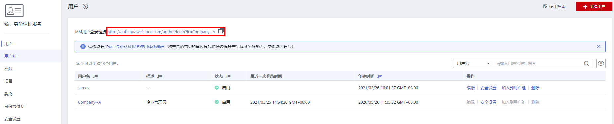

# IAM用户登录

管理员创建IAM用户后，这个新建的IAM用户可以登录华为云。登录方式包括登录页面的“IAM用户”，以及IAM控制台提供的“IAM用户登录链接”。

如果登录失败，请与管理员确认用户名密码是否正确，或者[重置密码](https://support.huaweicloud.com/iam_faq/iam_01_0314.html#section1)  。

## 登录方法1：华为云登录页面

1.  在华为云的登录页面，单击登录下方的“IAM用户”，在“IAM用户登录”页面，输入帐号名，IAM用户名/邮件地址和密码。

    **图 1**  IAM用户登录  
    

    -   租户名/原华为云帐号：IAM用户所属的帐号，即华为云[帐号](使用前必读.md#section570831416230)。如果不知道帐号名，请向[管理员](使用前必读.md#section209491111991)获取。
    -   IAM用户名/邮件地址：在IAM创建用户时，输入的[IAM用户](使用前必读.md#section108144194235)名/邮件地址。如果不知道用户名及初始密码，请向[管理员](使用前必读.md#section209491111991)获取。
    -   IAM用户密码：IAM用户的密码，非帐号密码。

2.  单击“登录”，完成登录。

    > **说明：** 
    >-   如果创建IAM用户时，IAM用户没有加入任何用户组，则IAM用户不具备任何权限，不能对云服务进行操作，需要联系管理员参考[创建用户组并授权](创建用户组并授权.md)和[用户组添加/移除用户](用户组添加-移除用户.md)给IAM用户授权。
    >-   如果创建IAM用户时，IAM用户加入了默认用户组“admin”，则IAM用户为管理员，可以对所有云服务执行任意操作。

## 登录方法2：IAM用户专属链接

此方法需要向管理员获取专属登录链接，获取后建议您保存该链接，方便后续快速登录。使用IAM用户专属链接登录时，系统会自动识别用户的帐号名，用户仅需要填写用户名和密码，方便用户快速登录。

1.  管理员在IAM控制台，复制“IAM用户登录链接”，并将链接发送给用户。

    **图 2**  IAM用户登录链接  
    

2.  用户在浏览器中打开复制的地址，输入“用户名/邮件地址”和“密码”，单击“登录”，完成登录。

