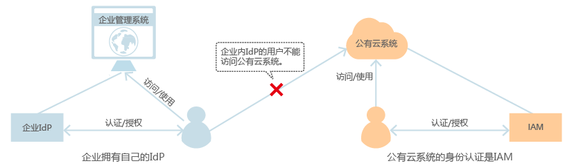
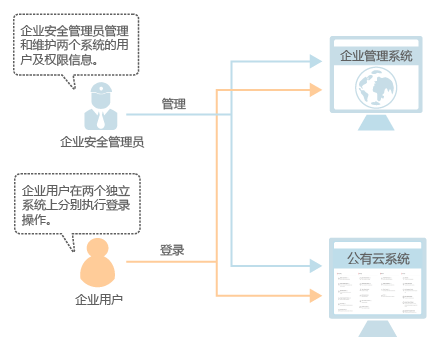
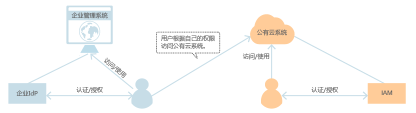
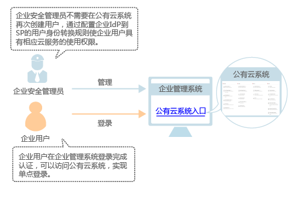

# 为什么要配置联邦身份认证

如果您已经有自己的身份认证系统，用户可以通过您自己的身份认证系统进行身份验证，通过配置联邦身份认证，不需要在服务提供商（简称SP）系统中重新创建用户，使得您身份认证系统中的用户实现单点登录。

系统支持基于浏览器的页面单点登录（WebSSO）和非浏览器的调用API接口访问两种形式的联邦身份认证。

-   WebSSO：浏览器作为通讯媒介，适用于普通用户通过浏览器访问系统。
-   调用API接口：开发工具/应用程序作为通讯媒介，例如：OpenStackClient，适用企业或用户使用开发工具调用API接口访问系统。

    调用API接口侧的联邦认证分为SP initiated方式和IdP initiated方式，用户可以根据企业IdP系统支持的方式进行选择。

## 未使用联邦身份认证时

-   企业IdP用户不能单点登录

    企业管理系统有自己的IdP（以下称为：企业IdP），通过企业IdP认证的用户无法直接访问本系统。

    **图 1**  用户认证模型（1）  
    

-   用户管理复杂

    管理员需要分别在两个系统中为用户创建账号。

-   用户操作繁琐

    用户访问两个系统时需要使用两个系统的账号登录。

    **图 2**  用户登录模型（1）  
    

## 使用联邦身份认证后

-   IdP用户可以单点登录

    企业IdP认证通过后，用户即可直接访问本系统。企业管理员无需在本系统中重复创建用户。

    **图 3**  用户认证模型（2）  
    

-   用户管理简单

    企业管理员只需要在企业管理系统中为用户创建账号，用户即可同时访问两个系统。降低了人员管理成本。

-   用户操作方便

    用户在本企业管理系统中登录即可访问两个系统。

    **图 4**  用户登录模型（2）  
    

