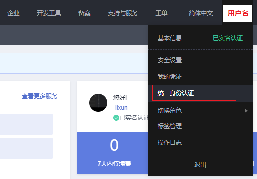
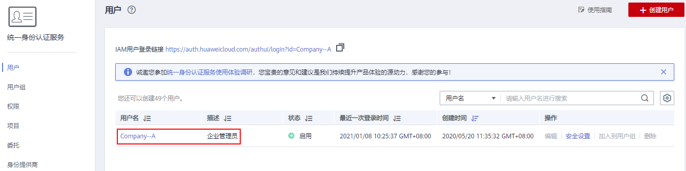
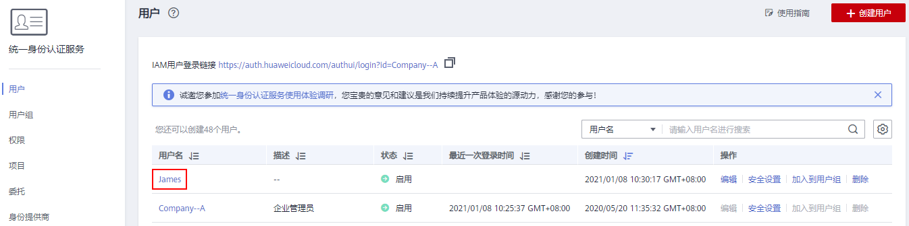
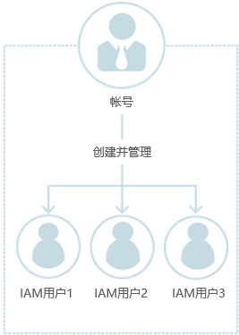
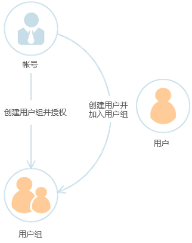

# 使用前必读

## IAM的使用对象

IAM的使用对象为管理员：

-   帐号：帐号可以使用所有服务，包括IAM。
-   admin用户组中的用户：IAM默认用户组admin中的用户，可以使用所有服务，包括IAM。
-   授予了“Security Administrator”权限的用户：具备该权限的用户为IAM管理员，可以使用IAM。

推荐您在使用IAM前，开通云审计服务CTS，方便查看、审计以及回溯IAM的关键操作记录。详情请参考：[开通云审计服务](开通云审计服务.md)。

## 如何进入IAM控制台

1.  登录华为云，在右上角单击“控制台”。

    **图 1**  进入控制台  
    

2.  在控制台页面，鼠标移动至右上方的帐号名，在下拉列表中选择“统一身份认证”。

    

## 帐号

您注册华为云后，系统自动创建帐号，帐号是资源的归属以及使用计费的主体，对其所拥有的资源具有完全控制权限，可以访问所有云服务。帐号不能在IAM中修改和删除，如果您需要删除帐号，可以在帐号中心进行注销。

如下图所示，使用帐号登录后，在IAM的“用户”中可以看到帐号对应的用户，在IAM中标识为“企业管理员”。

**图 2**  帐号对应的IAM用户  

## IAM用户

由管理员在IAM中创建的用户，如下图所示，“James”为管理员创建的IAM用户。IAM用户可以使用帐号名、IAM用户名和密码登录华为云，并根据权限使用所属帐号中的资源。IAM不拥有资源，不进行独立的计费，IAM用户的权限和资源由所属帐号统一控制和付费。

**图 3**  管理员创建的IAM用户  

## 帐号与IAM用户的关系

帐号与IAM用户可以类比为父子关系，帐号是资源归属以及计费的主体，对其拥有的资源具有完全控制权限。

IAM用户由管理员创建，权限由管理员分配，管理员可以随时修改或者撤销IAM用户的权限。IAM用户进行资源操作时产生的费用统一计入帐号中，IAM用户不需要为资源付费。

**图 4**  帐号和IAM用户的关系  

## 用户组

用户组是用户的集合，IAM可以通过用户组功能实现用户的授权。您创建的IAM用户，加入特定用户组后，将具备对应用户组的权限，可以基于权限对云服务进行操作。当某个用户加入多个用户组时，此用户同时拥多个用户组的权限，即多个用户组权限的全集。

“admin”为缺省用户组，具有所有云服务资源的操作权限。将用户加入该用户组后，用户可以操作并使用所有云资源，包括但不仅限于创建用户组及用户、修改用户组权限、管理资源等。

**图 5**  用户组  

## 权限

IAM预置了各服务的常用权限，例如管理员权限、只读权限，您可以直接使用这些权限。默认情况下，管理员创建的IAM用户没有任何权限。管理员可以将其加入用户组，并给用户组授予策略或角色，用户组中的用户将获得用户组的权限。同时，IAM用户也可以为自身授予权限。这一过程称为授权。授权后，用户就可以基于被授予的权限对云服务进行操作。

-   角色：IAM最初提供的一种根据用户的工作职能定义权限的粗粒度授权机制。该机制以服务为粒度，提供有限的服务相关角色用于授权。由于华为云各服务之间存在业务依赖关系，因此给用户授予角色时，可能需要一并授予依赖的其他角色，才能正确完成业务。角色并不能满足用户对精细化授权的要求，无法完全达到企业对权限最小化的安全管控要求。
-   策略：IAM最新提供的一种细粒度授权的能力，可以精确到具体服务的操作、资源以及请求条件等。基于策略的授权是一种更加灵活的授权方式，能够满足企业对权限最小化的安全管控要求。例如：针对ECS服务，管理员能够控制IAM用户仅能对某一类云服务器资源进行指定的管理操作。

如下图所示，如果您授予IAM用户弹性云服务器ECS的权限，则该IAM用户除了ECS，不能访问其他任何服务，如果尝试访问其他服务，系统将会提示没有权限。

**图 6**  系统提示没有权限  

