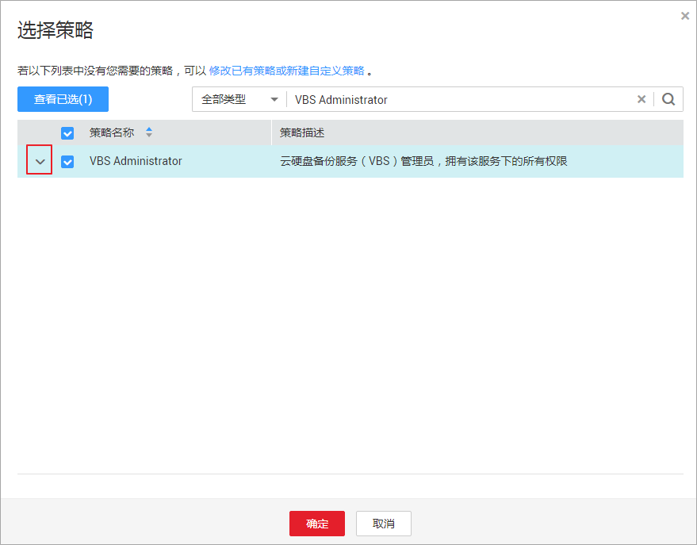
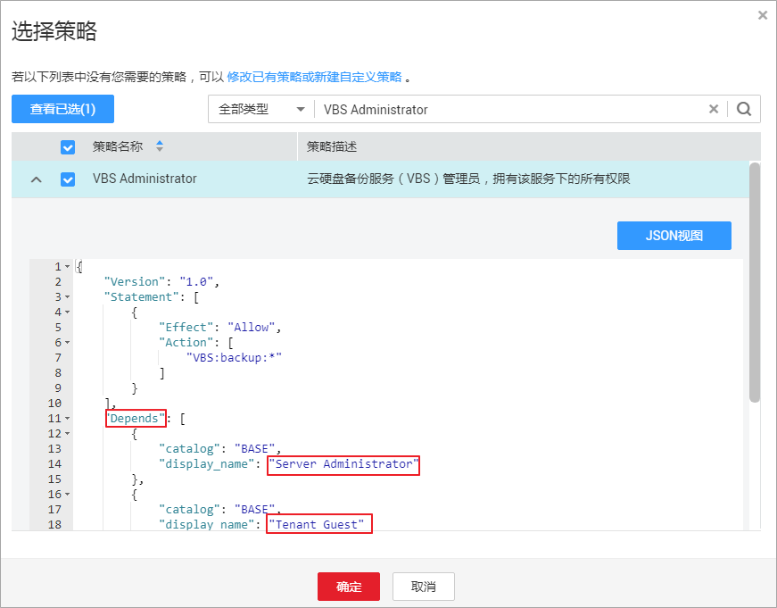
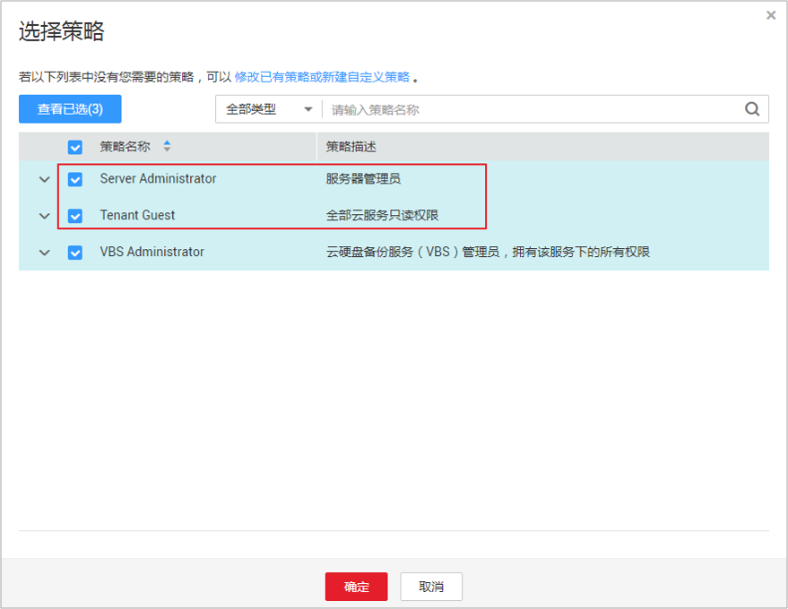

# 依赖权限的授权方法

由于华为云各服务之间存在业务交互关系，个别服务的权限依赖其他服务的权限实现功能。因此给用户组授予RBAC策略时，需要查看策略的具体内容，需要确认是否有依赖的策略，如果有，需要同时设置依赖的权限，授予的RBAC权限才会生效。细粒度策略不存在依赖关系，不需要进行依赖授权。

## 操作步骤

1.  管理员给用户组授权时，在“可选策略”中搜索并选择勾选需要的权限。
2.  单击勾选策略下方的，查看策略的依赖关系。

    

      

    例如“VBS Administrator”，策略内容中存在“Depends”字段，表示存在依赖关系。给用户组授予“VBS Administrator”策略时，还需要在同项目同时授予“Server Administrator”和“Tenant Guest”权限，“VBS Administrator”才能生效。

    

      

3.  在同项目中搜索并勾选依赖的策略“Server Administrator”和“Tenant Guest”。

    

      

4.  单击“确定”，完成依赖权限的授权。

