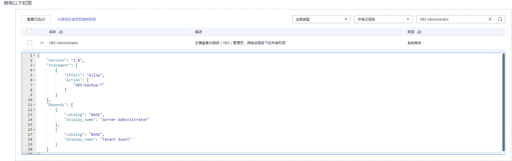

# 依赖角色的授权方法

由于华为云各服务之间存在业务交互关系，个别服务的角色依赖其他服务的角色实现功能。因此给用户组授予角色时，对于有依赖则需要授予依赖的角色才会生效。策略不存在依赖关系，不需要进行依赖授权。

## 操作步骤

1.  管理员给用户组授权时，在搜索框中搜索需要的权限。
2.  单击勾选权限下方的，查看权限的依赖关系。

    

    例如“VBS Administrator”，角色内容中存在“Depends”字段，表示存在依赖关系。给用户组授予“VBS Administrator”角色时，还需要在同项目同时授予“Server Administrator”和“Tenant Guest”角色，“VBS Administrator”才能生效。

3.  搜索并勾选依赖的角色“Server Administrator”和“Tenant Guest”，加入与“VBS Administrator”相同的项目。
4.  单击“确定”，完成依赖角色的授权。

