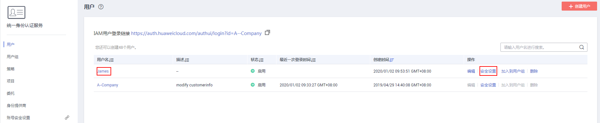

# 修改IAM用户信息

管理员在IAM用户列表中，单击用户名，或者单击右侧的“安全设置”，可以修改IAM用户的基本信息、所属用户组以及进行安全设置。

## 修改IAM用户基本信息

只能修改IAM用户的基本信息，不能修改账号的基本信息。

-   状态：修改IAM用户的状态，IAM用户的状态默认为启用，如果需要停止使用该IAM用户，可以将IAM用户的状态设置为“停用“。停用后，该IAM用户将无法登录华为云。
-   描述：修改IAM用户的描述信息。

## 修改IAM用户所属用户组

所属用户组表示用户具备的权限，通过修改用户的所属用户组可以修改用户的权限。只能修改IAM用户的所属用户组，账号属于默认用户组“admin”，不能修改。

-   单击“加入用户组”，在“配置用户组”中选择需要加入的用户组，一个用户可以加入一个或是多个用户组。用户加入用户组后，拥有用户组的所有权限。
-   单击已有用户组右侧的“删除“，退出选中的用户组，用户将不再拥有该用户组权限。

## 安全设置

-   多因素认证设备，只能修改IAM用户的多因素认证设备，不能修改账号的多因素认证设备。
    -   修改用户的手机、邮箱。
    -   虚拟MFA设备：给用户绑定或者解绑虚拟MFA设备。更多有关多因素认证以及MFA的介绍，详情请参见：[多因素认证与虚拟MFA](多因素认证与虚拟MFA.md)。

-   登录凭证：修改IAM用户的登录密码，详情请参见：[修改IAM用户密码](修改IAM用户密码.md)。
-   登录保护：修改IAM用户的登录验证方式，支持虚拟MFA、手机和邮箱。

    登录保护表示用户登录控制台时，除了在登录页面输入用户名和密码（第一次身份认证），还需要在“登录验证”页面输入验证码（第二次身份验证），该功能默认关闭。

-   访问密钥：管理IAM用户的访问密钥，详情请参见：[管理IAM用户访问密钥](管理IAM用户访问密钥.md)。

