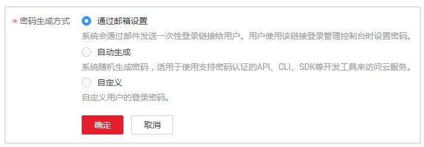

# 修改IAM用户密码

如果IAM用户忘记了登录密码，并且没有绑定邮箱或者手机，可以由管理员在IAM中重置密码。管理员可以修改IAM用户以及账号的密码。

管理员在IAM用户列表中，单击右侧的“安全设置“，重置IAM用户的密码。

> **说明：**   
>IAM提供的设置凭证功能，适用于管理员重置IAM用户的密码。“账号安全设置”中也可以[修改密码](https://support.huaweicloud.com/usermanual-iam/iam_01_0703.html)，适用于所有用户，在已知当前密码的情况下，主动修改自己的密码。  

-   通过邮箱设置：用户通过邮件中的一次性链接登录控制台时，自行设置密码。
-   自动生成：系统自动生成随机的10位密码，管理员将新密码发送给用户。
-   自定义：管理员自定义用户的密码，并将新密码发送给用户。

