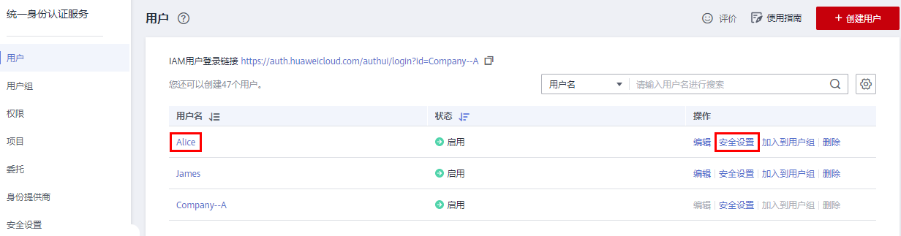

# 修改IAM用户密码

如果IAM用户忘记了登录密码，并且没有绑定邮件地址或者手机，可以由管理员在IAM中重置密码。

管理员在IAM用户列表中，单击右侧的“安全设置“，在“安全设置”页签，单击“登录凭证\>登录密码”右侧的，重置IAM用户的登录密码。

**图 1**  修改IAM用户密码  

> **说明：** 
>-   IAM提供的安全设置功能，适用于管理员重置IAM用户的密码。
>-   帐号自动生成的IAM用户无法通过“安全设置”修改密码，请参考[如何修改密码](https://support.huaweicloud.com/iam_faq/iam_01_0607.html)修改帐号密码。
>-   IAM用户可以在[基本信息](基本信息.md)页面修改自己的密码。帐号如需修改密码，请参考[如何修改密码](https://support.huaweicloud.com/iam_faq/iam_01_0607.html)。

-   通过邮件地址设置：用户通过邮件中的一次性链接登录控制台时，自行设置密码。
-   自动生成：系统自动生成随机密码，创建用户成功后可以下载并将新密码发送给用户。
-   自定义：管理员自定义用户的密码，并将新密码发送给用户。

