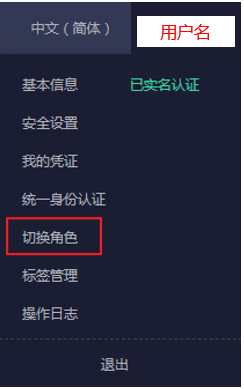

# 切换角色（被委托方操作）

当其他账号与您创建了委托关系，即您是被委托方，您以及分配了委托权限的用户，可以切换角色至委托方账号中，根据权限管理委托方的资源。

## 前提条件

-   已有账号与您创建了委托关系。
-   您已经获取到委托方的账号名称及所创建的委托名称。

## 操作步骤

1.  使用账号或者[3](（可选）分配委托权限（被委托方操作）.md#li695863494610)中新建的用户登录系统。

    > **说明：**   
    >[3](（可选）分配委托权限（被委托方操作）.md#li695863494610)中新建的用户具有管理委托的权限，可以切换角色。  

2.  鼠标移动至右上方的用户名，选择“切换角色“。

    

3.  在“切换角色“页面中，输入委托方的账号名称。

    > **说明：**   
    >输入账号名称后，系统将会按照顺序自动匹配委托名称，如果自动匹配的是没有授权的委托，系统将提示您没有权限访问，您可以删除委托名称，在下拉框中选择已授权的委托名称。  

4.  单击“确定“，切换至委托方账号中。

## 后续步骤

鼠标移动至右上角的用户名，选择“切换角色”，可以返回到您自己的账号中。

