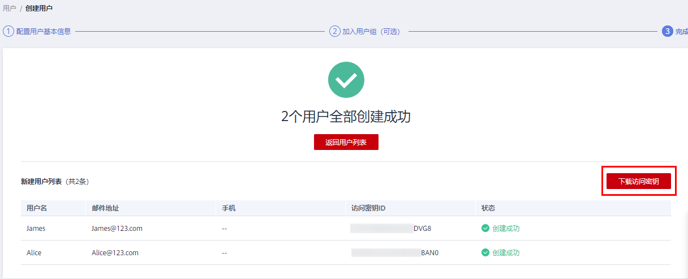

# 创建IAM用户

如果您是[管理员](使用前必读.md#section209491111991)，在华为云购买了多种资源，例如弹性云服务器、云硬盘、裸金属服务器等，您需要将资源分配给企业中不同的员工或者应用程序使用，为了避免分享自己的帐号密码，您可以使用IAM的用户管理功能，给员工或应用程序创建IAM用户。

默认情况下，**新创建的IAM用户没有任何权限**，管理员需要为其授予权限，或将其加入用户组，并[给用户组授权](创建用户组并授权.md#section29361034113212)，用户组中的用户将获得用户组的权限。IAM用户拥有权限后，IAM用户就可以基于权限对云服务进行操作。

“admin”为缺省用户组，具有所有云服务资源的操作权限。将用户加入该用户组后，用户可以操作并使用所有云服务资源，包括但不仅限于创建用户组及用户、修改用户组权限、管理资源等。

> **说明：** 
>如果删除并重新创建同名用户，则需要重新授权。

## 操作步骤

1.  管理员登录IAM控制台。
2.  在统一身份认证服务，左侧导航窗格中，选择“用户”，单击右上方的“创建用户”。
3.  在“创建用户”页面配置“用户信息”。如需一次创建多个用户，可以单击“添加用户”进行批量创建，每次最多可创建10个用户。

    **表 1**  用户信息

    
    <table><thead align="left"><tr id="row1839187135913"><th class="cellrowborder" valign="top" width="13.139999999999999%" id="mcps1.2.3.1.1">
参数

    </th>
    <th class="cellrowborder" valign="top" width="86.86%" id="mcps1.2.3.1.2">
描述

    </th>
    </tr>
    </thead>
    <tbody><tr id="row939114755917"><td class="cellrowborder" valign="top" width="13.139999999999999%" headers="mcps1.2.3.1.1 ">
用户名

    </td>
    <td class="cellrowborder" valign="top" width="86.86%" headers="mcps1.2.3.1.2 ">
自定义，不可与帐号、或帐号中其他IAM用户重复。

    </td>
    </tr>
    <tr id="row2039111795911"><td class="cellrowborder" valign="top" width="13.139999999999999%" headers="mcps1.2.3.1.1 ">
邮件地址

    </td>
    <td class="cellrowborder" valign="top" width="86.86%" headers="mcps1.2.3.1.2 ">
自定义，不可与帐号、或帐号中其他IAM用户重复。可用于IAM用户身份验证、重置密码。

    </td>
    </tr>
    <tr id="row11422842018"><td class="cellrowborder" valign="top" width="13.139999999999999%" headers="mcps1.2.3.1.1 ">
手机号

    </td>
    <td class="cellrowborder" valign="top" width="86.86%" headers="mcps1.2.3.1.2 ">
自定义，不可与帐号、或帐号中其他IAM用户重复。可用于IAM用户身份验证、重置密码。

    </td>
    </tr>
    <tr id="row12422242017"><td class="cellrowborder" valign="top" width="13.139999999999999%" headers="mcps1.2.3.1.1 ">
外部身份ID

    </td>
    <td class="cellrowborder" valign="top" width="86.86%" headers="mcps1.2.3.1.2 ">
为IAM用户配置<a href="基于SAML协议的联邦身份认证.md">基于SAML协议的联邦身份认证</a>时，“外部身份ID”为必选参数（不超过128个字符）。

    </td>
    </tr>
    </tbody>
    </table>

4.  选择“访问方式”。

    **表 2**  访问方式

    
    <table><thead align="left"><tr id="row19359151113466"><th class="cellrowborder" valign="top" width="14.92%" id="mcps1.2.3.1.1">
访问方式

    </th>
    <th class="cellrowborder" valign="top" width="85.08%" id="mcps1.2.3.1.2">
说明

    </th>
    </tr>
    </thead>
    <tbody><tr id="row16359111164619"><td class="cellrowborder" valign="top" width="14.92%" headers="mcps1.2.3.1.1 ">
编程访问

    </td>
    <td class="cellrowborder" valign="top" width="85.08%" headers="mcps1.2.3.1.2 ">
支持用户通过API、CLI、SDK等开发工具访问云服务。

    </td>
    </tr>
    <tr id="row3359111174614"><td class="cellrowborder" valign="top" width="14.92%" headers="mcps1.2.3.1.1 ">
管理控制台访问

    </td>
    <td class="cellrowborder" valign="top" width="85.08%" headers="mcps1.2.3.1.2 ">
支持用户登录管理控制台访问云服务。此时凭证类型“密码”为必选项。

    </td>
    </tr>
    </tbody>
    </table>

5.  选择“凭证类型”。

    **表 3**  配置凭证类型

    
    <table><thead align="left"><tr id="row290211117436"><th class="cellrowborder" colspan="2" valign="top" id="mcps1.2.4.1.1">
凭证类型

    </th>
    <th class="cellrowborder" valign="top" id="mcps1.2.4.1.2">
说明

    </th>
    </tr>
    </thead>
    <tbody><tr id="row29021113433"><td class="cellrowborder" colspan="2" valign="top" headers="mcps1.2.4.1.1 ">
访问密钥

    </td>
    <td class="cellrowborder" valign="top" headers="mcps1.2.4.1.2 ">
创建用户完成后即可下载本次创建的所有用户的<a href="https://support.huaweicloud.com/usermanual-ca/ca_01_0003.html" target="_blank" rel="noopener noreferrer">访问密钥（AK/SK）</a>。

    
<strong id="b6902711164320">一个用户最多拥有两个访问密钥。</strong>

    </td>
    </tr>
    <tr id="row11902121104316"><td class="cellrowborder" rowspan="3" valign="top" width="6.069999999999999%" headers="mcps1.2.4.1.1 ">
密码

    </td>
    <td class="cellrowborder" valign="top" width="9.879999999999999%" headers="mcps1.2.4.1.1 ">
自定义

    </td>
    <td class="cellrowborder" valign="top" width="84.05%" headers="mcps1.2.4.1.2 ">
自定义用户密码，并选择用户首次登录时是否需要重置密码。

    
如果您是用户的使用主体，建议您选择该方式，设置自己的登录密码，且无需勾选首次登录时重置密码。

    </td>
    </tr>
    <tr id="row3902161154315"><td class="cellrowborder" valign="top" headers="mcps1.2.4.1.1 ">
自动生成

    </td>
    <td class="cellrowborder" valign="top" headers="mcps1.2.4.1.1 ">
系统自动生成IAM用户的登录密码，创建完用户即可下载excel形式的密码文件。将密码文件提供给用户，用户使用该密码登录。

    
<strong id="b18902131117438">仅在创建单个用户时适用。</strong>

    </td>
    </tr>
    <tr id="row17902611204313"><td class="cellrowborder" valign="top" headers="mcps1.2.4.1.1 ">
首次登录时设置

    </td>
    <td class="cellrowborder" valign="top" headers="mcps1.2.4.1.1 ">
系统通过邮件发一次性登录链接给用户，用户登录控制台并设置密码。

    
如果您不是用户的使用主体，建议选择该方式，同时输入用户的邮件地址和手机，用户通过邮件中的一次性链接登录华为云，自行设置密码。该链接<strong id="b6902151113432">7天</strong>内有效。

    </td>
    </tr>
    </tbody>
    </table>

    **表 4**  配置建议

    
    <table><thead align="left"><tr id="row1128055004"><th class="cellrowborder" valign="top" width="8.4%" id="mcps1.2.6.1.1">
登录控制台

    </th>
    <th class="cellrowborder" valign="top" width="7.6%" id="mcps1.2.6.1.2">
编程访问

    </th>
    <th class="cellrowborder" valign="top" width="53.36%" id="mcps1.2.6.1.3">
访问凭证

    </th>
    <th class="cellrowborder" valign="top" width="15.52%" id="mcps1.2.6.1.4">
建议访问方式

    </th>
    <th class="cellrowborder" valign="top" width="15.120000000000001%" id="mcps1.2.6.1.5">
建议凭证类型

    </th>
    </tr>
    </thead>
    <tbody><tr id="row102917551001"><td class="cellrowborder" valign="top" width="8.4%" headers="mcps1.2.6.1.1 ">
√

    </td>
    <td class="cellrowborder" valign="top" width="7.6%" headers="mcps1.2.6.1.2 ">
×

    </td>
    <td class="cellrowborder" valign="top" width="53.36%" headers="mcps1.2.6.1.3 ">
无特殊要求。

    </td>
    <td class="cellrowborder" valign="top" width="15.52%" headers="mcps1.2.6.1.4 ">
管理控制台

    </td>
    <td class="cellrowborder" valign="top" width="15.120000000000001%" headers="mcps1.2.6.1.5 ">
密码

    </td>
    </tr>
    <tr id="row182917551803"><td class="cellrowborder" valign="top" width="8.4%" headers="mcps1.2.6.1.1 ">
×

    </td>
    <td class="cellrowborder" valign="top" width="7.6%" headers="mcps1.2.6.1.2 ">
√

    </td>
    <td class="cellrowborder" valign="top" width="53.36%" headers="mcps1.2.6.1.3 ">
无特殊要求。

    </td>
    <td class="cellrowborder" valign="top" width="15.52%" headers="mcps1.2.6.1.4 ">
编程访问

    </td>
    <td class="cellrowborder" valign="top" width="15.120000000000001%" headers="mcps1.2.6.1.5 ">
访问密钥

    </td>
    </tr>
    <tr id="row19587926711"><td class="cellrowborder" valign="top" width="8.4%" headers="mcps1.2.6.1.1 ">
×

    </td>
    <td class="cellrowborder" valign="top" width="7.6%" headers="mcps1.2.6.1.2 ">
√

    </td>
    <td class="cellrowborder" valign="top" width="53.36%" headers="mcps1.2.6.1.3 ">
<strong id="b1078010381774">需要使用密码作为编程访问的凭证</strong>（部分API要求）。

    </td>
    <td class="cellrowborder" valign="top" width="15.52%" headers="mcps1.2.6.1.4 ">
编程访问

    </td>
    <td class="cellrowborder" valign="top" width="15.120000000000001%" headers="mcps1.2.6.1.5 ">
密码

    </td>
    </tr>
    <tr id="row105871320719"><td class="cellrowborder" valign="top" width="8.4%" headers="mcps1.2.6.1.1 ">
√

    </td>
    <td class="cellrowborder" valign="top" width="7.6%" headers="mcps1.2.6.1.2 ">
×

    </td>
    <td class="cellrowborder" valign="top" width="53.36%" headers="mcps1.2.6.1.3 ">
需要在<strong id="b9849121989">控制台验证访问密钥</strong>（由IAM用户输入）。

    
例如：例如IAM用户在控制台使用云数据迁移CDM服务创建数据迁移，需要通过访问密钥进行身份验证。

    </td>
    <td class="cellrowborder" valign="top" width="15.52%" headers="mcps1.2.6.1.4 ">
编程访问和管理控制台

    </td>
    <td class="cellrowborder" valign="top" width="15.120000000000001%" headers="mcps1.2.6.1.5 ">
密码和访问密钥

    </td>
    </tr>
    </tbody>
    </table>

6.  选择“登录保护”设置。仅访问方式勾选管理控制台访问时，可以开启。
    -   开启登录保护（推荐）：开启登录保护后，IAM用户登录时，除了在登录页面输入用户名和密码外（第一次身份验证），还需要在登录验证页面输入验证码（第二次身份验证），该功能是一种安全实践，建议开启登录保护，多次身份认证可以提高安全性。

        您可以选择通过手机、邮箱、虚拟MFA进行登录验证。

    -   不开启：创建完成后，如需开启登录保护，请参见：[登录保护](敏感操作.md#zh-cn_topic_0176803437_section6465133820464)。

7.  单击“下一步”，（可选）勾选要加入的用户组，将用户加入到用户组。加入用户组后，用户将具备用户组的权限。

    > **说明：** 
    >-   如需创建新的用户组，可单击“创建用户组”，创建完成并勾选该用户组，用户将加入到新创建的用户组中。
    >-   如果该用户是管理员，可以将用户加入默认用户组“admin”中。
    >-   一个用户最多可以同时加入10个用户组。

8.  单击“创建用户”，IAM用户创建完成，用户列表中显示新创建的IAM用户。
    -   如果“[5](#li19731224131114)\>凭证类型”勾选了“访问密钥”，可在此页面下载访问密钥。
    -   如果“[5](#li19731224131114)\>凭证类型”勾选了“密码\>自动生成”，可在此页面下载密码。

        **图 1**  创建成功  
        

