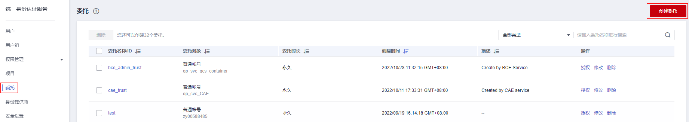

# 创建委托（委托方操作）

通过创建委托，可以将资源共享给其他账号，或委托更专业的人或团队来代为管理资源。被委托方使用自己的账号登录后，切换到委托方账号，即可管理委托方委托的资源，避免委托方共享自己的安全凭证（密码/密钥）给他人，确保账号安全。

## 前提条件

在创建委托前，建议管理员提前了解并规划以下内容：

-   了解策略的[基本概念及分类](策略基本概念.md)。
-   建议开通细粒度策略功能，否则无法选择仅支持细粒度策略服务的权限。
-   规划委托需要的[权限策略](https://support.huaweicloud.com/usermanual-permissions/zh-cn_topic_0063498930.html)，并确认策略是否有依赖，如果有，需要同时[设置依赖的权限](依赖权限的授权方法.md)。

## 操作步骤

1.  登录华为云，在右上角单击“控制台”。

    

2.  在控制台页面，鼠标移动至右上方的用户名，在下拉列表中选择“统一身份认证”。

    

3.  在统一身份认证服务的左侧导航窗格中，单击“委托 \> 创建委托“。
4.  在创建委托页面，设置“委托名称”。

    

5.  “委托类型”选择“普通账号”，在“委托的账号”中输入需要建立委托关系的其他华为云账号的账号名。

    > **说明：**   
    >-   普通账号：将资源共享给其他账号或委托更专业的人或团队来代为管理账号中的资源。可以是其他账号，也可以是委托方账号，不能是联邦用户或者IAM用户。  
    >-   云服务：授权指定云服务使用其他云服务。详情请参见：[委托其他云服务管理资源](委托其他云服务管理资源.md)。  

6.  设置“持续时间”及“描述”信息。
7.  在“权限选择”区域中，单击列表左上方的“配置权限”，给委托选择权限，并单击“确定”。

    > **说明：**   
    >-   给委托授权即给其他账号授权，给用户组授权即给账号中的IAM用户授权，两者操作方法相同，仅可选择的策略个数不同，授权操作请参见：[给用户组授权](创建用户组并授权.md#section12561378357)。  
    >-   所有服务的权限，请参见：[权限策略](https://support.huaweicloud.com/usermanual-permissions/zh-cn_topic_0063498930.html)。  

8.  单击“确定”，委托创建完成，委托列表中显示新创建的委托。

    > **说明：**   
    >委托方操作完成，将自己的华为云账号名称、创建的委托名称、委托ID以及委托的资源权限告知被委托方后，被委托方可以通过切换角色至委托方账号中管理委托资源。  

## 相关操作

-   修改委托

    如果需要修改委托的权限、持续时间、描述等，可以在委托列表中，单击委托右侧的“修改”，修改委托。

-   删除委托

    如果不再需要使用委托，可以在委托列表中，单击委托右侧的“删除”，删除委托。

    > **说明：**   
    >删除委托后，将撤销被委托方账号的权限，被委托方将无法管理您的委托资源，对您的其他业务合作伙伴没有影响。  

