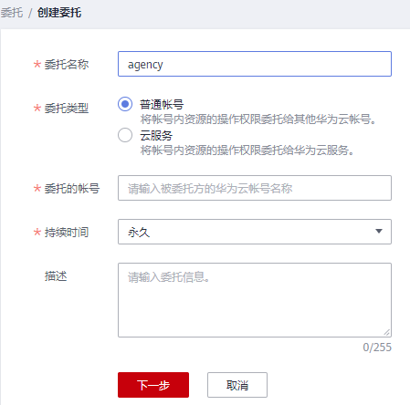

# 创建委托（委托方操作）

通过创建委托，可以将资源共享给其他帐号，或委托更专业的人或团队来代为管理资源。被委托方使用自己的帐号登录后，切换到委托方帐号，即可管理委托方委托的资源，避免委托方共享自己的安全凭证（密码/密钥）给他人，确保帐号安全。

## 前提条件

在创建委托前，建议管理员提前了解并规划以下内容：

-   了解权限的[基本概念及分类](权限基本概念.md)。
-   规划委托需要的**[系统权限](https://support.huaweicloud.com/usermanual-permissions/iam_01_0001.html)**，并确认权限是否有依赖，如果有，需要同时[设置依赖的权限](依赖角色的授权方法.md)。

## 操作步骤

1.  登录统一身份认证服务控制台。
2.  在统一身份认证服务的左侧导航窗格中，选择“委托”页签，单击右上方的“创建委托“。

    **图 1**  创建委托  
    

3.  在创建委托页面，设置“委托名称”。

    **图 2**  委托名称  
    

4.  “委托类型”选择“普通帐号”，在“委托的帐号”中输入需要建立委托关系的其他帐号的帐号名。

    > **说明：** 
    >-   普通帐号：将资源共享给其他帐号或委托更专业的人或团队来代为管理帐号中的资源。委托的帐号只能是帐号，不能是联邦用户、IAM用户。
    >-   云服务：授权指定云服务使用其他云服务。详情请参见：[委托其他云服务管理资源](委托其他云服务管理资源.md)。

5.  选择“持续时间”，填写“描述”信息。
6.  单击“下一步”，进入给委托授权页面。
7.  勾选需要授予委托的权限，单击“下一步”，选择权限的作用范围。

    > **说明：** 
    >-   给委托授权即给其他帐号授权，给用户组授权即给帐号中的IAM用户授权，两者操作方法相同，仅可选择的权限个数不同，授权操作请参见：[给用户组授权](创建用户组并授权.md#section29361034113212)。
    >-   为了保障您的帐号安全，委托将不能添加Security Administrator权限，建议您按照业务场景为委托授予最小权限。

8.  单击“确定”，委托创建完成。

    > **说明：** 
    >委托方操作完成，将自己的帐号名称、创建的委托名称、委托ID以及委托的资源权限告知被委托方后，被委托方可以通过切换角色至委托方帐号中管理委托资源。

