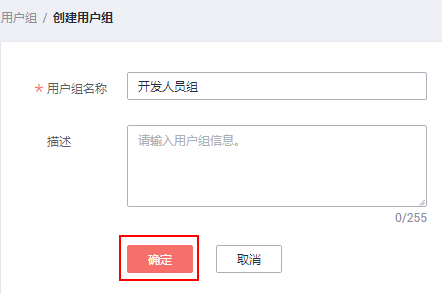
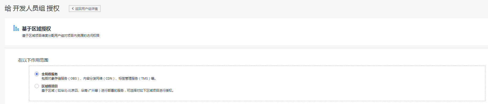
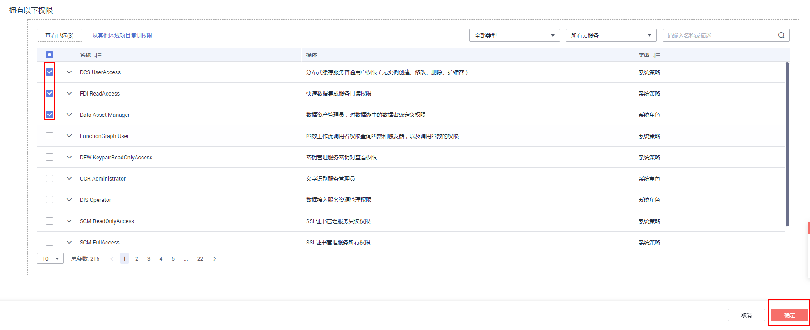

# 创建用户组并授权

管理员可以创建用户组，并给用户组授予策略或角色，然后将用户加入用户组，使得用户组中的用户获得相应的权限。IAM预置了各服务的常用权限，例如管理员权限、只读权限，管理员可以直接使用这些系统权限给用户组授权，授权后，用户就可以基于权限对云服务进行操作。**如需查看所有云服务的系统权限，请参见：[系统权限](https://support.huaweicloud.com/usermanual-permissions/iam_01_0001.html)**。

## 前提条件

在创建用户组前，建议管理员提前了解并规划以下内容：

-   了解权限的[基本概念及分类](权限基本概念.md)。
-   规划用户组需要的权限，IAM的权限如[表1](#table037948173715)所示，**如需了解其他服务的权限，请参考：[系统权限](https://support.huaweicloud.com/usermanual-permissions/iam_01_0001.html)**。
-   如果给用户组授予角色，需要确认该角色是否有依赖，如果有，需要同时[设置依赖的角色](依赖角色的授权方法.md)，授予的角色才会生效。

**表 1**  IAM系统角色/策略

<table><thead align="left"><tr id="row83713480378"><th class="cellrowborder" valign="top" width="20.11201120112011%" id="mcps1.2.4.1.1">
系统角色/策略名称

</th>
<th class="cellrowborder" valign="top" width="7.2007200720072%" id="mcps1.2.4.1.2">
授权区域

</th>
<th class="cellrowborder" valign="top" width="72.68726872687269%" id="mcps1.2.4.1.3">
权限描述

</th>
</tr>
</thead>
<tbody><tr id="row10757822184914"><td class="cellrowborder" valign="top" width="20.11201120112011%" headers="mcps1.2.4.1.1 ">
IAM ReadOnlyAccess

</td>
<td class="cellrowborder" valign="top" width="7.2007200720072%" headers="mcps1.2.4.1.2 ">
全局

</td>
<td class="cellrowborder" valign="top" width="72.68726872687269%" headers="mcps1.2.4.1.3 ">
统一身份认证服务的只读权限，拥有对用户、用户组、策略、委托、账号安全设置等资源的查看权限，暂不包含项目和身份提供商查看权限。

</td>
</tr>
<tr id="row133814803718"><td class="cellrowborder" valign="top" width="20.11201120112011%" headers="mcps1.2.4.1.1 ">
Security Administrator

</td>
<td class="cellrowborder" valign="top" width="7.2007200720072%" headers="mcps1.2.4.1.2 ">
全局

</td>
<td class="cellrowborder" valign="top" width="72.68726872687269%" headers="mcps1.2.4.1.3 ">
IAM的管理员权限，可以对IAM执行所有操作，包括但不限于：

<ul id="ul252510391440"><li>创建、修改、删除IAM用户。</li><li>创建、修改、删除用户组、给用户组授权。</li><li>创建、修改、删除自定义策略。</li><li>创建、修改项目。</li><li>创建、修改、删除委托。</li><li>创建、修改、删除身份提供商。</li><li>设置账号安全策略。</li></ul>

该权限仅能管理IAM服务，不能切换角色。

</td>
</tr>
<tr id="row538948123717"><td class="cellrowborder" valign="top" width="20.11201120112011%" headers="mcps1.2.4.1.1 ">
Agent Operator

</td>
<td class="cellrowborder" valign="top" width="7.2007200720072%" headers="mcps1.2.4.1.2 ">
全局

</td>
<td class="cellrowborder" valign="top" width="72.68726872687269%" headers="mcps1.2.4.1.3 ">
切换角色权限，该权限不能使用IAM服务，仅能切换角色至委托方账号中，访问授权的服务。

</td>
</tr>
</tbody>
</table>

## 创建用户组

1.  登录华为云，在右上角单击“控制台”。
2.  在控制台页面，鼠标移动至右上方的用户名，在下拉列表中选择“统一身份认证”。
3.  在统一身份认证服务，左侧导航窗格中，单击“用户组”\>“创建用户组”。

    

4.  在“创建用户组”界面，输入“用户组名称”，例如“开发人员组”。

    

      

5.  单击“确定”，用户组创建完成，用户组列表中显示新创建的用户组。

    > **说明：**   
    >您最多可以创建20个用户组，如果当前资源配额无法满足业务需要，您可以申请扩大配额，具体方法请参见：[如何修改配额](https://support.huaweicloud.com/usermanual-iaas/zh-cn_topic_0040259342.html)。  

## 给用户组授权

以下步骤仅适用于给用户组**新增权限**，如需**移除权限**，请参见：[修改用户组权限](查看或修改用户组.md#section1546815652119)。

1.  在用户组列表中，单击新建用户组“开发人员组”，右侧的“权限配置”。

    

2.  在用户组权限页签中，单击列表左上方的“配置权限”。

    

3.  选择作用范围。此处如选择区域级项目，则还需要在下拉框中选择需要授权的区域。

    -   全局服务：服务部署时不区分物理区域，为全局级服务，在全局区域中授权。包括对象存储服务（OBS）、内容分发网络（CDN）、标签管理服务（TMS）等。
    -   区域级项目：服务部署时通过物理区域划分，为项目级服务，授权后只在授权区域生效，如果需要所有区域都生效，则所有区域都需要进行授权操作。

    

4.  勾选需要授予用户组的权限，单击“确定”，完成用户组授权。

    

[表2](#table24561510152720)为常用权限，完整的权限列表请参见：**[系统权限](https://support.huaweicloud.com/usermanual-permissions/iam_01_0001.html)**。

**表 2**  常用权限

<table><thead align="left"><tr id="row16441510182713"><th class="cellrowborder" valign="top" width="16.098390160983904%" id="mcps1.2.5.1.1">
权限

</th>
<th class="cellrowborder" valign="top" width="26.487351264873517%" id="mcps1.2.5.1.2">
需要授予的策略

</th>
<th class="cellrowborder" valign="top" width="31.356864313568643%" id="mcps1.2.5.1.3">
权限说明

</th>
<th class="cellrowborder" valign="top" width="26.05739426057394%" id="mcps1.2.5.1.4">
所属区域

</th>
</tr>
</thead>
<tbody><tr id="row14441161011279"><td class="cellrowborder" valign="top" width="16.098390160983904%" headers="mcps1.2.5.1.1 ">
总负责人

</td>
<td class="cellrowborder" valign="top" width="26.487351264873517%" headers="mcps1.2.5.1.2 ">
FullAccess

</td>
<td class="cellrowborder" valign="top" width="31.356864313568643%" headers="mcps1.2.5.1.3 ">
支持基于策略授权服务的所有权限

</td>
<td class="cellrowborder" valign="top" width="26.05739426057394%" headers="mcps1.2.5.1.4 ">
全局区域

</td>
</tr>
<tr id="row11442191013270"><td class="cellrowborder" valign="top" width="16.098390160983904%" headers="mcps1.2.5.1.1 ">
管理资源

</td>
<td class="cellrowborder" valign="top" width="26.487351264873517%" headers="mcps1.2.5.1.2 ">
Tenant Administrator

</td>
<td class="cellrowborder" valign="top" width="31.356864313568643%" headers="mcps1.2.5.1.3 ">
除IAM外，其他所有服务的管理员权限

</td>
<td class="cellrowborder" valign="top" width="26.05739426057394%" headers="mcps1.2.5.1.4 ">
所有区域

</td>
</tr>
<tr id="row6443171052715"><td class="cellrowborder" valign="top" width="16.098390160983904%" headers="mcps1.2.5.1.1 ">
查看资源

</td>
<td class="cellrowborder" valign="top" width="26.487351264873517%" headers="mcps1.2.5.1.2 ">
Tenant Guest

</td>
<td class="cellrowborder" valign="top" width="31.356864313568643%" headers="mcps1.2.5.1.3 ">
所有资源的只读权限

</td>
<td class="cellrowborder" valign="top" width="26.05739426057394%" headers="mcps1.2.5.1.4 ">
所有区域

</td>
</tr>
<tr id="row16443201012273"><td class="cellrowborder" valign="top" width="16.098390160983904%" headers="mcps1.2.5.1.1 ">
管理IAM用户

</td>
<td class="cellrowborder" valign="top" width="26.487351264873517%" headers="mcps1.2.5.1.2 ">
Security Administrator

</td>
<td class="cellrowborder" valign="top" width="31.356864313568643%" headers="mcps1.2.5.1.3 ">
IAM的管理员权限

</td>
<td class="cellrowborder" valign="top" width="26.05739426057394%" headers="mcps1.2.5.1.4 ">
全局区域

</td>
</tr>
<tr id="row17443131022713"><td class="cellrowborder" valign="top" width="16.098390160983904%" headers="mcps1.2.5.1.1 ">
管理费用

</td>
<td class="cellrowborder" valign="top" width="26.487351264873517%" headers="mcps1.2.5.1.2 ">
BSS Administrator

</td>
<td class="cellrowborder" valign="top" width="31.356864313568643%" headers="mcps1.2.5.1.3 ">
费用中心的管理员权限，包括管理发票、管理订单、管理合同、管理续费、查看账单等权限。

 说明： 

授权时，需要授予所有区域的“BSS Administrator”权限。

</td>
<td class="cellrowborder" valign="top" width="26.05739426057394%" headers="mcps1.2.5.1.4 ">
除全局区域外的其他所有区域

</td>
</tr>
<tr id="row16447161010272"><td class="cellrowborder" rowspan="6" valign="top" width="16.098390160983904%" headers="mcps1.2.5.1.1 ">
计算域运维

</td>
<td class="cellrowborder" valign="top" width="26.487351264873517%" headers="mcps1.2.5.1.2 ">
ECS FullAccess

</td>
<td class="cellrowborder" valign="top" width="31.356864313568643%" headers="mcps1.2.5.1.3 ">
弹性云服务器的管理员权限

</td>
<td class="cellrowborder" valign="top" width="26.05739426057394%" headers="mcps1.2.5.1.4 ">
除全局区域外的其他所有区域

</td>
</tr>
<tr id="row744719109275"><td class="cellrowborder" valign="top" headers="mcps1.2.5.1.1 ">
CCE FullAccess

</td>
<td class="cellrowborder" valign="top" headers="mcps1.2.5.1.2 ">
云容器引擎的管理员权限

</td>
<td class="cellrowborder" valign="top" headers="mcps1.2.5.1.3 ">
除全局区域外的其他所有区域

</td>
</tr>
<tr id="row144719106274"><td class="cellrowborder" valign="top" headers="mcps1.2.5.1.1 ">
CCI FullAccess

</td>
<td class="cellrowborder" valign="top" headers="mcps1.2.5.1.2 ">
云容器实例管理员权限

</td>
<td class="cellrowborder" valign="top" headers="mcps1.2.5.1.3 ">
除全局区域外的其他所有区域

</td>
</tr>
<tr id="row17450210202719"><td class="cellrowborder" valign="top" headers="mcps1.2.5.1.1 ">
BMS FullAccess

</td>
<td class="cellrowborder" valign="top" headers="mcps1.2.5.1.2 ">
裸金属服务器的管理员权限

</td>
<td class="cellrowborder" valign="top" headers="mcps1.2.5.1.3 ">
除全局区域外的其他所有区域

</td>
</tr>
<tr id="row1745016104273"><td class="cellrowborder" valign="top" headers="mcps1.2.5.1.1 ">
IMS FullAccess

</td>
<td class="cellrowborder" valign="top" headers="mcps1.2.5.1.2 ">
镜像服务的管理员权限

</td>
<td class="cellrowborder" valign="top" headers="mcps1.2.5.1.3 ">
除全局区域外的其他所有区域

</td>
</tr>
<tr id="row184511510162711"><td class="cellrowborder" valign="top" headers="mcps1.2.5.1.1 ">
AutoScaling FullAccess

</td>
<td class="cellrowborder" valign="top" headers="mcps1.2.5.1.2 ">
弹性伸缩的管理员权限

</td>
<td class="cellrowborder" valign="top" headers="mcps1.2.5.1.3 ">
除全局区域外的其他所有区域

</td>
</tr>
<tr id="row1445181012272"><td class="cellrowborder" rowspan="2" valign="top" width="16.098390160983904%" headers="mcps1.2.5.1.1 ">
网络域运维

</td>
<td class="cellrowborder" valign="top" width="26.487351264873517%" headers="mcps1.2.5.1.2 ">
VPC FullAccess

</td>
<td class="cellrowborder" valign="top" width="31.356864313568643%" headers="mcps1.2.5.1.3 ">
虚拟私有云的管理员权限

</td>
<td class="cellrowborder" valign="top" width="26.05739426057394%" headers="mcps1.2.5.1.4 ">
除全局区域外的其他所有区域

</td>
</tr>
<tr id="row8451131072716"><td class="cellrowborder" valign="top" headers="mcps1.2.5.1.1 ">
ELB FullAccess

</td>
<td class="cellrowborder" valign="top" headers="mcps1.2.5.1.2 ">
弹性负载均衡的管理员权限

</td>
<td class="cellrowborder" valign="top" headers="mcps1.2.5.1.3 ">
除全局区域外的其他所有区域

</td>
</tr>
<tr id="row104521510142711"><td class="cellrowborder" rowspan="3" valign="top" width="16.098390160983904%" headers="mcps1.2.5.1.1 ">
数据库运维

</td>
<td class="cellrowborder" valign="top" width="26.487351264873517%" headers="mcps1.2.5.1.2 ">
RDS FullAccess

</td>
<td class="cellrowborder" valign="top" width="31.356864313568643%" headers="mcps1.2.5.1.3 ">
云数据库的管理员权限

</td>
<td class="cellrowborder" valign="top" width="26.05739426057394%" headers="mcps1.2.5.1.4 ">
除全局区域外的其他所有区域

</td>
</tr>
<tr id="row114527107272"><td class="cellrowborder" valign="top" headers="mcps1.2.5.1.1 ">
DDS FullAccess

</td>
<td class="cellrowborder" valign="top" headers="mcps1.2.5.1.2 ">
文档数据库服务的管理员权限

</td>
<td class="cellrowborder" valign="top" headers="mcps1.2.5.1.3 ">
除全局区域外的其他所有区域

</td>
</tr>
<tr id="row54531010122718"><td class="cellrowborder" valign="top" headers="mcps1.2.5.1.1 ">
DDM FullAccess

</td>
<td class="cellrowborder" valign="top" headers="mcps1.2.5.1.2 ">
分布式数据库中间件的管理员权限

</td>
<td class="cellrowborder" valign="top" headers="mcps1.2.5.1.3 ">
除全局区域外的其他所有区域

</td>
</tr>
<tr id="row7453141062715"><td class="cellrowborder" rowspan="9" valign="top" width="16.098390160983904%" headers="mcps1.2.5.1.1 ">
安全领域运维

</td>
<td class="cellrowborder" valign="top" width="26.487351264873517%" headers="mcps1.2.5.1.2 ">
Anti-DDoS Administrator

</td>
<td class="cellrowborder" valign="top" width="31.356864313568643%" headers="mcps1.2.5.1.3 ">
Anti-DDoS流量清洗服务的管理员权限

</td>
<td class="cellrowborder" valign="top" width="26.05739426057394%" headers="mcps1.2.5.1.4 ">
除全局区域外的其他所有区域

</td>
</tr>
<tr id="row545431018273"><td class="cellrowborder" valign="top" headers="mcps1.2.5.1.1 ">
CAD Administrator

</td>
<td class="cellrowborder" valign="top" headers="mcps1.2.5.1.2 ">
DDoS高防服务的管理员权限

</td>
<td class="cellrowborder" valign="top" headers="mcps1.2.5.1.3 ">
除全局区域外的其他所有区域

</td>
</tr>
<tr id="row745441011275"><td class="cellrowborder" valign="top" headers="mcps1.2.5.1.1 ">
WAF Administrator

</td>
<td class="cellrowborder" valign="top" headers="mcps1.2.5.1.2 ">
Web应用防火墙的管理员权限

</td>
<td class="cellrowborder" valign="top" headers="mcps1.2.5.1.3 ">
除全局区域外的其他所有区域

</td>
</tr>
<tr id="row18454210152711"><td class="cellrowborder" valign="top" headers="mcps1.2.5.1.1 ">
VSS Administrator

</td>
<td class="cellrowborder" valign="top" headers="mcps1.2.5.1.2 ">
漏洞扫描服务的管理员权限

</td>
<td class="cellrowborder" valign="top" headers="mcps1.2.5.1.3 ">
除全局区域外的其他所有区域

</td>
</tr>
<tr id="row74553104272"><td class="cellrowborder" valign="top" headers="mcps1.2.5.1.1 ">
CGS Administrator

</td>
<td class="cellrowborder" valign="top" headers="mcps1.2.5.1.2 ">
容器安全服务的管理员权限

</td>
<td class="cellrowborder" valign="top" headers="mcps1.2.5.1.3 ">
除全局区域外的其他所有区域

</td>
</tr>
<tr id="row1445591013272"><td class="cellrowborder" valign="top" headers="mcps1.2.5.1.1 ">
KMS Administrator

</td>
<td class="cellrowborder" valign="top" headers="mcps1.2.5.1.2 ">
数据加密服务的管理员权限

</td>
<td class="cellrowborder" valign="top" headers="mcps1.2.5.1.3 ">
除全局区域外的其他所有区域

</td>
</tr>
<tr id="row154551110122713"><td class="cellrowborder" valign="top" headers="mcps1.2.5.1.1 ">
DBSS System Administrator

</td>
<td class="cellrowborder" valign="top" headers="mcps1.2.5.1.2 ">
数据库安全服务的管理员权限

</td>
<td class="cellrowborder" valign="top" headers="mcps1.2.5.1.3 ">
除全局区域外的其他所有区域

</td>
</tr>
<tr id="row845619102270"><td class="cellrowborder" valign="top" headers="mcps1.2.5.1.1 ">
SES Administrator

</td>
<td class="cellrowborder" valign="top" headers="mcps1.2.5.1.2 ">
安全专家服务的管理员权限

</td>
<td class="cellrowborder" valign="top" headers="mcps1.2.5.1.3 ">
除全局区域外的其他所有区域

</td>
</tr>
<tr id="row045691010275"><td class="cellrowborder" valign="top" headers="mcps1.2.5.1.1 ">
SC Administrator

</td>
<td class="cellrowborder" valign="top" headers="mcps1.2.5.1.2 ">
SSL证书管理服务的管理员权限

</td>
<td class="cellrowborder" valign="top" headers="mcps1.2.5.1.3 ">
除全局区域外的其他所有区域

</td>
</tr>
</tbody>
</table>

> **说明：**   
>更多有关权限的使用建议请参见：[多运维人员权限设置案例](https://support.huaweicloud.com/bestpractice-iam/iam_0430.html)、[依赖角色的授权方法](依赖角色的授权方法.md)、[自定义策略使用样例](自定义策略使用样例.md)。  

