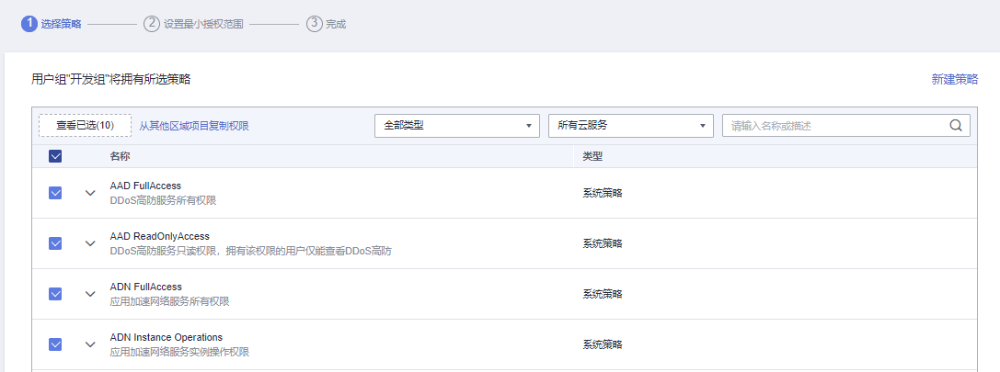

# 创建用户组并授权

管理员可以创建用户组，并给用户组授予策略或角色，然后将用户加入用户组，使得用户组中的用户获得相应的权限。IAM预置了各服务的常用权限，例如管理员权限、只读权限，管理员可以直接使用这些系统权限给用户组授权，授权后，用户就可以基于权限对云服务进行操作。详情请参见[给IAM用户授权](给IAM用户授权.md)。**如需查看所有云服务的系统权限，请参见：[系统权限](https://support.huaweicloud.com/usermanual-permissions/iam_01_0001.html)**。

## 前提条件

在创建用户组前，建议管理员提前了解并规划以下内容：

-   了解权限的[基本概念及分类](权限基本概念.md)。
-   **所有使用IAM授权的云服务的系统策略，请参考：[系统权限](https://support.huaweicloud.com/usermanual-permissions/iam_01_0001.html)**。

## 创建用户组

1.  管理员登录“统一身份认证控制台”。
2.  在统一身份认证服务，左侧导航窗格中，选择“用户组”页签，单击右上方的“创建用户组”。

    **图 1**  创建用户组  
    

3.  在“创建用户组”界面，输入“用户组名称”。
4.  单击“确定”，用户组创建完成，用户组列表中显示新创建的用户组。

    > **说明：** 
    >您最多可以创建20个用户组，如果当前资源配额无法满足业务需要，您可以申请扩大配额，具体方法请参见：[如何申请扩大配额？](调整配额.md#section18536123011437)。

## 给用户组授权

以下步骤仅适用于给用户组**新增权限**。如需**移除权限**，请参见：[移除用户组权限](移除用户组权限.md)。

1.  在用户组列表中，单击新建用户组右侧的“授权”。

    **图 2**  进入用户组权限设置页面  
    

2.  在用户组选择策略页面中，勾选需要授予用户组的权限。单击“下一步”。

    如果系统策略不满足授权要求，可以单击权限列表右上角的“新建策略”创建自定义策略，并勾选新创建的策略来进行精细的权限控制，自定义策略是对系统策略的扩展和补充。详情请参考[创建自定义策略](创建自定义策略.md)。

    **图 3**  选择权限  
    

3.  选择权限的作用范围。系统会根据您所选择的策略，自动推荐授权范围方案，便于为用户选择合适的授权作用范围，[表1](#table13959113218281)为IAM提供的所有授权范围方案。

    **表 1**  授权范围方案

    
    <table><thead align="left"><tr id="row119591322288"><th class="cellrowborder" valign="top" width="14.01%" id="mcps1.2.3.1.1">
可选方案

    </th>
    <th class="cellrowborder" valign="top" width="85.99%" id="mcps1.2.3.1.2">
方案说明

    </th>
    </tr>
    </thead>
    <tbody><tr id="row1959113212281"><td class="cellrowborder" valign="top" width="14.01%" headers="mcps1.2.3.1.1 ">
所有资源

    </td>
    <td class="cellrowborder" valign="top" width="85.99%" headers="mcps1.2.3.1.2 ">
IAM用户可以根据权限使用帐号中所有的区域项目、全局服务资源。

    </td>
    </tr>
    <tr id="row1095903212281"><td class="cellrowborder" valign="top" width="14.01%" headers="mcps1.2.3.1.1 ">
指定企业项目资源

    </td>
    <td class="cellrowborder" valign="top" width="85.99%" headers="mcps1.2.3.1.2 ">
选择指定企业项目，IAM用户可以根据权限使用该企业项目中的资源。<strong id="b1995910325281">仅开通企业项目后可选。</strong>

    
如果您暂未开通企业项目，将不支持基于企业项目授权，了解企业项目请参考：<a href="https://support.huaweicloud.com/usermanual-em/em_eps_01_0000.html" target="_blank" rel="noopener noreferrer">什么是企业项目管理</a>。如需开通，请参考：<a href="https://support.huaweicloud.com/usermanual-em/pm_topic_0002.html" target="_blank" rel="noopener noreferrer">开通企业项目</a>。

    </td>
    </tr>
    <tr id="row17959532122817"><td class="cellrowborder" valign="top" width="14.01%" headers="mcps1.2.3.1.1 ">
指定区域项目资源

    </td>
    <td class="cellrowborder" valign="top" width="85.99%" headers="mcps1.2.3.1.2 ">
选择指定区域项目，IAM用户可以根据权限使用该区域项目中的资源。

    
如果选择作用范围为“区域项目”，且所勾选的策略包含全局服务权限，系统自动将全局服务权限的作用范围设置为<strong id="b3947103313316">所有资源</strong>，勾选的区域项目权限的作用范围仍为指定区域项目。

    </td>
    </tr>
    <tr id="row1395916328285"><td class="cellrowborder" valign="top" width="14.01%" headers="mcps1.2.3.1.1 ">
全局服务资源

    </td>
    <td class="cellrowborder" valign="top" width="85.99%" headers="mcps1.2.3.1.2 ">
IAM用户可以根据权限使用全局服务。全局服务部署时不区分物理区域。访问全局级服务时，不需要切换区域，如对象存储服务（OBS）、内容分发网络（CDN）等。

    
如果选择作用范围为“全局服务”，且所勾选的策略包含项目级服务权限，系统自动将项目权限作用范围设置为<strong id="b4131527113818">所有资源</strong>，勾选的全局服务权限的作用范围仍为全局服务。

    </td>
    </tr>
    </tbody>
    </table>

4.  单击“确定”，完成用户组授权。

[表2](#table13217163713216)为常用权限，完整的权限列表请参见：**[系统权限](https://support.huaweicloud.com/usermanual-permissions/iam_01_0001.html)**。

> **说明：** 
>-   当一个用户被加入多个用户组，将会拥有所有已加入用户组的权限。
>-   更多有关权限的使用建议请参见：[多运维人员权限设置案例](https://support.huaweicloud.com/bestpractice-iam/iam_0430.html)、[依赖角色的授权方法](依赖角色的授权方法.md)、[自定义策略使用样例](自定义策略使用样例.md)。

**表 2**  常用权限

<table><thead align="left"><tr id="row152171037123216"><th class="cellrowborder" valign="top" width="16.098390160983904%" id="mcps1.2.5.1.1">
权限

</th>
<th class="cellrowborder" valign="top" width="26.487351264873517%" id="mcps1.2.5.1.2">
需要授予的策略

</th>
<th class="cellrowborder" valign="top" width="31.356864313568643%" id="mcps1.2.5.1.3">
权限说明

</th>
<th class="cellrowborder" valign="top" width="26.05739426057394%" id="mcps1.2.5.1.4">
授权范围

</th>
</tr>
</thead>
<tbody><tr id="row1621763713323"><td class="cellrowborder" valign="top" width="16.098390160983904%" headers="mcps1.2.5.1.1 ">
总负责人

</td>
<td class="cellrowborder" valign="top" width="26.487351264873517%" headers="mcps1.2.5.1.2 ">
FullAccess

</td>
<td class="cellrowborder" valign="top" width="31.356864313568643%" headers="mcps1.2.5.1.3 ">
支持基于策略授权服务的所有权限

</td>
<td class="cellrowborder" valign="top" width="26.05739426057394%" headers="mcps1.2.5.1.4 ">
所有资源

</td>
</tr>
<tr id="row9218137163210"><td class="cellrowborder" valign="top" width="16.098390160983904%" headers="mcps1.2.5.1.1 ">
管理资源

</td>
<td class="cellrowborder" valign="top" width="26.487351264873517%" headers="mcps1.2.5.1.2 ">
Tenant Administrator

</td>
<td class="cellrowborder" valign="top" width="31.356864313568643%" headers="mcps1.2.5.1.3 ">
除IAM外，其他所有服务的管理员权限

</td>
<td class="cellrowborder" valign="top" width="26.05739426057394%" headers="mcps1.2.5.1.4 ">
所有资源

</td>
</tr>
<tr id="row182181037143215"><td class="cellrowborder" valign="top" width="16.098390160983904%" headers="mcps1.2.5.1.1 ">
查看资源

</td>
<td class="cellrowborder" valign="top" width="26.487351264873517%" headers="mcps1.2.5.1.2 ">
Tenant Guest

</td>
<td class="cellrowborder" valign="top" width="31.356864313568643%" headers="mcps1.2.5.1.3 ">
所有资源的只读权限

</td>
<td class="cellrowborder" valign="top" width="26.05739426057394%" headers="mcps1.2.5.1.4 ">
所有资源

</td>
</tr>
<tr id="row12218737133211"><td class="cellrowborder" valign="top" width="16.098390160983904%" headers="mcps1.2.5.1.1 ">
管理IAM用户

</td>
<td class="cellrowborder" valign="top" width="26.487351264873517%" headers="mcps1.2.5.1.2 ">
Security Administrator

</td>
<td class="cellrowborder" valign="top" width="31.356864313568643%" headers="mcps1.2.5.1.3 ">
IAM的管理员权限

</td>
<td class="cellrowborder" valign="top" width="26.05739426057394%" headers="mcps1.2.5.1.4 ">
全局服务资源

</td>
</tr>
<tr id="row132188378323"><td class="cellrowborder" valign="top" width="16.098390160983904%" headers="mcps1.2.5.1.1 ">
管理费用

</td>
<td class="cellrowborder" valign="top" width="26.487351264873517%" headers="mcps1.2.5.1.2 ">
BSS Administrator

</td>
<td class="cellrowborder" valign="top" width="31.356864313568643%" headers="mcps1.2.5.1.3 ">
费用中心的管理员权限，包括管理发票、管理订单、管理合同、管理续费、查看账单等权限。

 说明： 

授权时，需要授予所有区域的“BSS Administrator”权限。

</td>
<td class="cellrowborder" valign="top" width="26.05739426057394%" headers="mcps1.2.5.1.4 ">
指定区域项目资源

</td>
</tr>
<tr id="row7218153703219"><td class="cellrowborder" rowspan="6" valign="top" width="16.098390160983904%" headers="mcps1.2.5.1.1 ">
计算域运维

</td>
<td class="cellrowborder" valign="top" width="26.487351264873517%" headers="mcps1.2.5.1.2 ">
ECS FullAccess

</td>
<td class="cellrowborder" valign="top" width="31.356864313568643%" headers="mcps1.2.5.1.3 ">
弹性云服务器的管理员权限

</td>
<td class="cellrowborder" valign="top" width="26.05739426057394%" headers="mcps1.2.5.1.4 ">
指定区域项目资源

</td>
</tr>
<tr id="row021814371321"><td class="cellrowborder" valign="top" headers="mcps1.2.5.1.1 ">
CCE FullAccess

</td>
<td class="cellrowborder" valign="top" headers="mcps1.2.5.1.2 ">
云容器引擎的管理员权限

</td>
<td class="cellrowborder" valign="top" headers="mcps1.2.5.1.3 ">
指定区域项目资源

</td>
</tr>
<tr id="row92181937113211"><td class="cellrowborder" valign="top" headers="mcps1.2.5.1.1 ">
CCI FullAccess

</td>
<td class="cellrowborder" valign="top" headers="mcps1.2.5.1.2 ">
云容器实例管理员权限

</td>
<td class="cellrowborder" valign="top" headers="mcps1.2.5.1.3 ">
指定区域项目资源

</td>
</tr>
<tr id="row19218537103212"><td class="cellrowborder" valign="top" headers="mcps1.2.5.1.1 ">
BMS FullAccess

</td>
<td class="cellrowborder" valign="top" headers="mcps1.2.5.1.2 ">
裸金属服务器的管理员权限

</td>
<td class="cellrowborder" valign="top" headers="mcps1.2.5.1.3 ">
指定区域项目资源

</td>
</tr>
<tr id="row621813711323"><td class="cellrowborder" valign="top" headers="mcps1.2.5.1.1 ">
IMS FullAccess

</td>
<td class="cellrowborder" valign="top" headers="mcps1.2.5.1.2 ">
镜像服务的管理员权限

</td>
<td class="cellrowborder" valign="top" headers="mcps1.2.5.1.3 ">
指定区域项目资源

</td>
</tr>
<tr id="row42185371325"><td class="cellrowborder" valign="top" headers="mcps1.2.5.1.1 ">
AutoScaling FullAccess

</td>
<td class="cellrowborder" valign="top" headers="mcps1.2.5.1.2 ">
弹性伸缩的管理员权限

</td>
<td class="cellrowborder" valign="top" headers="mcps1.2.5.1.3 ">
指定区域项目资源

</td>
</tr>
<tr id="row22191376325"><td class="cellrowborder" rowspan="2" valign="top" width="16.098390160983904%" headers="mcps1.2.5.1.1 ">
网络域运维

</td>
<td class="cellrowborder" valign="top" width="26.487351264873517%" headers="mcps1.2.5.1.2 ">
VPC FullAccess

</td>
<td class="cellrowborder" valign="top" width="31.356864313568643%" headers="mcps1.2.5.1.3 ">
虚拟私有云的管理员权限

</td>
<td class="cellrowborder" valign="top" width="26.05739426057394%" headers="mcps1.2.5.1.4 ">
指定区域项目资源

</td>
</tr>
<tr id="row1219183710326"><td class="cellrowborder" valign="top" headers="mcps1.2.5.1.1 ">
ELB FullAccess

</td>
<td class="cellrowborder" valign="top" headers="mcps1.2.5.1.2 ">
弹性负载均衡的管理员权限

</td>
<td class="cellrowborder" valign="top" headers="mcps1.2.5.1.3 ">
指定区域项目资源

</td>
</tr>
<tr id="row1321983715327"><td class="cellrowborder" rowspan="3" valign="top" width="16.098390160983904%" headers="mcps1.2.5.1.1 ">
数据库运维

</td>
<td class="cellrowborder" valign="top" width="26.487351264873517%" headers="mcps1.2.5.1.2 ">
RDS FullAccess

</td>
<td class="cellrowborder" valign="top" width="31.356864313568643%" headers="mcps1.2.5.1.3 ">
云数据库的管理员权限

</td>
<td class="cellrowborder" valign="top" width="26.05739426057394%" headers="mcps1.2.5.1.4 ">
指定区域项目资源

</td>
</tr>
<tr id="row172191537173220"><td class="cellrowborder" valign="top" headers="mcps1.2.5.1.1 ">
DDS FullAccess

</td>
<td class="cellrowborder" valign="top" headers="mcps1.2.5.1.2 ">
文档数据库服务的管理员权限

</td>
<td class="cellrowborder" valign="top" headers="mcps1.2.5.1.3 ">
指定区域项目资源

</td>
</tr>
<tr id="row10219193783220"><td class="cellrowborder" valign="top" headers="mcps1.2.5.1.1 ">
DDM FullAccess

</td>
<td class="cellrowborder" valign="top" headers="mcps1.2.5.1.2 ">
分布式数据库中间件的管理员权限

</td>
<td class="cellrowborder" valign="top" headers="mcps1.2.5.1.3 ">
指定区域项目资源

</td>
</tr>
<tr id="row92195373326"><td class="cellrowborder" rowspan="9" valign="top" width="16.098390160983904%" headers="mcps1.2.5.1.1 ">
安全领域运维

</td>
<td class="cellrowborder" valign="top" width="26.487351264873517%" headers="mcps1.2.5.1.2 ">
Anti-DDoS Administrator

</td>
<td class="cellrowborder" valign="top" width="31.356864313568643%" headers="mcps1.2.5.1.3 ">
Anti-DDoS流量清洗服务的管理员权限

</td>
<td class="cellrowborder" valign="top" width="26.05739426057394%" headers="mcps1.2.5.1.4 ">
指定区域项目资源

</td>
</tr>
<tr id="row1121913714325"><td class="cellrowborder" valign="top" headers="mcps1.2.5.1.1 ">
CAD Administrator

</td>
<td class="cellrowborder" valign="top" headers="mcps1.2.5.1.2 ">
DDoS高防服务的管理员权限

</td>
<td class="cellrowborder" valign="top" headers="mcps1.2.5.1.3 ">
指定区域项目资源

</td>
</tr>
<tr id="row12197377323"><td class="cellrowborder" valign="top" headers="mcps1.2.5.1.1 ">
WAF Administrator

</td>
<td class="cellrowborder" valign="top" headers="mcps1.2.5.1.2 ">
Web应用防火墙的管理员权限

</td>
<td class="cellrowborder" valign="top" headers="mcps1.2.5.1.3 ">
指定区域项目资源

</td>
</tr>
<tr id="row162191237103211"><td class="cellrowborder" valign="top" headers="mcps1.2.5.1.1 ">
VSS Administrator

</td>
<td class="cellrowborder" valign="top" headers="mcps1.2.5.1.2 ">
漏洞扫描服务的管理员权限

</td>
<td class="cellrowborder" valign="top" headers="mcps1.2.5.1.3 ">
指定区域项目资源

</td>
</tr>
<tr id="row022023743215"><td class="cellrowborder" valign="top" headers="mcps1.2.5.1.1 ">
CGS Administrator

</td>
<td class="cellrowborder" valign="top" headers="mcps1.2.5.1.2 ">
容器安全服务的管理员权限

</td>
<td class="cellrowborder" valign="top" headers="mcps1.2.5.1.3 ">
指定区域项目资源

</td>
</tr>
<tr id="row182201337143215"><td class="cellrowborder" valign="top" headers="mcps1.2.5.1.1 ">
KMS Administrator

</td>
<td class="cellrowborder" valign="top" headers="mcps1.2.5.1.2 ">
数据加密服务的管理员权限

</td>
<td class="cellrowborder" valign="top" headers="mcps1.2.5.1.3 ">
指定区域项目资源

</td>
</tr>
<tr id="row422023743219"><td class="cellrowborder" valign="top" headers="mcps1.2.5.1.1 ">
DBSS System Administrator

</td>
<td class="cellrowborder" valign="top" headers="mcps1.2.5.1.2 ">
数据库安全服务的管理员权限

</td>
<td class="cellrowborder" valign="top" headers="mcps1.2.5.1.3 ">
指定区域项目资源

</td>
</tr>
<tr id="row42201037143216"><td class="cellrowborder" valign="top" headers="mcps1.2.5.1.1 ">
SES Administrator

</td>
<td class="cellrowborder" valign="top" headers="mcps1.2.5.1.2 ">
安全专家服务的管理员权限

</td>
<td class="cellrowborder" valign="top" headers="mcps1.2.5.1.3 ">
指定区域项目资源

</td>
</tr>
<tr id="row4220837123217"><td class="cellrowborder" valign="top" headers="mcps1.2.5.1.1 ">
SC Administrator

</td>
<td class="cellrowborder" valign="top" headers="mcps1.2.5.1.2 ">
SSL证书管理服务的管理员权限

</td>
<td class="cellrowborder" valign="top" headers="mcps1.2.5.1.3 ">
指定区域项目资源

</td>
</tr>
</tbody>
</table>

