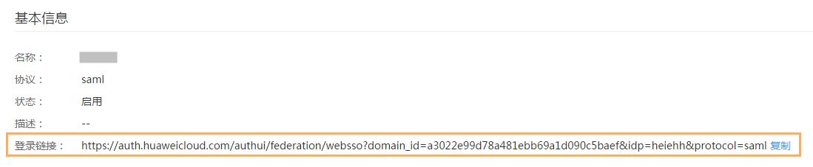

# 创建身份提供商

在IAM上创建身份提供商，并配置身份提供商的元数据文件后，可以使企业IdP认证的用户直接访问本系统。

## 背景信息

IAM仅支持使用SAML2.0协议进行联邦身份认证，因此企业IdP必须支持SAML2.0协议。

SAML（Security Assertion Markup Language）：安全断言标记语言，是一个在信任域之间交互认证、授权信息的XML标准。您可以通过以下网站了解更多关于SAML2.0协议的基本信息：[https://en.wikipedia.org/wiki/SAML\_2.0](https://en.wikipedia.org/wiki/SAML_2.0)。

## 前提条件

两个系统已建立信任关系。方法请参见[建立信任关系](建立信任关系.md)。

## 操作步骤

1.  在系统首页，单击“控制台“。
2.  单击右上方登录的用户，在下拉列表中选择“统一身份认证“。
3.  在左侧导航窗格中，单击“身份提供商“。
4.  在“身份提供商“界面，单击“创建身份提供商“。
5.  设置身份提供商的名称、启用或停用状态及描述信息。

    > **说明：**   
    >协议类型只支持saml。  

6.  单击“确定“。

    创建身份提供商成功，界面提示如[图1](#fig24618444143656)所示：

    **图 1**  创建身份提供商成功提示信息  
    

7.  配置身份提供商信息。单击界面提示中的“修改身份提供商“，界面提示关闭后，可以单击目标身份提供商“操作“列的“修改“。
8.  在“修改身份提供商“页面的“元数据配置“区域配置元数据，以下两种方式选择其中一种即可。

    元数据配置支持上传和手动编辑两种方式，如果元数据文件超过500KB，可以通过“手动编辑“配置元数据。

    -   上传元数据：
        1.  单击“上传文件“左侧的，选择获取的企业IdP的元数据文件。
        2.  单击“上传文件“。

            弹出页面显示系统提取到的元数据。

        3.  单击“确定“。
            -   提示“系统发现您上传的文件中包含多个身份提供商，请选择您本次需要使用的身份提供商“，请在“Entity ID“下拉框中选择您本次需要使用的身份提供商。
            -   提示元数据文件中Entity ID为空、签名证书过期等内容时，需要您确认元数据文件的正确性后，重新上传或者通过手动编辑提取元数据。

        4.  单击“确定“。
        5.  单击，可以查看系统提取的元数据详情。

    -   手动编辑元数据
        1.  单击“手动编辑“。
        2.  在“手动编辑元数据“页面中，输入“Entity ID“、“签名证书“和“SingleSignOnService“等参数。

            
            <table><thead align="left"><tr id="row17214019145813"><th class="cellrowborder" valign="top" width="30.259999999999998%" id="mcps1.1.3.1.1">
参数

            </th>
            <th class="cellrowborder" valign="top" width="69.74000000000001%" id="mcps1.1.3.1.2">
含义

            </th>
            </tr>
            </thead>
            <tbody><tr id="row521401925810"><td class="cellrowborder" valign="top" width="30.259999999999998%" headers="mcps1.1.3.1.1 ">
Entity ID

            </td>
            <td class="cellrowborder" valign="top" width="69.74000000000001%" headers="mcps1.1.3.1.2 ">
企业身份提供商的唯一标识，元数据文件中可能包含多个身份提供商，需要选择对应的身份提供商。

            </td>
            </tr>
            <tr id="row4214619145817"><td class="cellrowborder" valign="top" width="30.259999999999998%" headers="mcps1.1.3.1.1 ">
支持的协议

            </td>
            <td class="cellrowborder" valign="top" width="69.74000000000001%" headers="mcps1.1.3.1.2 ">
企业IdP与服务提供商之间，通过SAML协议完成联邦认证，IAM只支持SAML2.0协议。

            </td>
            </tr>
            <tr id="row1221431945819"><td class="cellrowborder" valign="top" width="30.259999999999998%" headers="mcps1.1.3.1.1 ">
支持的NameIdFormat

            </td>
            <td class="cellrowborder" valign="top" width="69.74000000000001%" headers="mcps1.1.3.1.2 ">
身份提供商支持的用户名称标识格式。 名称标识是身份提供商与联邦用户之间实现通信的一种方式。

            </td>
            </tr>
            <tr id="row19214101916586"><td class="cellrowborder" valign="top" width="30.259999999999998%" headers="mcps1.1.3.1.1 ">
签名证书

            </td>
            <td class="cellrowborder" valign="top" width="69.74000000000001%" headers="mcps1.1.3.1.2 ">
是一份包含公钥用于验证签名的证书，为了确保安全性，建议使用长度大于等于2048位的公钥。系统通过元数据文件中的签名证书来确认联邦认证过程中断言消息的可信性、完整性。

            </td>
            </tr>
            <tr id="row22141319185819"><td class="cellrowborder" valign="top" width="30.259999999999998%" headers="mcps1.1.3.1.1 ">
SingleSignOnService

            </td>
            <td class="cellrowborder" valign="top" width="69.74000000000001%" headers="mcps1.1.3.1.2 ">
单点登录过程中发送SAML请求的方式。元数据文件中的“SingleSignOnService”需要支持HTTP Redirect或HTTP POST方式。

            
 说明： 

单点登录详情请参见<a href="单点登录流程.md">单点登录流程</a>。

            

            </td>
            </tr>
            <tr id="row19214151905812"><td class="cellrowborder" valign="top" width="30.259999999999998%" headers="mcps1.1.3.1.1 ">
SingleLogoutService

            </td>
            <td class="cellrowborder" valign="top" width="69.74000000000001%" headers="mcps1.1.3.1.2 ">
服务提供商提供会话注销功能，联邦用户在IAM注销会话后返回绑定的地址。“SingleLogoutService” 需要支持HTTP Redirect或HTTP POST方式。

            </td>
            </tr>
            </tbody>
            </table>

        3.  单击“确定“。

9.  单击“确定“，保存设置信息。

## 结果验证

1.  单击目标身份提供商列表右侧的“查看“。

    **图 2**  身份提供商基本信息  
    

2.  单击“登录链接“右侧的“复制“，复制“登录链接“的地址，并在浏览器中打开。
3.  检查是否可以跳转到企业的IdP服务器提供的登录界面。

    > **说明：**   
    >如果跳转失败，请确认获取的企业元数据文件以及企业的IdP服务器是否配置正确。  

4.  输入用户名和密码验证是否可以登录到本系统。
    -   登录成功，将该地址以链接的形式配置到您自己的企业网站。方法请参考[配置页面单点登录](配置页面单点登录.md)。
    -   登录失败，请检查您的用户名和密码。

## 后续处理

-   在“身份转换规则“区域，创建身份转换规则。身份转换规则详情请参见[通过规则控制联邦用户访问权限](通过规则控制联邦用户访问权限.md)。
-   在企业管理系统中配置单点登录，方法请参考：[配置页面单点登录](配置页面单点登录.md)。

## 相关任务

-   查看身份提供商信息：在身份提供商列表中，单击“查看“，可查看身份提供商的基本信息、元数据详情、身份转换规则。

    > **说明：**   
    >单击“查看身份提供商“页面下方的“修改身份提供商“，可直接进入“修改身份提供商“界面。  

-   修改身份提供商信息：在身份提供商列表中，单击“修改“进入“修改身份提供商“界面。可修改身份提供商的状态（“启用“或“停用“）、描述信息、元数据信息和身份转换规则。
-   删除身份提供商：在身份提供商列表中，单击“删除“，删除对应的身份提供商。

