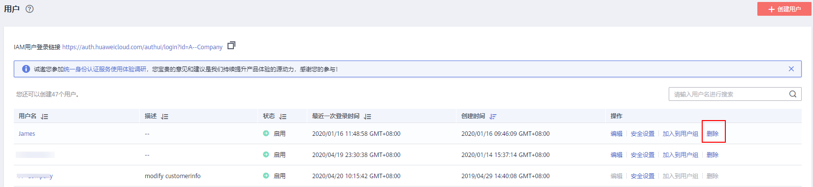
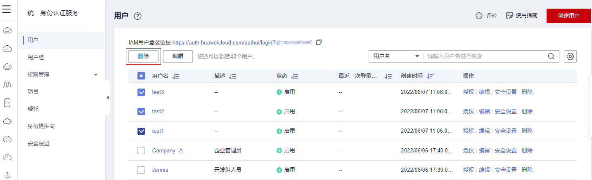

# 删除IAM用户

> **注意：** 
>请谨慎删除IAM用户，删除后该IAM用户将无法登录，该用户的IAM用户名、IAM密码、访问密钥、及其所有IAM授权关系将被清除且不可恢复。
>-   请排查要删除的用户是否有其他服务或场景在使用，若无法确定，建议先使用"停用"功能，以免业务运行失败后无法回退。如需暂时停用IAM用户，请参考[基本信息](查看或修改IAM用户信息.md#section9175812485)，批量停用请参考[批量修改IAM用户信息](查看或修改IAM用户信息.md#section741315524012)。
>-   如需将IAM用户从某个用户组移除，请参见：[用户组添加/移除用户](用户组添加-移除用户.md)。

## 操作步骤

1.  进入IAM控制台，在左侧导航栏选择“用户”页签。
2.  单击需要删除的IAM用户操作列的“删除”，确认弹窗中删除用户的信息，单击“是”，删除成功。

    **图 1**  删除IAM用户  
    

## 批量删除IAM用户

1.  进入IAM控制台，在左侧导航栏选择“用户”页签。
2.  在用户列表中，勾选需要删除的用户。勾选完成后，单击用户列表上方的“删除”。

    **图 2**  批量删除IAM用户  
    

3.  弹窗中单击“是”，完成所选IAM用户删除。

