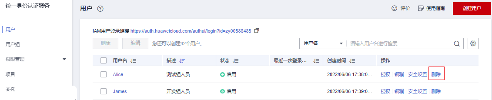

# 删除IAM用户

> **注意：** 
>请谨慎删除IAM用户，删除后该IAM用户的所有数据将被删除且不可恢复。如仅想将IAM用户从某个用户组移除，请参见：[用户组添加/移除用户](用户组添加-移除用户.md)。

## 操作步骤

1.  进入IAM控制台，在左侧导航栏选择“用户”页签。
2.  单击需要删除的IAM用户操作列的“删除”，确认弹窗中删除用户的信息，单击“是”，删除成功。

    **图 1**  删除IAM用户  
    

