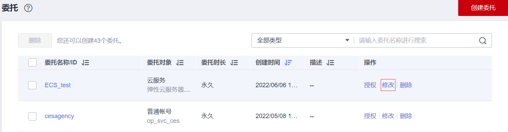
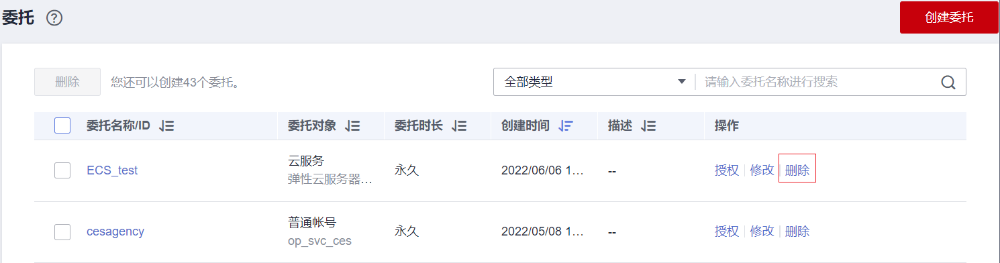
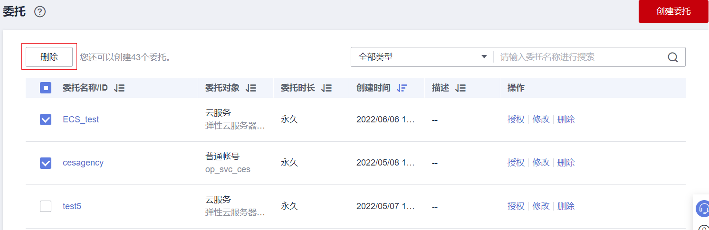

# 删除或修改委托

## 修改委托

如果需要修改委托的权限、持续时间、描述等，可以在委托列表中，单击委托右侧的“修改”，修改委托。

**图 1**  修改委托  

> **说明：** 
>-   云服务委托支持修改云服务、持续时间、描述、权限，委托名称、类型不支持修改。
>-   修改云服务委托权限后可能会影响该云服务部分功能的使用，请谨慎操作。

## 删除委托

如果不再需要使用委托，可以在委托列表中，单击委托右侧的“删除”，删除委托。

**图 2**  单点删除委托  

## 批量删除委托

如果需要删除多个委托，可在委托列表中勾选需要删除的委托，然后单击列表上方的“删除”。

**图 3**  批量删除委托  

> **说明：** 
>删除委托后，将撤销被委托方帐号的权限，被委托方将无法管理您的委托资源，对您的其他业务合作伙伴没有影响。

