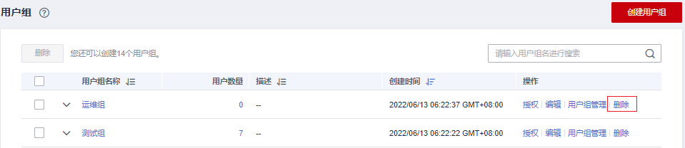
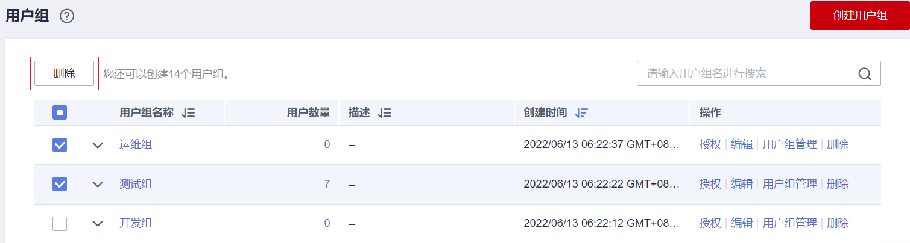

# 删除用户组

## 操作步骤

当您需要删除用户组，请参考以下操作：

1.  进入IAM控制台，在左侧导航栏选择“用户组”页签。
2.  在用户组列表中，单击用户组右侧的“删除”。

    **图 1**  删除用户组  
    

3.  在弹窗中选择“是”，删除勾选的用户组。

## 批量删除用户组

当您需要一次性删除多个用户组时，请参考以下操作：

1.  进入IAM控制台，在左侧导航栏选择“用户组”页签。
2.  勾选需要删除的用户组，单击用户组列表上方的“删除”。

    

3.  在弹窗中，选择“是”，删除用户组。

