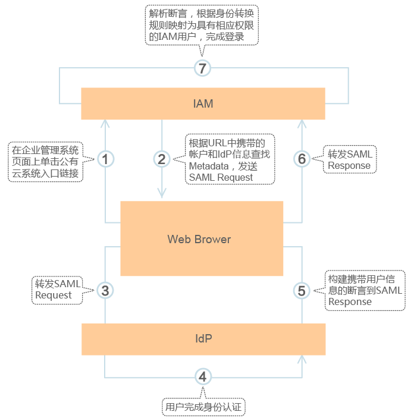

# 单点登录流程

完成联邦认证配置后，联邦用户通过企业IdP登录认证后可以直接访问本系统。本章介绍通过IdP认证后如何在IAM中进行认证。

**图 1**  登录流程模型  

## 步骤说明

> **说明：**   
>为方便您查看交互的请求及断言消息，建议您使用Chrome浏览器并安装插件“SAML Message Decoder“。  

1.  在浏览器中打开创建身份提供商后生成的登录链接，Web Browser发起单点登录。
2.  IAM根据链接中携带的账号和IdP信息，查找出企业IdP的Metadata文件，构建SAML Request，响应到浏览器。
3.  浏览器响应后转发SAML Request到企业IdP。
4.  用户在IdP服务器，输入用户名和密码等完成身份认证。
5.  IdP服务器构造断言到SAML Response，响应到浏览器中。
6.  浏览响应后转发SAML Response到IAM。
7.  IAM从SAML Response取出断言进行解析，并根据配置的规则，生成Token，完成登录。

    > **说明：**   
    >断言中要携带签名，否则会导致登录失败。  

