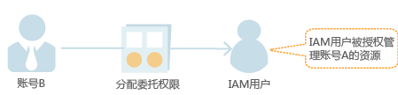
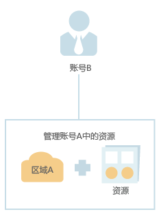

# 基本流程

通过委托信任功能，您可以将自己账号中的资源操作权限委托给更专业、高效的其他华为云账号，被委托的账号可以根据权限代替您进行资源运维工作。

> **说明：**   
>只能对华为云账号进行委托，不能对IAM用户进行委托。  

如下以A账号委托B账号管理资源为例，讲述委托的原理及方法。A账号为委托方，B账号为被委托方。

1.  账号A创建委托。

    

      

2.  （可选）账号B分配委托权限。

    1.  创建用户组并授予用户组管理委托的权限。
    2.  创建用户并将用户加入到用户组中。

    

      

3.  账号B或者IAM用户管理委托资源。

    1.  登录自己的华为云账号，切换角色到账号A。
    2.  切换到被授权的区域A，管理账号A的资源。

    

