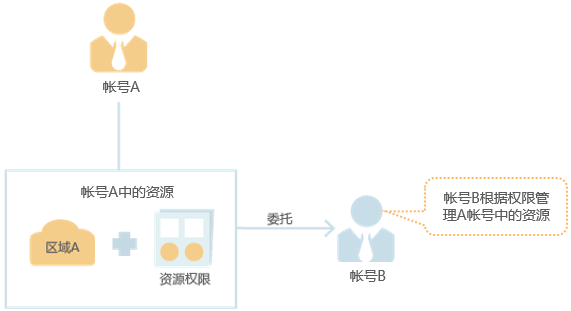
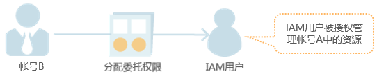
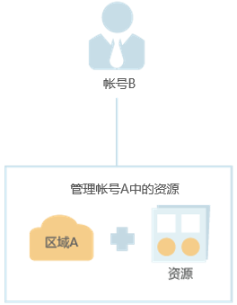

# 基本流程

通过委托信任功能，您可以将自己帐号中的资源操作权限委托给更专业、高效的其他帐号，被委托的帐号可以根据权限代替您进行资源运维工作。

> **说明：** 
>只能对帐号进行委托，不能对IAM用户进行委托。

如下以A帐号委托B帐号管理资源为例，讲述委托的原理及方法。A帐号为委托方，B帐号为被委托方。

1.  帐号A创建委托。

    **图 1**  帐号A创建委托  
    

      

2.  （可选）帐号B分配委托权限。

    1.  创建用户组并授予用户组管理委托的权限。
    2.  创建用户并将用户加入到用户组中。

    **图 2**  帐号B分配委托权限  
    

3.  帐号B或者IAM用户管理委托资源。

    1.  被委托方登录自己的帐号，切换角色到帐号A。
    2.  切换到被授权的区域A，管理帐号A的资源。

    **图 3**  帐号B切换角色  
    

