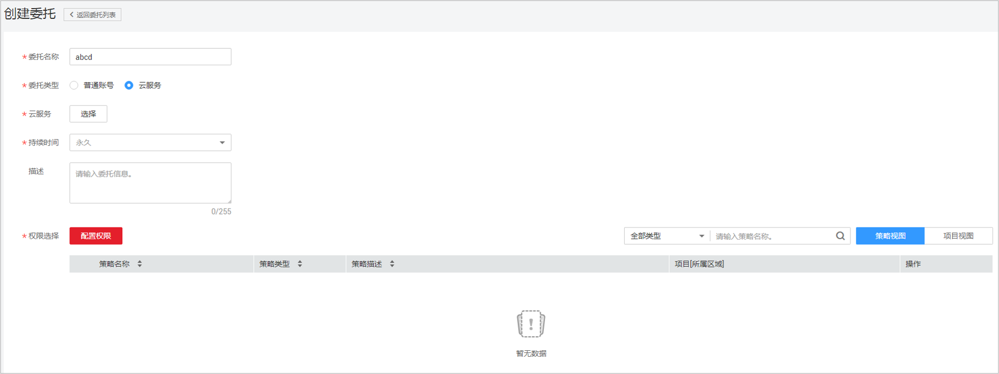

# 委托其他云服务管理资源

由于华为云各服务之间存在业务交互关系，一些云服务需要与其他云服务协同工作，需要您创建云服务委托，将操作权限委托给该服务，让该服务以您的身份使用其他云服务，代替您进行一些资源运维工作。

例如：在使用Elasticsearch服务时，Elasticsearch服务请求获取您其他云服务和资源的权限，创建委托并授权后，在发生故障转移时，Elasticsearch可以使用这个委托将您的弹性IP绑定到主Elasticsearch实例，帮助您进行资源运维。

## 操作步骤

1.  登录华为云，在右上角单击“控制台”。

    

2.  在控制台页面，鼠标移动至右上方的用户名，在下拉列表中选择“统一身份认证”。

    

3.  在统一身份认证服务的左侧导航窗格中，单击“委托 \> 创建委托“。
4.  在创建委托页面，设置“委托名称”。

    

5.  “委托类型”选择“云服务”，在“云服务”中选择需要授权的云服务。
6.  “持续时间”选择“永久”。
7.  在“权限选择”区域中，在“全局”和“对象存储服务”项目中设置“Tenant Administrator”权限，在除“全局服务”以外的其他需要授权的区域，例如“华北-北京一”，设置“Tenant Administrator”权限。
8.  单击“确定”，委托创建完成，委托列表中显示新创建的委托。

    > **说明：**   
    >委托类型为云服务的委托不支持修改，如果要修改委托的名称、权限等，需要删除后重新创建。  

## 相关操作

-   修改委托

    如果需要修改云服务委托的权限，可以在委托列表中，单击委托右侧的“修改”，修改委托。

    > **说明：**   
    >-   云服务委托仅支持修改权限，委托名称、类型、云服务、持续时间、描述均不支持修改。  
    >-   修改权限后可能会影响该云服务部分功能的使用，请谨慎操作。  

-   删除委托

    如果不再需要使用委托，可以在委托列表中，单击委托右侧的“删除”，删除委托。

