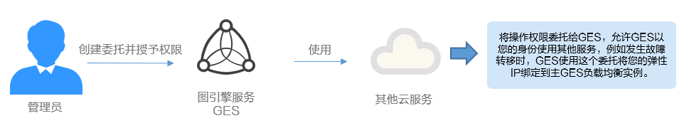
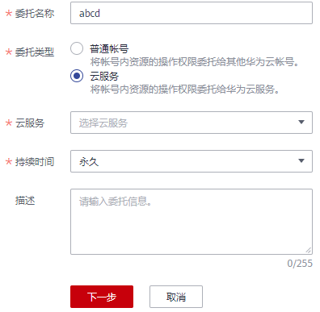

# 委托其他云服务管理资源

由于华为云各服务之间存在业务交互关系，一些云服务需要与其他云服务协同工作，需要您创建云服务委托，将操作权限委托给该服务，让该服务以您的身份使用其他云服务，代替您进行一些资源运维工作。

当前IAM提供两种创建委托方式：

1.  [在IAM控制台创建云服务委托](#section930952513442)

    以图引擎服务 GES为例：将操作权限委托给GES，允许GES以您的身份使用其他服务，例如发生故障转移时，GES使用这个委托将您的弹性IP绑定到主GES负载均衡实例。

    **图 1**  云服务委托  
    

2.  在云服务控制台使用某项资源时，系统提示您自动创建委托，以完成云服务间的协同工作。

    以创建弹性文件服务SFS委托为例：

    1.  在SFS控制台创建文件系统。
    2.  在创建文件系统页面，开启“静态数据加密”。
    3.  弹窗提示需要创建SFS委托，单击“确定”，系统自动为您在当前项目创建SFS委托，并授予KMS CMKFullAccess权限，授权成功后，SFS可以获取KMS密钥用来加解密文件系统。
    4.  您可以在IAM控制台的委托列表中查看已创建的委托。

## 在IAM控制台创建云服务委托

1.  登录统一身份认证服务控制台。
2.  在统一身份认证服务的左侧导航窗格中，选择“委托”页签，单击“创建委托“。
3.  在创建委托页面，设置“委托名称”。

    **图 2**  云服务委托名称  
    

4.  “委托类型”选择“云服务”，在“云服务”中选择需要授权的云服务。
5.  选择“持续时间”。
6.  （可选）填写“委托描述”。建议填写描述信息，如将KMS Administrator权限委托给GES。
7.  单击“下一步”，进入授权页面。
8.  设置作用范围为“全局服务”，并勾选“Tenant Administrator”权限，单击“确定”，设置全局服务权限。
9.  在委托详情页面。“授权记录”页签下，单击“授权”，设置作用范围为“区域级项目”，并选择项目，例如“华北-北京一”，勾选“Tenant Administrator”权限，设置区域级项目权限。
10. 单击“确定”，委托创建完成。

## 相关操作

-   修改委托

    如果需要修改云服务委托的权限，可以在委托列表中，单击委托右侧的“修改”，修改委托。

    > **说明：** 
    >-   云服务委托支持修改云服务、持续时间、描述、权限，委托名称、类型不支持修改。
    >-   修改权限后可能会影响该云服务部分功能的使用，请谨慎操作。

-   删除委托

    如果不再需要使用委托，可以在委托列表中，单击委托右侧的“删除”，删除委托。

