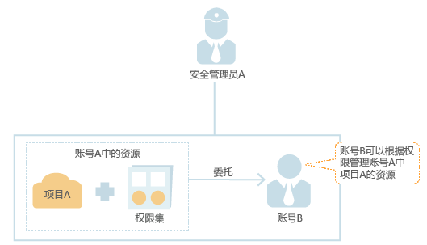
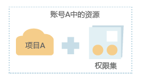

# 委托其他账号管理资源

当需要与其他账号共享资源，或需要委托其他账号管理资源时，可以创建委托并授予被委托方资源管理权限。

以账号A委托账号B管理账号A中的某些资源为例，讲述委托的原理及方法。

1.  账号A的安全管理员A创建委托。

    **图 1**  创建委托模型  
    

2.  账号B的安全管理员B授予用户Job管理账号A资源的权限（Agent Operator）。

    1.  创建用户组（如：Agency）并授予Agent Operator权限。
    2.  将用户Job加入到用户组（Agency）中。

    **图 2**  委托授权模型  
    

3.  账号B的用户Job根据权限管理账号A的资源。

    1.  Job登录系统，并切换角色到账号A。
    2.  切换到项目A。
    3.  根据权限管理账号A的资源。

    **图 3**  管理委托模型  
    

