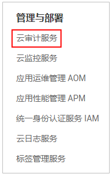
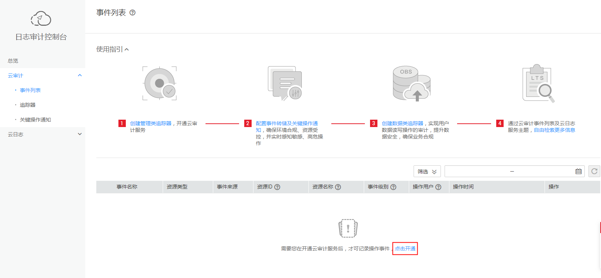
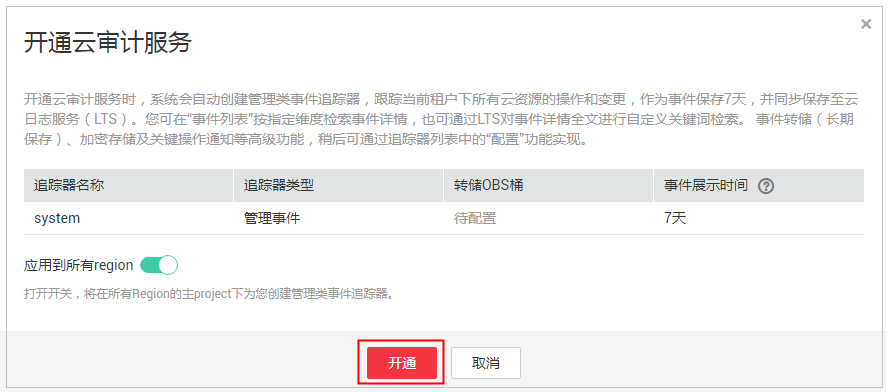

# 开通云审计服务

云审计服务（Cloud Trace Service，以下简称CTS），是华为云安全解决方案中专业的日志审计服务，提供对各种云资源操作记录的收集、存储和查询功能，可用于支撑安全分析、合规审计、资源跟踪和问题定位等常见应用场景。为了方便查看IAM的关键操作事件，例如创建用户、删除用户等，建议管理员开启云审计服务。

## 操作步骤

1.  管理员在控制台页面所有服务中，选择“管理与部署”\>“云审计服务”。

    

2.  在日志审计控制台，开通云审计服务。

    

    

3.  在IAM进行操作，例如创建用户、用户组等，CTS将会记录这些操作。CTS支持记录的IAM相关的操作事件，如[表1](#table13159538114510)所示。

    **表 1**  CTS支持的IAM操作列表

    
    <table><thead align="left"><tr id="row91461738194513"><th class="cellrowborder" valign="top" width="33.86%" id="mcps1.2.4.1.1">
操作名称

    </th>
    <th class="cellrowborder" valign="top" width="32.940000000000005%" id="mcps1.2.4.1.2">
资源类型

    </th>
    <th class="cellrowborder" valign="top" width="33.2%" id="mcps1.2.4.1.3">
事件名称

    </th>
    </tr>
    </thead>
    <tbody><tr id="row214773894512"><td class="cellrowborder" valign="top" width="33.86%" headers="mcps1.2.4.1.1 ">
用户登录

    </td>
    <td class="cellrowborder" valign="top" width="32.940000000000005%" headers="mcps1.2.4.1.2 ">
user

    </td>
    <td class="cellrowborder" valign="top" width="33.2%" headers="mcps1.2.4.1.3 ">
login

    </td>
    </tr>
    <tr id="row214813380457"><td class="cellrowborder" valign="top" width="33.86%" headers="mcps1.2.4.1.1 ">
用户登出

    </td>
    <td class="cellrowborder" valign="top" width="32.940000000000005%" headers="mcps1.2.4.1.2 ">
user

    </td>
    <td class="cellrowborder" valign="top" width="33.2%" headers="mcps1.2.4.1.3 ">
logout

    </td>
    </tr>
    <tr id="row31487389452"><td class="cellrowborder" valign="top" width="33.86%" headers="mcps1.2.4.1.1 ">
创建用户

    </td>
    <td class="cellrowborder" valign="top" width="32.940000000000005%" headers="mcps1.2.4.1.2 ">
user

    </td>
    <td class="cellrowborder" valign="top" width="33.2%" headers="mcps1.2.4.1.3 ">
createUser

    </td>
    </tr>
    <tr id="row1714911388458"><td class="cellrowborder" valign="top" width="33.86%" headers="mcps1.2.4.1.1 ">
修改用户信息

    </td>
    <td class="cellrowborder" valign="top" width="32.940000000000005%" headers="mcps1.2.4.1.2 ">
user

    </td>
    <td class="cellrowborder" valign="top" width="33.2%" headers="mcps1.2.4.1.3 ">
updateUser

    </td>
    </tr>
    <tr id="row914973819454"><td class="cellrowborder" valign="top" width="33.86%" headers="mcps1.2.4.1.1 ">
修改邮箱

    </td>
    <td class="cellrowborder" valign="top" width="32.940000000000005%" headers="mcps1.2.4.1.2 ">
user

    </td>
    <td class="cellrowborder" valign="top" width="33.2%" headers="mcps1.2.4.1.3 ">
modifyUserEmail

    </td>
    </tr>
    <tr id="row214983894517"><td class="cellrowborder" valign="top" width="33.86%" headers="mcps1.2.4.1.1 ">
修改手机

    </td>
    <td class="cellrowborder" valign="top" width="32.940000000000005%" headers="mcps1.2.4.1.2 ">
user

    </td>
    <td class="cellrowborder" valign="top" width="33.2%" headers="mcps1.2.4.1.3 ">
modifyUserMobile

    </td>
    </tr>
    <tr id="row7150338114513"><td class="cellrowborder" valign="top" width="33.86%" headers="mcps1.2.4.1.1 ">
用户修改密码

    </td>
    <td class="cellrowborder" valign="top" width="32.940000000000005%" headers="mcps1.2.4.1.2 ">
user

    </td>
    <td class="cellrowborder" valign="top" width="33.2%" headers="mcps1.2.4.1.3 ">
changePassword

    </td>
    </tr>
    <tr id="row31501384451"><td class="cellrowborder" valign="top" width="33.86%" headers="mcps1.2.4.1.1 ">
管理员修改用户密码

    </td>
    <td class="cellrowborder" valign="top" width="32.940000000000005%" headers="mcps1.2.4.1.2 ">
user

    </td>
    <td class="cellrowborder" valign="top" width="33.2%" headers="mcps1.2.4.1.3 ">
modifyUserPassword

    </td>
    </tr>
    <tr id="row8151163819454"><td class="cellrowborder" valign="top" width="33.86%" headers="mcps1.2.4.1.1 ">
删除用户

    </td>
    <td class="cellrowborder" valign="top" width="32.940000000000005%" headers="mcps1.2.4.1.2 ">
user

    </td>
    <td class="cellrowborder" valign="top" width="33.2%" headers="mcps1.2.4.1.3 ">
deleteUser

    </td>
    </tr>
    <tr id="row5151113814456"><td class="cellrowborder" valign="top" width="33.86%" headers="mcps1.2.4.1.1 ">
创建访问密钥AK/SK

    </td>
    <td class="cellrowborder" valign="top" width="32.940000000000005%" headers="mcps1.2.4.1.2 ">
user

    </td>
    <td class="cellrowborder" valign="top" width="33.2%" headers="mcps1.2.4.1.3 ">
addCredential

    </td>
    </tr>
    <tr id="row8152193816458"><td class="cellrowborder" valign="top" width="33.86%" headers="mcps1.2.4.1.1 ">
删除访问密钥AK/SK

    </td>
    <td class="cellrowborder" valign="top" width="32.940000000000005%" headers="mcps1.2.4.1.2 ">
user

    </td>
    <td class="cellrowborder" valign="top" width="33.2%" headers="mcps1.2.4.1.3 ">
deleteCredential

    </td>
    </tr>
    <tr id="row3152133815451"><td class="cellrowborder" valign="top" width="33.86%" headers="mcps1.2.4.1.1 ">
登录开启登录认证

    </td>
    <td class="cellrowborder" valign="top" width="32.940000000000005%" headers="mcps1.2.4.1.2 ">
user

    </td>
    <td class="cellrowborder" valign="top" width="33.2%" headers="mcps1.2.4.1.3 ">
modifySMVerify

    </td>
    </tr>
    <tr id="row1415317385454"><td class="cellrowborder" valign="top" width="33.86%" headers="mcps1.2.4.1.1 ">
上传头像

    </td>
    <td class="cellrowborder" valign="top" width="32.940000000000005%" headers="mcps1.2.4.1.2 ">
user

    </td>
    <td class="cellrowborder" valign="top" width="33.2%" headers="mcps1.2.4.1.3 ">
modifyUserPicture

    </td>
    </tr>
    <tr id="row1015383810458"><td class="cellrowborder" valign="top" width="33.86%" headers="mcps1.2.4.1.1 ">
创建用户组

    </td>
    <td class="cellrowborder" valign="top" width="32.940000000000005%" headers="mcps1.2.4.1.2 ">
userGroup

    </td>
    <td class="cellrowborder" valign="top" width="33.2%" headers="mcps1.2.4.1.3 ">
createGroup

    </td>
    </tr>
    <tr id="row5153938134510"><td class="cellrowborder" valign="top" width="33.86%" headers="mcps1.2.4.1.1 ">
更新用户组

    </td>
    <td class="cellrowborder" valign="top" width="32.940000000000005%" headers="mcps1.2.4.1.2 ">
userGroup

    </td>
    <td class="cellrowborder" valign="top" width="33.2%" headers="mcps1.2.4.1.3 ">
updateGroup

    </td>
    </tr>
    <tr id="row1153123813456"><td class="cellrowborder" valign="top" width="33.86%" headers="mcps1.2.4.1.1 ">
删除用户组

    </td>
    <td class="cellrowborder" valign="top" width="32.940000000000005%" headers="mcps1.2.4.1.2 ">
userGroup

    </td>
    <td class="cellrowborder" valign="top" width="33.2%" headers="mcps1.2.4.1.3 ">
deleteGroup

    </td>
    </tr>
    <tr id="row4154113812457"><td class="cellrowborder" valign="top" width="33.86%" headers="mcps1.2.4.1.1 ">
添加用户到用户组

    </td>
    <td class="cellrowborder" valign="top" width="32.940000000000005%" headers="mcps1.2.4.1.2 ">
userGroup

    </td>
    <td class="cellrowborder" valign="top" width="33.2%" headers="mcps1.2.4.1.3 ">
addUserToGroup

    </td>
    </tr>
    <tr id="row13154203816455"><td class="cellrowborder" valign="top" width="33.86%" headers="mcps1.2.4.1.1 ">
从用户组删除用户

    </td>
    <td class="cellrowborder" valign="top" width="32.940000000000005%" headers="mcps1.2.4.1.2 ">
userGroup

    </td>
    <td class="cellrowborder" valign="top" width="33.2%" headers="mcps1.2.4.1.3 ">
removeUserFromGroup

    </td>
    </tr>
    <tr id="row1515553814511"><td class="cellrowborder" valign="top" width="33.86%" headers="mcps1.2.4.1.1 ">
创建项目

    </td>
    <td class="cellrowborder" valign="top" width="32.940000000000005%" headers="mcps1.2.4.1.2 ">
project

    </td>
    <td class="cellrowborder" valign="top" width="33.2%" headers="mcps1.2.4.1.3 ">
createProject

    </td>
    </tr>
    <tr id="row111551538164516"><td class="cellrowborder" valign="top" width="33.86%" headers="mcps1.2.4.1.1 ">
修改项目

    </td>
    <td class="cellrowborder" valign="top" width="32.940000000000005%" headers="mcps1.2.4.1.2 ">
project

    </td>
    <td class="cellrowborder" valign="top" width="33.2%" headers="mcps1.2.4.1.3 ">
updateProject

    </td>
    </tr>
    <tr id="row11155163874514"><td class="cellrowborder" valign="top" width="33.86%" headers="mcps1.2.4.1.1 ">
创建委托

    </td>
    <td class="cellrowborder" valign="top" width="32.940000000000005%" headers="mcps1.2.4.1.2 ">
agency

    </td>
    <td class="cellrowborder" valign="top" width="33.2%" headers="mcps1.2.4.1.3 ">
createAgency

    </td>
    </tr>
    <tr id="row3156133894514"><td class="cellrowborder" valign="top" width="33.86%" headers="mcps1.2.4.1.1 ">
修改委托

    </td>
    <td class="cellrowborder" valign="top" width="32.940000000000005%" headers="mcps1.2.4.1.2 ">
agency

    </td>
    <td class="cellrowborder" valign="top" width="33.2%" headers="mcps1.2.4.1.3 ">
updateAgency

    </td>
    </tr>
    <tr id="row8156938174518"><td class="cellrowborder" valign="top" width="33.86%" headers="mcps1.2.4.1.1 ">
删除委托

    </td>
    <td class="cellrowborder" valign="top" width="32.940000000000005%" headers="mcps1.2.4.1.2 ">
agency

    </td>
    <td class="cellrowborder" valign="top" width="33.2%" headers="mcps1.2.4.1.3 ">
deleteAgency

    </td>
    </tr>
    <tr id="row315693814458"><td class="cellrowborder" valign="top" width="33.86%" headers="mcps1.2.4.1.1 ">
切换角色

    </td>
    <td class="cellrowborder" valign="top" width="32.940000000000005%" headers="mcps1.2.4.1.2 ">
user

    </td>
    <td class="cellrowborder" valign="top" width="33.2%" headers="mcps1.2.4.1.3 ">
switchRole

    </td>
    </tr>
    <tr id="row615616383452"><td class="cellrowborder" valign="top" width="33.86%" headers="mcps1.2.4.1.1 ">
创建身份提供商

    </td>
    <td class="cellrowborder" valign="top" width="32.940000000000005%" headers="mcps1.2.4.1.2 ">
identityProvider

    </td>
    <td class="cellrowborder" valign="top" width="33.2%" headers="mcps1.2.4.1.3 ">
createIdentityProvider

    </td>
    </tr>
    <tr id="row11571138174512"><td class="cellrowborder" valign="top" width="33.86%" headers="mcps1.2.4.1.1 ">
更新身份提供商

    </td>
    <td class="cellrowborder" valign="top" width="32.940000000000005%" headers="mcps1.2.4.1.2 ">
identityProvider

    </td>
    <td class="cellrowborder" valign="top" width="33.2%" headers="mcps1.2.4.1.3 ">
updateIdentityProvider

    </td>
    </tr>
    <tr id="row815710387451"><td class="cellrowborder" valign="top" width="33.86%" headers="mcps1.2.4.1.1 ">
删除身份提供商

    </td>
    <td class="cellrowborder" valign="top" width="32.940000000000005%" headers="mcps1.2.4.1.2 ">
identityProvider

    </td>
    <td class="cellrowborder" valign="top" width="33.2%" headers="mcps1.2.4.1.3 ">
deleteIdentityProvider

    </td>
    </tr>
    <tr id="row16157113834513"><td class="cellrowborder" valign="top" width="33.86%" headers="mcps1.2.4.1.1 ">
更新IdP元数据

    </td>
    <td class="cellrowborder" valign="top" width="32.940000000000005%" headers="mcps1.2.4.1.2 ">
identityProvider

    </td>
    <td class="cellrowborder" valign="top" width="33.2%" headers="mcps1.2.4.1.3 ">
updateMetaConfigure

    </td>
    </tr>
    <tr id="row1415816388456"><td class="cellrowborder" valign="top" width="33.86%" headers="mcps1.2.4.1.1 ">
更新登录验证策略

    </td>
    <td class="cellrowborder" valign="top" width="32.940000000000005%" headers="mcps1.2.4.1.2 ">
domain

    </td>
    <td class="cellrowborder" valign="top" width="33.2%" headers="mcps1.2.4.1.3 ">
updateSecurityPolicies

    </td>
    </tr>
    <tr id="row91580383457"><td class="cellrowborder" valign="top" width="33.86%" headers="mcps1.2.4.1.1 ">
更新密码策略

    </td>
    <td class="cellrowborder" valign="top" width="32.940000000000005%" headers="mcps1.2.4.1.2 ">
domain

    </td>
    <td class="cellrowborder" valign="top" width="33.2%" headers="mcps1.2.4.1.3 ">
updatePasswordPolicies

    </td>
    </tr>
    <tr id="row4158338194510"><td class="cellrowborder" valign="top" width="33.86%" headers="mcps1.2.4.1.1 ">
更新访问控制列表

    </td>
    <td class="cellrowborder" valign="top" width="32.940000000000005%" headers="mcps1.2.4.1.2 ">
domain

    </td>
    <td class="cellrowborder" valign="top" width="33.2%" headers="mcps1.2.4.1.3 ">
updateACLPolicies

    </td>
    </tr>
    <tr id="row915963834513"><td class="cellrowborder" valign="top" width="33.86%" headers="mcps1.2.4.1.1 ">
更新操作保护

    </td>
    <td class="cellrowborder" valign="top" width="32.940000000000005%" headers="mcps1.2.4.1.2 ">
domain

    </td>
    <td class="cellrowborder" valign="top" width="33.2%" headers="mcps1.2.4.1.3 ">
updateOperationProtection

    </td>
    </tr>
    </tbody>
    </table>

