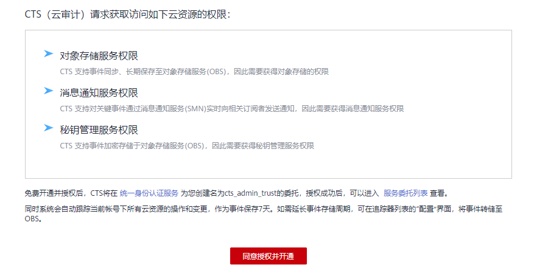

# 开通云审计服务

云审计服务（Cloud Trace Service，以下简称CTS），是华为云安全解决方案中专业的日志审计服务，提供对各种云资源操作记录的收集、存储和查询功能，可用于支撑安全分析、合规审计、资源跟踪和问题定位等常见应用场景。

为了方便查看IAM的关键操作事件，例如创建用户、删除用户等，建议管理员开启云审计服务。

## 操作步骤

1.  登录管理控制台。
2.  如果您是以主账号登录华为云，请直接进行[3](#li187371137382)；如果您是以IAM用户登录华为云，需要联系管理员对IAM用户授予以下权限：

    -   Security Administrator
    -   CTS FullAccess

    授权方法请参见[给IAM用户授权](给IAM用户授权.md)。

3.  选择“服务列表 \> 管理与监管 \> 云审计服务”，进入云审计服务授权页面，如下图所示。

    **图 1**  云审计服务授权  
    

4.  单击“同意授权并开通”，进入云审计服务页面。

    > **说明：** 
    >-   后续使用云审计服务，仅需拥有云审计服务相关权限即可，无需拥有Security Administrator权限。
    >-   同意授权并开通CTS服务后，系统会自动为您创建以下管理追踪器，用于记录管理事件，即针对所有云资源的操作日志，例如创建、登录、删除等：
    >    -   自动在**当前region**创建1个管理追踪器，用于记录项目级服务的管理事件。
    >    -   自动在**华北-北京四**区域创建1个管理追踪器，用于记录全局服务（如IAM服务）的管理事件。

在IAM进行操作，例如创建用户、用户组等，CTS将会记录这些操作。CTS支持记录的IAM相关的操作事件，如[下表](#table725512182414)所示。

**表 1**  CTS支持的IAM操作列表

<table><thead align="left"><tr id="row725281804118"><th class="cellrowborder" valign="top" width="22.31%" id="mcps1.2.4.1.1">
操作名称

</th>
<th class="cellrowborder" valign="top" width="24.7%" id="mcps1.2.4.1.2">
资源类型

</th>
<th class="cellrowborder" valign="top" width="52.99%" id="mcps1.2.4.1.3">
事件名称

</th>
</tr>
</thead>
<tbody><tr id="row202526182415"><td class="cellrowborder" valign="top" width="22.31%" headers="mcps1.2.4.1.1 ">
用户登录

</td>
<td class="cellrowborder" valign="top" width="24.7%" headers="mcps1.2.4.1.2 ">
user

</td>
<td class="cellrowborder" valign="top" width="52.99%" headers="mcps1.2.4.1.3 ">
login

</td>
</tr>
<tr id="row14252418164115"><td class="cellrowborder" valign="top" width="22.31%" headers="mcps1.2.4.1.1 ">
用户登出

</td>
<td class="cellrowborder" valign="top" width="24.7%" headers="mcps1.2.4.1.2 ">
user

</td>
<td class="cellrowborder" valign="top" width="52.99%" headers="mcps1.2.4.1.3 ">
logout

</td>
</tr>
<tr id="row1025261804119"><td class="cellrowborder" valign="top" width="22.31%" headers="mcps1.2.4.1.1 ">
IAM用户首次登录修改密码

</td>
<td class="cellrowborder" valign="top" width="24.7%" headers="mcps1.2.4.1.2 ">
user

</td>
<td class="cellrowborder" valign="top" width="52.99%" headers="mcps1.2.4.1.3 ">
changePassword

</td>
</tr>
<tr id="row3253121854117"><td class="cellrowborder" valign="top" width="22.31%" headers="mcps1.2.4.1.1 ">
通过忘记密码修改密码

</td>
<td class="cellrowborder" valign="top" width="24.7%" headers="mcps1.2.4.1.2 ">
user

</td>
<td class="cellrowborder" valign="top" width="52.99%" headers="mcps1.2.4.1.3 ">
updateUserPwd

</td>
</tr>
<tr id="row1253151844119"><td class="cellrowborder" valign="top" width="22.31%" headers="mcps1.2.4.1.1 ">
创建用户

</td>
<td class="cellrowborder" valign="top" width="24.7%" headers="mcps1.2.4.1.2 ">
user

</td>
<td class="cellrowborder" valign="top" width="52.99%" headers="mcps1.2.4.1.3 ">
createUser

</td>
</tr>
<tr id="row625317187416"><td class="cellrowborder" valign="top" width="22.31%" headers="mcps1.2.4.1.1 ">
修改用户信息

</td>
<td class="cellrowborder" valign="top" width="24.7%" headers="mcps1.2.4.1.2 ">
user

</td>
<td class="cellrowborder" valign="top" width="52.99%" headers="mcps1.2.4.1.3 ">
updateUser

</td>
</tr>
<tr id="row17253818184119"><td class="cellrowborder" valign="top" width="22.31%" headers="mcps1.2.4.1.1 ">
删除用户

</td>
<td class="cellrowborder" valign="top" width="24.7%" headers="mcps1.2.4.1.2 ">
user

</td>
<td class="cellrowborder" valign="top" width="52.99%" headers="mcps1.2.4.1.3 ">
deleteUser

</td>
</tr>
<tr id="row1525351864119"><td class="cellrowborder" valign="top" width="22.31%" headers="mcps1.2.4.1.1 ">
添加用户到用户组

</td>
<td class="cellrowborder" valign="top" width="24.7%" headers="mcps1.2.4.1.2 ">
userGroup

</td>
<td class="cellrowborder" valign="top" width="52.99%" headers="mcps1.2.4.1.3 ">
addUserToGroup、updateUser

</td>
</tr>
<tr id="row142532018174117"><td class="cellrowborder" valign="top" width="22.31%" headers="mcps1.2.4.1.1 ">
从用户组删除用户

</td>
<td class="cellrowborder" valign="top" width="24.7%" headers="mcps1.2.4.1.2 ">
userGroup

</td>
<td class="cellrowborder" valign="top" width="52.99%" headers="mcps1.2.4.1.3 ">
removeUserFromGroup、updateUser

</td>
</tr>
<tr id="row1625313183413"><td class="cellrowborder" valign="top" width="22.31%" headers="mcps1.2.4.1.1 ">
修改邮件地址

</td>
<td class="cellrowborder" valign="top" width="24.7%" headers="mcps1.2.4.1.2 ">
user

</td>
<td class="cellrowborder" valign="top" width="52.99%" headers="mcps1.2.4.1.3 ">
modifyUserEmail

</td>
</tr>
<tr id="row3253418194116"><td class="cellrowborder" valign="top" width="22.31%" headers="mcps1.2.4.1.1 ">
修改手机

</td>
<td class="cellrowborder" valign="top" width="24.7%" headers="mcps1.2.4.1.2 ">
user

</td>
<td class="cellrowborder" valign="top" width="52.99%" headers="mcps1.2.4.1.3 ">
modifyUserMobile

</td>
</tr>
<tr id="row425311180411"><td class="cellrowborder" valign="top" width="22.31%" headers="mcps1.2.4.1.1 ">
创建AK/SK

</td>
<td class="cellrowborder" valign="top" width="24.7%" headers="mcps1.2.4.1.2 ">
user

</td>
<td class="cellrowborder" valign="top" width="52.99%" headers="mcps1.2.4.1.3 ">
addCredential

</td>
</tr>
<tr id="row2253101844118"><td class="cellrowborder" valign="top" width="22.31%" headers="mcps1.2.4.1.1 ">
删除AK/SK

</td>
<td class="cellrowborder" valign="top" width="24.7%" headers="mcps1.2.4.1.2 ">
user

</td>
<td class="cellrowborder" valign="top" width="52.99%" headers="mcps1.2.4.1.3 ">
deleteCredential

</td>
</tr>
<tr id="row9253518174117"><td class="cellrowborder" valign="top" width="22.31%" headers="mcps1.2.4.1.1 ">
停用、启用AK/SK

</td>
<td class="cellrowborder" valign="top" width="24.7%" headers="mcps1.2.4.1.2 ">
user

</td>
<td class="cellrowborder" valign="top" width="52.99%" headers="mcps1.2.4.1.3 ">
changeCredentialStatus

</td>
</tr>
<tr id="row17253111824116"><td class="cellrowborder" valign="top" width="22.31%" headers="mcps1.2.4.1.1 ">
修改AK/SK

</td>
<td class="cellrowborder" valign="top" width="24.7%" headers="mcps1.2.4.1.2 ">
user

</td>
<td class="cellrowborder" valign="top" width="52.99%" headers="mcps1.2.4.1.3 ">
updateCredential

</td>
</tr>
<tr id="row125318182412"><td class="cellrowborder" valign="top" width="22.31%" headers="mcps1.2.4.1.1 ">
用户在安全设置自行修改密码

</td>
<td class="cellrowborder" valign="top" width="24.7%" headers="mcps1.2.4.1.2 ">
user

</td>
<td class="cellrowborder" valign="top" width="52.99%" headers="mcps1.2.4.1.3 ">
modifyUserPassword

</td>
</tr>
<tr id="row7253118174117"><td class="cellrowborder" valign="top" width="22.31%" headers="mcps1.2.4.1.1 ">
管理员设置用户密码

</td>
<td class="cellrowborder" valign="top" width="24.7%" headers="mcps1.2.4.1.2 ">
user

</td>
<td class="cellrowborder" valign="top" width="52.99%" headers="mcps1.2.4.1.3 ">
setPasswordByAdmin

</td>
</tr>
<tr id="row152549189412"><td class="cellrowborder" valign="top" width="22.31%" headers="mcps1.2.4.1.1 ">
创建用户组

</td>
<td class="cellrowborder" valign="top" width="24.7%" headers="mcps1.2.4.1.2 ">
userGroup

</td>
<td class="cellrowborder" valign="top" width="52.99%" headers="mcps1.2.4.1.3 ">
createUserGroup

</td>
</tr>
<tr id="row132541518134115"><td class="cellrowborder" valign="top" width="22.31%" headers="mcps1.2.4.1.1 ">
更新用户组

</td>
<td class="cellrowborder" valign="top" width="24.7%" headers="mcps1.2.4.1.2 ">
userGroup

</td>
<td class="cellrowborder" valign="top" width="52.99%" headers="mcps1.2.4.1.3 ">
updateUserGroup

</td>
</tr>
<tr id="row1525413186410"><td class="cellrowborder" valign="top" width="22.31%" headers="mcps1.2.4.1.1 ">
删除用户组

</td>
<td class="cellrowborder" valign="top" width="24.7%" headers="mcps1.2.4.1.2 ">
userGroup

</td>
<td class="cellrowborder" valign="top" width="52.99%" headers="mcps1.2.4.1.3 ">
deleteUserGroup

</td>
</tr>
<tr id="row87952294298"><td class="cellrowborder" valign="top" width="22.31%" headers="mcps1.2.4.1.1 ">
解绑虚拟MFA设备

</td>
<td class="cellrowborder" valign="top" width="24.7%" headers="mcps1.2.4.1.2 ">
MFA

</td>
<td class="cellrowborder" valign="top" width="52.99%" headers="mcps1.2.4.1.3 ">
BindMFA

</td>
</tr>
<tr id="row2795202992919"><td class="cellrowborder" valign="top" width="22.31%" headers="mcps1.2.4.1.1 ">
绑定虚拟MFA设备

</td>
<td class="cellrowborder" valign="top" width="24.7%" headers="mcps1.2.4.1.2 ">
MFA

</td>
<td class="cellrowborder" valign="top" width="52.99%" headers="mcps1.2.4.1.3 ">
UnBindMFA

</td>
</tr>
<tr id="row16254161817411"><td class="cellrowborder" valign="top" width="22.31%" headers="mcps1.2.4.1.1 ">
创建项目

</td>
<td class="cellrowborder" valign="top" width="24.7%" headers="mcps1.2.4.1.2 ">
project

</td>
<td class="cellrowborder" valign="top" width="52.99%" headers="mcps1.2.4.1.3 ">
createProject

</td>
</tr>
<tr id="row14254181819415"><td class="cellrowborder" valign="top" width="22.31%" headers="mcps1.2.4.1.1 ">
修改项目

</td>
<td class="cellrowborder" valign="top" width="24.7%" headers="mcps1.2.4.1.2 ">
project

</td>
<td class="cellrowborder" valign="top" width="52.99%" headers="mcps1.2.4.1.3 ">
updateProject

</td>
</tr>
<tr id="row2254151816411"><td class="cellrowborder" valign="top" width="22.31%" headers="mcps1.2.4.1.1 ">
创建委托

</td>
<td class="cellrowborder" valign="top" width="24.7%" headers="mcps1.2.4.1.2 ">
agency

</td>
<td class="cellrowborder" valign="top" width="52.99%" headers="mcps1.2.4.1.3 ">
createAgency

</td>
</tr>
<tr id="row1025471814415"><td class="cellrowborder" valign="top" width="22.31%" headers="mcps1.2.4.1.1 ">
修改委托

</td>
<td class="cellrowborder" valign="top" width="24.7%" headers="mcps1.2.4.1.2 ">
agency

</td>
<td class="cellrowborder" valign="top" width="52.99%" headers="mcps1.2.4.1.3 ">
updateAgency

</td>
</tr>
<tr id="row1325417185411"><td class="cellrowborder" valign="top" width="22.31%" headers="mcps1.2.4.1.1 ">
删除委托

</td>
<td class="cellrowborder" valign="top" width="24.7%" headers="mcps1.2.4.1.2 ">
agency

</td>
<td class="cellrowborder" valign="top" width="52.99%" headers="mcps1.2.4.1.3 ">
deleteAgency

</td>
</tr>
<tr id="row52541018154115"><td class="cellrowborder" valign="top" width="22.31%" headers="mcps1.2.4.1.1 ">
注册身份提供商

</td>
<td class="cellrowborder" valign="top" width="24.7%" headers="mcps1.2.4.1.2 ">
identityProvider

</td>
<td class="cellrowborder" valign="top" width="52.99%" headers="mcps1.2.4.1.3 ">
createIdentityProvider

</td>
</tr>
<tr id="row7254101814419"><td class="cellrowborder" valign="top" width="22.31%" headers="mcps1.2.4.1.1 ">
更新身份提供商

</td>
<td class="cellrowborder" valign="top" width="24.7%" headers="mcps1.2.4.1.2 ">
identityProvider

</td>
<td class="cellrowborder" valign="top" width="52.99%" headers="mcps1.2.4.1.3 ">
updateIdentityProvider

</td>
</tr>
<tr id="row112547182419"><td class="cellrowborder" valign="top" width="22.31%" headers="mcps1.2.4.1.1 ">
删除身份提供商

</td>
<td class="cellrowborder" valign="top" width="24.7%" headers="mcps1.2.4.1.2 ">
identityProvider

</td>
<td class="cellrowborder" valign="top" width="52.99%" headers="mcps1.2.4.1.3 ">
deleteIdentityProvider

</td>
</tr>
<tr id="row1525421834116"><td class="cellrowborder" valign="top" width="22.31%" headers="mcps1.2.4.1.1 ">
更新身份转换规则

</td>
<td class="cellrowborder" valign="top" width="24.7%" headers="mcps1.2.4.1.2 ">
identityProvider

</td>
<td class="cellrowborder" valign="top" width="52.99%" headers="mcps1.2.4.1.3 ">
updateMetaConfigure

</td>
</tr>
<tr id="row162541118184110"><td class="cellrowborder" valign="top" width="22.31%" headers="mcps1.2.4.1.1 ">
更新IDP元数据

</td>
<td class="cellrowborder" valign="top" width="24.7%" headers="mcps1.2.4.1.2 ">
identityProvider

</td>
<td class="cellrowborder" valign="top" width="52.99%" headers="mcps1.2.4.1.3 ">
updateMetaConfigure、uploadMetadataFile

</td>
</tr>
<tr id="row0255201812414"><td class="cellrowborder" valign="top" width="22.31%" headers="mcps1.2.4.1.1 ">
更新帐号登录策略

</td>
<td class="cellrowborder" valign="top" width="24.7%" headers="mcps1.2.4.1.2 ">
domain

</td>
<td class="cellrowborder" valign="top" width="52.99%" headers="mcps1.2.4.1.3 ">
updateSecurityPolicies

</td>
</tr>
<tr id="row4255111854115"><td class="cellrowborder" valign="top" width="22.31%" headers="mcps1.2.4.1.1 ">
更新密码策略

</td>
<td class="cellrowborder" valign="top" width="24.7%" headers="mcps1.2.4.1.2 ">
domain

</td>
<td class="cellrowborder" valign="top" width="52.99%" headers="mcps1.2.4.1.3 ">
updatePasswordPolicies

</td>
</tr>
<tr id="row132551818174117"><td class="cellrowborder" valign="top" width="22.31%" headers="mcps1.2.4.1.1 ">
更新访问控制列表

</td>
<td class="cellrowborder" valign="top" width="24.7%" headers="mcps1.2.4.1.2 ">
domain

</td>
<td class="cellrowborder" valign="top" width="52.99%" headers="mcps1.2.4.1.3 ">
updateACLPolicies

</td>
</tr>
<tr id="row10255191854114"><td class="cellrowborder" valign="top" width="22.31%" headers="mcps1.2.4.1.1 ">
ECP模式获取unscope token

</td>
<td class="cellrowborder" valign="top" width="24.7%" headers="mcps1.2.4.1.2 ">
unscopedOS-FederationToken

</td>
<td class="cellrowborder" valign="top" width="52.99%" headers="mcps1.2.4.1.3 ">
createUnscopedOS-FederationToken

</td>
</tr>
</tbody>
</table>

在IAM进行操作，例如创建用户、用户组等，CTS将会记录这些操作。CTS支持记录的IAM相关的操作事件，如[下表](#zh-cn_topic_0191538829_table52008441163754)所示。

**表 2**  CTS支持的IAM操作列表

<table><thead align="left"><tr id="zh-cn_topic_0191538829_row35586605163754"><th class="cellrowborder" valign="top" width="33.86%" id="mcps1.2.4.1.1">
操作名称

</th>
<th class="cellrowborder" valign="top" width="32.940000000000005%" id="mcps1.2.4.1.2">
资源类型

</th>
<th class="cellrowborder" valign="top" width="33.2%" id="mcps1.2.4.1.3">
事件名称

</th>
</tr>
</thead>
<tbody><tr id="zh-cn_topic_0191538829_row23849839163754"><td class="cellrowborder" valign="top" width="33.86%" headers="mcps1.2.4.1.1 ">
用户登录

</td>
<td class="cellrowborder" valign="top" width="32.940000000000005%" headers="mcps1.2.4.1.2 ">
user

</td>
<td class="cellrowborder" valign="top" width="33.2%" headers="mcps1.2.4.1.3 ">
login

</td>
</tr>
<tr id="row683315945320"><td class="cellrowborder" valign="top" width="33.86%" headers="mcps1.2.4.1.1 ">
云联盟用户登录

</td>
<td class="cellrowborder" valign="top" width="32.940000000000005%" headers="mcps1.2.4.1.2 ">
user

</td>
<td class="cellrowborder" valign="top" width="33.2%" headers="mcps1.2.4.1.3 ">
cloudLoginBySaml

</td>
</tr>
<tr id="row11582450181019"><td class="cellrowborder" valign="top" width="33.86%" headers="mcps1.2.4.1.1 ">
登录失败

</td>
<td class="cellrowborder" valign="top" width="32.940000000000005%" headers="mcps1.2.4.1.2 ">
user

</td>
<td class="cellrowborder" valign="top" width="33.2%" headers="mcps1.2.4.1.3 ">
loginFailed

</td>
</tr>
<tr id="zh-cn_topic_0191538829_row14502393163754"><td class="cellrowborder" valign="top" width="33.86%" headers="mcps1.2.4.1.1 ">
用户登出

</td>
<td class="cellrowborder" valign="top" width="32.940000000000005%" headers="mcps1.2.4.1.2 ">
user

</td>
<td class="cellrowborder" valign="top" width="33.2%" headers="mcps1.2.4.1.3 ">
logout

</td>
</tr>
<tr id="row10154154595119"><td class="cellrowborder" valign="top" width="33.86%" headers="mcps1.2.4.1.1 ">
联邦用户登录

</td>
<td class="cellrowborder" valign="top" width="32.940000000000005%" headers="mcps1.2.4.1.2 ">
user

</td>
<td class="cellrowborder" valign="top" width="33.2%" headers="mcps1.2.4.1.3 ">
tenantLoginBySamlSuccess/

oidcLoginSuccess

</td>
</tr>
<tr id="zh-cn_topic_0191538829_row62154424163754"><td class="cellrowborder" valign="top" width="33.86%" headers="mcps1.2.4.1.1 ">
IAM用户首次登录、密码过期、密码即将过期提醒等场景修改密码

</td>
<td class="cellrowborder" valign="top" width="32.940000000000005%" headers="mcps1.2.4.1.2 ">
user

</td>
<td class="cellrowborder" valign="top" width="33.2%" headers="mcps1.2.4.1.3 ">
changePassword

</td>
</tr>
<tr id="zh-cn_topic_0191538829_row14231157163754"><td class="cellrowborder" valign="top" width="33.86%" headers="mcps1.2.4.1.1 ">
创建用户

</td>
<td class="cellrowborder" valign="top" width="32.940000000000005%" headers="mcps1.2.4.1.2 ">
user

</td>
<td class="cellrowborder" valign="top" width="33.2%" headers="mcps1.2.4.1.3 ">
createUser

</td>
</tr>
<tr id="zh-cn_topic_0191538829_row293515218235"><td class="cellrowborder" valign="top" width="33.86%" headers="mcps1.2.4.1.1 ">
修改用户信息

</td>
<td class="cellrowborder" valign="top" width="32.940000000000005%" headers="mcps1.2.4.1.2 ">
user

</td>
<td class="cellrowborder" valign="top" width="33.2%" headers="mcps1.2.4.1.3 ">
updateUser

</td>
</tr>
<tr id="zh-cn_topic_0191538829_row34643839163754"><td class="cellrowborder" valign="top" width="33.86%" headers="mcps1.2.4.1.1 ">
删除用户

</td>
<td class="cellrowborder" valign="top" width="32.940000000000005%" headers="mcps1.2.4.1.2 ">
user

</td>
<td class="cellrowborder" valign="top" width="33.2%" headers="mcps1.2.4.1.3 ">
deleteUser

</td>
</tr>
<tr id="zh-cn_topic_0191538829_row996852510245"><td class="cellrowborder" valign="top" width="33.86%" headers="mcps1.2.4.1.1 ">
创建AK/SK

</td>
<td class="cellrowborder" valign="top" width="32.940000000000005%" headers="mcps1.2.4.1.2 ">
user

</td>
<td class="cellrowborder" valign="top" width="33.2%" headers="mcps1.2.4.1.3 ">
createCredential、addCredential

</td>
</tr>
<tr id="zh-cn_topic_0191538829_row389252317240"><td class="cellrowborder" valign="top" width="33.86%" headers="mcps1.2.4.1.1 ">
删除AK/SK

</td>
<td class="cellrowborder" valign="top" width="32.940000000000005%" headers="mcps1.2.4.1.2 ">
user

</td>
<td class="cellrowborder" valign="top" width="33.2%" headers="mcps1.2.4.1.3 ">
deleteCredential

</td>
</tr>
<tr id="row2155162463415"><td class="cellrowborder" valign="top" width="33.86%" headers="mcps1.2.4.1.1 ">
停用、启用AK/SK

</td>
<td class="cellrowborder" valign="top" width="32.940000000000005%" headers="mcps1.2.4.1.2 ">
user

</td>
<td class="cellrowborder" valign="top" width="33.2%" headers="mcps1.2.4.1.3 ">
changeCredentialStatus

</td>
</tr>
<tr id="row20699412349"><td class="cellrowborder" valign="top" width="33.86%" headers="mcps1.2.4.1.1 ">
修改AK/SK

</td>
<td class="cellrowborder" valign="top" width="32.940000000000005%" headers="mcps1.2.4.1.2 ">
user

</td>
<td class="cellrowborder" valign="top" width="33.2%" headers="mcps1.2.4.1.3 ">
updateCredential

</td>
</tr>
<tr id="zh-cn_topic_0191538829_row137221212132412"><td class="cellrowborder" valign="top" width="33.86%" headers="mcps1.2.4.1.1 ">
修改

</td>
<td class="cellrowborder" valign="top" width="32.940000000000005%" headers="mcps1.2.4.1.2 ">
user

</td>
<td class="cellrowborder" valign="top" width="33.2%" headers="mcps1.2.4.1.3 ">
modifyUserEmail

</td>
</tr>
<tr id="zh-cn_topic_0191538829_row7775151010244"><td class="cellrowborder" valign="top" width="33.86%" headers="mcps1.2.4.1.1 ">
修改手机

</td>
<td class="cellrowborder" valign="top" width="32.940000000000005%" headers="mcps1.2.4.1.2 ">
user

</td>
<td class="cellrowborder" valign="top" width="33.2%" headers="mcps1.2.4.1.3 ">
modifyUserMobile

</td>
</tr>
<tr id="row1664010158537"><td class="cellrowborder" valign="top" width="33.86%" headers="mcps1.2.4.1.1 ">
用户在安全设置自行修改密码

</td>
<td class="cellrowborder" valign="top" width="32.940000000000005%" headers="mcps1.2.4.1.2 ">
user

</td>
<td class="cellrowborder" valign="top" width="33.2%" headers="mcps1.2.4.1.3 ">
modifyUserPassword

</td>
</tr>
<tr id="row146403151535"><td class="cellrowborder" valign="top" width="33.86%" headers="mcps1.2.4.1.1 ">
管理员设置用户密码

</td>
<td class="cellrowborder" valign="top" width="32.940000000000005%" headers="mcps1.2.4.1.2 ">
user

</td>
<td class="cellrowborder" valign="top" width="33.2%" headers="mcps1.2.4.1.3 ">
setPasswordByAdmin

</td>
</tr>
<tr id="zh-cn_topic_0191538829_row35476970163754"><td class="cellrowborder" valign="top" width="33.86%" headers="mcps1.2.4.1.1 ">
创建用户组

</td>
<td class="cellrowborder" valign="top" width="32.940000000000005%" headers="mcps1.2.4.1.2 ">
userGroup

</td>
<td class="cellrowborder" valign="top" width="33.2%" headers="mcps1.2.4.1.3 ">
createUserGroup

</td>
</tr>
<tr id="zh-cn_topic_0191538829_row9107123992515"><td class="cellrowborder" valign="top" width="33.86%" headers="mcps1.2.4.1.1 ">
更新用户组

</td>
<td class="cellrowborder" valign="top" width="32.940000000000005%" headers="mcps1.2.4.1.2 ">
userGroup

</td>
<td class="cellrowborder" valign="top" width="33.2%" headers="mcps1.2.4.1.3 ">
updateGroup、updateUserGroup

</td>
</tr>
<tr id="zh-cn_topic_0191538829_row64911828163754"><td class="cellrowborder" valign="top" width="33.86%" headers="mcps1.2.4.1.1 ">
删除用户组

</td>
<td class="cellrowborder" valign="top" width="32.940000000000005%" headers="mcps1.2.4.1.2 ">
userGroup

</td>
<td class="cellrowborder" valign="top" width="33.2%" headers="mcps1.2.4.1.3 ">
deleteUserGroup

</td>
</tr>
<tr id="zh-cn_topic_0191538829_row16403151312615"><td class="cellrowborder" valign="top" width="33.86%" headers="mcps1.2.4.1.1 ">
添加用户到用户组

</td>
<td class="cellrowborder" valign="top" width="32.940000000000005%" headers="mcps1.2.4.1.2 ">
userGroup

</td>
<td class="cellrowborder" valign="top" width="33.2%" headers="mcps1.2.4.1.3 ">
addUserToGroup、updateUser/updateUserGroup

</td>
</tr>
<tr id="zh-cn_topic_0191538829_row1727137163754"><td class="cellrowborder" valign="top" width="33.86%" headers="mcps1.2.4.1.1 ">
从用户组删除用户

</td>
<td class="cellrowborder" valign="top" width="32.940000000000005%" headers="mcps1.2.4.1.2 ">
userGroup

</td>
<td class="cellrowborder" valign="top" width="33.2%" headers="mcps1.2.4.1.3 ">
removeUserFromGroup、updateUser/updateUserGroup

</td>
</tr>
<tr id="zh-cn_topic_0191538829_row18959014202719"><td class="cellrowborder" valign="top" width="33.86%" headers="mcps1.2.4.1.1 ">
创建项目

</td>
<td class="cellrowborder" valign="top" width="32.940000000000005%" headers="mcps1.2.4.1.2 ">
project

</td>
<td class="cellrowborder" valign="top" width="33.2%" headers="mcps1.2.4.1.3 ">
createProject

</td>
</tr>
<tr id="zh-cn_topic_0191538829_row109089124279"><td class="cellrowborder" valign="top" width="33.86%" headers="mcps1.2.4.1.1 ">
修改项目

</td>
<td class="cellrowborder" valign="top" width="32.940000000000005%" headers="mcps1.2.4.1.2 ">
project

</td>
<td class="cellrowborder" valign="top" width="33.2%" headers="mcps1.2.4.1.3 ">
updateProject

</td>
</tr>
<tr id="zh-cn_topic_0191538829_row1123116279"><td class="cellrowborder" valign="top" width="33.86%" headers="mcps1.2.4.1.1 ">
删除项目

</td>
<td class="cellrowborder" valign="top" width="32.940000000000005%" headers="mcps1.2.4.1.2 ">
project

</td>
<td class="cellrowborder" valign="top" width="33.2%" headers="mcps1.2.4.1.3 ">
deleteProject

</td>
</tr>
<tr id="zh-cn_topic_0191538829_row1460465952811"><td class="cellrowborder" valign="top" width="33.86%" headers="mcps1.2.4.1.1 ">
创建委托

</td>
<td class="cellrowborder" valign="top" width="32.940000000000005%" headers="mcps1.2.4.1.2 ">
agency

</td>
<td class="cellrowborder" valign="top" width="33.2%" headers="mcps1.2.4.1.3 ">
createAgency

</td>
</tr>
<tr id="zh-cn_topic_0191538829_row174441036193012"><td class="cellrowborder" valign="top" width="33.86%" headers="mcps1.2.4.1.1 ">
修改委托

</td>
<td class="cellrowborder" valign="top" width="32.940000000000005%" headers="mcps1.2.4.1.2 ">
agency

</td>
<td class="cellrowborder" valign="top" width="33.2%" headers="mcps1.2.4.1.3 ">
updateAgency

</td>
</tr>
<tr id="zh-cn_topic_0191538829_row108445567281"><td class="cellrowborder" valign="top" width="33.86%" headers="mcps1.2.4.1.1 ">
删除委托

</td>
<td class="cellrowborder" valign="top" width="32.940000000000005%" headers="mcps1.2.4.1.2 ">
agency

</td>
<td class="cellrowborder" valign="top" width="33.2%" headers="mcps1.2.4.1.3 ">
deleteAgency

</td>
</tr>
<tr id="row8911202694810"><td class="cellrowborder" rowspan="2" valign="top" width="33.86%" headers="mcps1.2.4.1.1 ">
切换角色

</td>
<td class="cellrowborder" valign="top" width="32.940000000000005%" headers="mcps1.2.4.1.2 ">
agency

</td>
<td class="cellrowborder" valign="top" width="33.2%" headers="mcps1.2.4.1.3 ">
switchRole

</td>
</tr>
<tr id="row2674143901217"><td class="cellrowborder" valign="top" headers="mcps1.2.4.1.1 ">
Token

</td>
<td class="cellrowborder" valign="top" headers="mcps1.2.4.1.2 ">
createToken

</td>
</tr>
<tr id="zh-cn_topic_0191538829_row58919945163754"><td class="cellrowborder" valign="top" width="33.86%" headers="mcps1.2.4.1.1 ">
创建身份提供商

</td>
<td class="cellrowborder" valign="top" width="32.940000000000005%" headers="mcps1.2.4.1.2 ">
identityProvider

</td>
<td class="cellrowborder" valign="top" width="33.2%" headers="mcps1.2.4.1.3 ">
createIdentityProvider

</td>
</tr>
<tr id="zh-cn_topic_0191538829_row67461258313"><td class="cellrowborder" valign="top" width="33.86%" headers="mcps1.2.4.1.1 ">
更新身份提供商

</td>
<td class="cellrowborder" valign="top" width="32.940000000000005%" headers="mcps1.2.4.1.2 ">
identityProvider

</td>
<td class="cellrowborder" valign="top" width="33.2%" headers="mcps1.2.4.1.3 ">
updateIdentityProvider

</td>
</tr>
<tr id="zh-cn_topic_0191538829_row45895703173414"><td class="cellrowborder" valign="top" width="33.86%" headers="mcps1.2.4.1.1 ">
删除身份提供商

</td>
<td class="cellrowborder" valign="top" width="32.940000000000005%" headers="mcps1.2.4.1.2 ">
identityProvider

</td>
<td class="cellrowborder" valign="top" width="33.2%" headers="mcps1.2.4.1.3 ">
deleteIdentityProvider

</td>
</tr>
<tr id="zh-cn_topic_0191538829_row15292987154533"><td class="cellrowborder" valign="top" width="33.86%" headers="mcps1.2.4.1.1 ">
上传IdP元数据

</td>
<td class="cellrowborder" valign="top" width="32.940000000000005%" headers="mcps1.2.4.1.2 ">
identityProvider

</td>
<td class="cellrowborder" valign="top" width="33.2%" headers="mcps1.2.4.1.3 ">
updateMetaConfigure、uploadMetadataFile

</td>
</tr>
<tr id="row8797114419143"><td class="cellrowborder" valign="top" width="33.86%" headers="mcps1.2.4.1.1 ">
手动编辑IdP元数据

</td>
<td class="cellrowborder" valign="top" width="32.940000000000005%" headers="mcps1.2.4.1.2 ">
identityProvider

</td>
<td class="cellrowborder" valign="top" width="33.2%" headers="mcps1.2.4.1.3 ">
updateMetaConfigure

</td>
</tr>
<tr id="row69481944174512"><td class="cellrowborder" valign="top" width="33.86%" headers="mcps1.2.4.1.1 ">
创建自定义策略

</td>
<td class="cellrowborder" valign="top" width="32.940000000000005%" headers="mcps1.2.4.1.2 ">
role

</td>
<td class="cellrowborder" valign="top" width="33.2%" headers="mcps1.2.4.1.3 ">
createRole

</td>
</tr>
<tr id="row10948184412456"><td class="cellrowborder" valign="top" width="33.86%" headers="mcps1.2.4.1.1 ">
修改自定义策略

</td>
<td class="cellrowborder" valign="top" width="32.940000000000005%" headers="mcps1.2.4.1.2 ">
role

</td>
<td class="cellrowborder" valign="top" width="33.2%" headers="mcps1.2.4.1.3 ">
updateRole

</td>
</tr>
<tr id="row59488443456"><td class="cellrowborder" valign="top" width="33.86%" headers="mcps1.2.4.1.1 ">
删除自定义策略

</td>
<td class="cellrowborder" valign="top" width="32.940000000000005%" headers="mcps1.2.4.1.2 ">
role

</td>
<td class="cellrowborder" valign="top" width="33.2%" headers="mcps1.2.4.1.3 ">
deleteRole

</td>
</tr>
<tr id="zh-cn_topic_0191538829_row55681413171833"><td class="cellrowborder" valign="top" width="33.86%" headers="mcps1.2.4.1.1 ">
更新账号登录策略

</td>
<td class="cellrowborder" valign="top" width="32.940000000000005%" headers="mcps1.2.4.1.2 ">
domain

</td>
<td class="cellrowborder" valign="top" width="33.2%" headers="mcps1.2.4.1.3 ">
updateSecurityPolicies

</td>
</tr>
<tr id="zh-cn_topic_0191538829_row5161261414384"><td class="cellrowborder" valign="top" width="33.86%" headers="mcps1.2.4.1.1 ">
更新密码策略

</td>
<td class="cellrowborder" valign="top" width="32.940000000000005%" headers="mcps1.2.4.1.2 ">
domain

</td>
<td class="cellrowborder" valign="top" width="33.2%" headers="mcps1.2.4.1.3 ">
updatePasswordPolicies

</td>
</tr>
<tr id="zh-cn_topic_0191538829_row3808295114386"><td class="cellrowborder" valign="top" width="33.86%" headers="mcps1.2.4.1.1 ">
更新访问控制列表

</td>
<td class="cellrowborder" valign="top" width="32.940000000000005%" headers="mcps1.2.4.1.2 ">
domain

</td>
<td class="cellrowborder" valign="top" width="33.2%" headers="mcps1.2.4.1.3 ">
updateACLPolicies

</td>
</tr>
</tbody>
</table>

