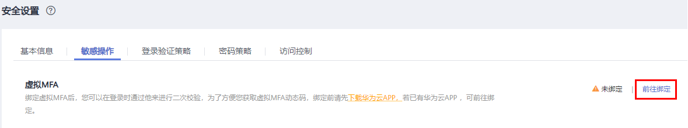
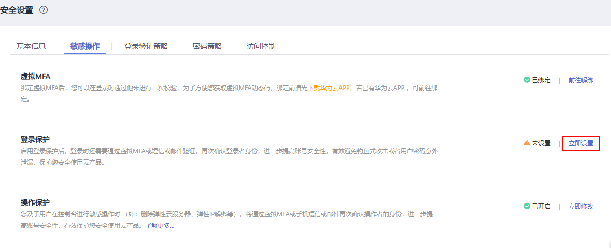
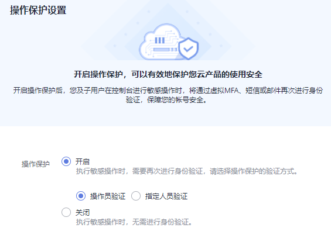
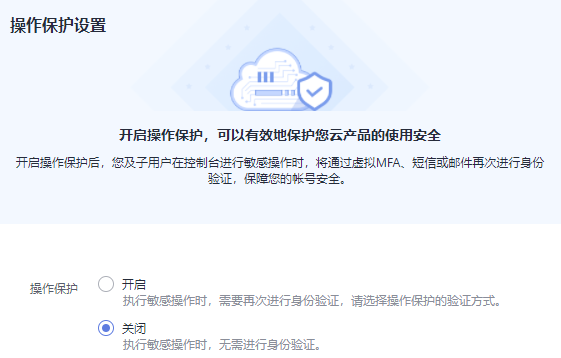

# 敏感操作

只有[管理员](使用前必读.md)可以设置敏感操作，普通IAM用户只有查看权限，不能对其进行设置，如需修改，请联系管理员为您操作或添加权限。

> **说明：** 
>联邦用户在执行敏感操作时，不需要进行身份验证。

## 虚拟MFA

虚拟Multi-Factor Authentication \(MFA\) 是能产生6位数字认证码的设备，遵循基于时间的一次性密码 （TOTP）标准。MFA设备可以基于硬件也可以基于软件，目前仅支持基于软件的虚拟MFA，虚拟MFA应用程序可以在移动硬件设备（包括智能手机）上运行，非常方便，虚拟MFA是多因素认证方式中的一种。

本节以“华为云App”为例介绍如何绑定虚拟MFA，如果您已安装其他MFA应用程序，请根据应用程序指引添加用户。如需了解有关解绑虚拟MFA、重置虚拟MFA的操作，请参见：[虚拟MFA](虚拟MFA.md)。

[暂未升级华为帐号](#li133552613287)、[ 已升级华为帐号](#li15525104711287)绑定虚拟MFA的操作方法不同。

> **说明：** 
>您需要先在智能设备上安装一个MFA应用程序（例如： “华为云”手机应用程序），才能绑定虚拟MFA设备。

-   **暂未升级华为帐号**

1.  [进入安全设置](安全设置概述.md#zh-cn_topic_0179263545_section113256158575)。
2.  在“安全设置\>敏感操作”页面，单击“虚拟MFA”右侧的“前往绑定”。

    **图 1**  虚拟MFA  
    

3.  根据右侧弹出的绑定虚拟MFA页面，在您的MFA应用程序中添加用户。

    **图 2**  绑定虚拟MFA  
    

    您可以通过扫描二维码、手动输入两种方式绑定MFA设备，下面以“华为云”手机应用程序为例绑定虚拟MFA：

    -   扫描二维码

        打开手机上已安装好的“华为云”手机应用程序，选择“控制台-MFA-添加-扫码添加”，扫描“绑定虚拟MFA”弹窗中的二维码。扫描成功后，“华为云”手机应用程序会自动添加用户，虚拟MFA列表中出现帐号/IAM用户名及对应的MFA动态码。

    -   手动输入

        打开手机上已安装好的“华为云”手机应用程序，选择“控制台-MFA-添加-手动输入”。帐号绑定虚拟MFA，输入帐号和密钥；IAM用户绑定虚拟MFA，输入IAM用户名和密钥。单击“添加”手动添加用户。

        > **说明：** 
        >手动输入添加用户方式只支持基于时间模式，建议在移动设备中开启自动设置时间功能。

4.  添加用户完成，在“华为云”手机应用程序“虚拟MFA页面”，查看虚拟MFA的动态口令页面。动态口令每30秒自动更新一次。
5.  在“绑定虚拟MFA”页面输入连续的两组口令，然后单击“确定“，完成绑定虚拟MFA设备的操作。

-   **已升级华为帐号**

1.  [进入安全设置](安全设置概述.md#zh-cn_topic_0179263545_section113256158575)。
2.  在“安全设置\>敏感操作”页面，单击“虚拟MFA”右侧的“前往绑定”。

    **图 3**  绑定虚拟MFA  
    

3.  跳转至“华为帐号\>安全验证”页面，根据提示绑定虚拟MFA。

## 登录保护

开启登录保护后，您或帐号中的IAM用户在登录华为云时，除了在登录页面输入用户名和密码外（第一次身份验证），还需要在登录验证页面输入验证码（第二次身份验证），该功能是一种安全实践，**建议开启登录保护**，多次身份认证可以提高帐号安全性。

帐号只能自己开启登录保护，帐号或管理员都可以为IAM用户开启登录保护。

-   **管理员为IAM用户开启登录保护**

    管理员在IAM用户列表中，单击操作列的“安全设置”，单击“登录保护\>验证方式”右侧的“”，选择验证方式为手机、邮件地址或虚拟MFA，为IAM用户开启登录保护。

    > **说明：** 
    >-   登录保护仅影响使用管理控制台访问华为云的IAM用户，对编程访问用户无影响。
    >-   目前“华为云”手机应用程序暂不支持通过手机、邮件地址进行二次身份验证。如需登录“华为云”手机应用程序，建议选择MFA验证方式。

-   **未升级华为帐号的华为云帐号开启登录保护**

    如果您的华为云帐号暂未升级华为帐号，[进入安全设置](安全设置概述.md#zh-cn_topic_0179263545_section113256158575)后，帐号可以在“安全设置  \>  敏感操作\>登录保护  \>   “中单击“立即设置”，选择“开启”，并设置验证方式，开启登录保护。

    **图 4**  开启登录保护  
    

-   **华为帐号开启登录保护**

    如果您的华为云帐号已升级为华为帐号，将不支持在“安全设置”页面开启登录保护，请在“[华为帐号中心](https://id1.cloud.huawei.com/AMW/portal/userCenter/index.html)\>帐号与安全\>安全验证\>双重验证”中单击“开启”，输入验证信息，开启登录保护。

    系统会对华为帐号登录进行安全认证，如果您更换终端，初次登录将进行安全认证\(安全手机二次验证\)。如果您没有开启“双重验证”，初次登录完成后，单击“信任”，将终端添加到信任列表中，后续将无需二次认证。

      

## 操作保护

-   **开启操作保护**

    开启后，帐号以及帐号中的IAM用户进行[敏感操作](#section966741313160)时，例如删除弹性云服务器资源，需要输入验证码进行验证，避免误操作带来的风险和损失。“操作保护”默认为开启状态，为了您的资源安全，建议保持开启状态。

    开启操作保护后，默认在敏感操作验证成功后的15分钟之内，进行敏感操作无需再次验证。

1.  管理员[进入安全设置](安全设置概述.md#zh-cn_topic_0179263545_section113256158575)。
2.  在“安全设置  \>  敏感操作\>操作保护  \>   “中，单击“立即启用“。

    **图 5**  开启操作保护  
    

3.  在右侧弹窗中选择“开启”，勾选“操作员验证”或“指定人员验证”。

    如选择“指定人员验证”，开启操作保护时，需要进行初次身份核验，确保指定人员验证方式可用。

    **图 6**  操作保护设置  
    

    -   操作员验证：触发敏感操作的帐号或IAM用户进行二次验证。
    -   指定人员验证：帐号及IAM用户触发的敏感操作均由指定人员进行验证。支持手机号、邮件地址，不支持虚拟MFA验证。

4.  单击“确定”开启操作保护。

-   **关闭操作保护**

关闭后，帐号以及帐号中的IAM用户进行[敏感操作](#section966741313160)时，不需要输入验证码进行验证。

1.  管理员[进入安全设置](安全设置概述.md#zh-cn_topic_0179263545_section113256158575)。
2.  管理员在“安全设置  \>  敏感操作\>操作保护  \>   “中，单击“立即修改“。

    **图 7**  单击立即修改  
    

3.  在右侧弹窗中选择“关闭”，并单击“确定”。

    **图 8**  关闭操作保护  
    

4.  在“身份验证”弹窗中输入验证码。
    -   操作员验证：关闭操作保护管理员本人进行二次验证。支持手机号、邮件地址、虚拟MFA。
    -   指定人员验证：由指定人员进行验证。支持手机号、邮件地址，不支持虚拟MFA验证。

5.  单击“确定”，关闭操作保护。

> **说明：** 
>-   敏感操作由各个云服务单独定义。
>-   用户如果进行敏感操作，将进入“操作保护”页面，选择认证方式，包括邮件地址、手机和虚拟MFA三种认证方式。
>    -   如果用户只绑定了手机号，则认证方式只能选择手机。
>    -   如果用户只绑定了邮件地址，则认证方式只能选择邮件地址。
>    -   如果用户未绑定邮件地址、手机和虚拟MFA，进行敏感操作时，将提示用户绑定邮件地址、手机或虚拟MFA。
>-   使用邮件地址、手机进行认证可能出现收不到验证码故障，建议您使用MFA验证方式。
>-   **如需修改验证手机号、邮件地址，请在[帐号中心](https://support.huaweicloud.com/usermanual-account/account_id_000.html)修改；如需修改虚拟MFA设备，请在[虚拟MFA](#section126314145413)中修改。**
>-   开启操作保护后，执行敏感操作时，需要输入验证码进行验证，此验证码将会发送至进行操作的IAM用户所绑定的手机号或邮件地址，而不是该IAM用户所属的帐号。

## 访问密钥保护

-   **开启访问密钥保护**

    开启后，仅管理员才可以创建、启用/停用或删除IAM用户的访问密钥。由于“访问密钥保护”默认为关闭状态，为了保障资源安全，建议开启访问密钥保护功能。

    管理员[进入安全设置](安全设置概述.md#zh-cn_topic_0179263545_section113256158575)后，在“敏感操作\>访问密钥保护  \>   “中，单击“”，开启访问密钥保护。

-   **关闭访问密钥保护**

    关闭后，所有IAM用户可以创建、启用/停用或删除自己的访问密钥。

    管理员[进入安全设置](安全设置概述.md#zh-cn_topic_0179263545_section113256158575)后，在“敏感操作\>访问密钥保护\> “中，单击“”，关闭访问密钥保护。

## 自主管理用户属性

-   **开启自主管理用户属性**

    开启后，所有IAM用户可以管理自己的[基本信息](基本信息.md)，可以根据场景选择IAM用户可以修改的属性信息，可以选择登录密码、手机号、邮件地址。默认开启，且支持IAM用户修改所有属性。

    管理员[进入安全设置](安全设置概述.md#zh-cn_topic_0179263545_section113256158575)后，在“安全设置  \>  敏感操作\>自主管理用户属性  \>   “中，单击“立即启用”。在“自主管理用户属性设置”弹窗中，选择“开启”并勾选支持IAM用户自主修改的属性，单击“确定”，开启IAM用户自主管理用户属性。

-   **关闭自主管理用户属性**

    关闭后，仅管理员可以管理自己的[基本信息](基本信息.md)。IAM用户如需修改登录密码、手机号、邮件地址，请联系管理员参考[查看或修改IAM用户信息](查看或修改IAM用户信息.md)进行操作。

    管理员[进入安全设置](安全设置概述.md#zh-cn_topic_0179263545_section113256158575)后，在“安全设置  \>  敏感操作\>自主管理用户属性  \>   “中，单击“立即修改”。在“自主管理用户属性设置”弹窗中，选择“关闭”，单击“确定”，关闭IAM用户自主管理用户属性。

## 敏感操作有哪些

当您开启操作保护后，进行以下操作时，需要进行身份认证。

**表 1**  各云服务定义的敏感操作

<table><thead align="left"><tr id="row84321128172211"><th class="cellrowborder" valign="top" width="15%" id="mcps1.2.4.1.1">
类型

</th>
<th class="cellrowborder" valign="top" width="25%" id="mcps1.2.4.1.2">
服务

</th>
<th class="cellrowborder" valign="top" width="60%" id="mcps1.2.4.1.3">
敏感操作

</th>
</tr>
</thead>
<tbody><tr id="row9432152872210"><td class="cellrowborder" rowspan="3" valign="top" width="15%" headers="mcps1.2.4.1.1 ">
计算

&nbsp;&nbsp;

</td>
<td class="cellrowborder" valign="top" width="25%" headers="mcps1.2.4.1.2 ">
弹性云服务器（ECS）

</td>
<td class="cellrowborder" valign="top" width="60%" headers="mcps1.2.4.1.3 "><ul id="ul188112219419"><li>关闭、重启、删除弹性云服务器</li><li>重置弹性云服务器密码</li><li>卸载磁盘</li><li>解绑弹性公网IP</li></ul>
</td>
</tr>
<tr id="row4432132810222"><td class="cellrowborder" valign="top" headers="mcps1.2.4.1.1 ">
裸金属服务器（BMS）

</td>
<td class="cellrowborder" valign="top" headers="mcps1.2.4.1.2 "><ul id="ul132751618173412"><li>关机、重启裸金属服务器</li><li>重置裸金属服务器的密码</li><li>卸载磁盘</li><li>解绑弹性公网IP</li></ul>
</td>
</tr>
<tr id="row12432728172215"><td class="cellrowborder" valign="top" headers="mcps1.2.4.1.1 ">
弹性伸缩（AS）

</td>
<td class="cellrowborder" valign="top" headers="mcps1.2.4.1.2 ">
删除伸缩组

</td>
</tr>
<tr id="row58844554345"><td class="cellrowborder" rowspan="3" valign="top" width="15%" headers="mcps1.2.4.1.1 ">
存储

</td>
<td class="cellrowborder" valign="top" width="25%" headers="mcps1.2.4.1.2 ">
对象存储服务（OBS）

</td>
<td class="cellrowborder" valign="top" width="60%" headers="mcps1.2.4.1.3 "><ul id="ul1875432184413"><li>删除桶</li><li>创建、编辑、删除桶策略</li><li>配置对象策略</li><li>创建、编辑、删除桶ACL</li><li>配置日志记录</li><li>配置防盗链</li><li>增加、编辑桶清单</li></ul>
</td>
</tr>
<tr id="row43822212231"><td class="cellrowborder" valign="top" headers="mcps1.2.4.1.1 ">
云硬盘服务（EVS）

</td>
<td class="cellrowborder" valign="top" headers="mcps1.2.4.1.2 ">
删除云硬盘

</td>
</tr>
<tr id="row147824574531"><td class="cellrowborder" valign="top" headers="mcps1.2.4.1.1 ">
内容分发网络（CDN）

</td>
<td class="cellrowborder" valign="top" headers="mcps1.2.4.1.2 ">
域名下线策略

</td>
</tr>
<tr id="row128951748382"><td class="cellrowborder" rowspan="2" valign="top" width="15%" headers="mcps1.2.4.1.1 ">
容器

</td>
<td class="cellrowborder" valign="top" width="25%" headers="mcps1.2.4.1.2 ">
云容器引擎（CCE）

</td>
<td class="cellrowborder" valign="top" width="60%" headers="mcps1.2.4.1.3 ">
删除集群

</td>
</tr>
<tr id="row1188194317412"><td class="cellrowborder" valign="top" headers="mcps1.2.4.1.1 ">
应用编排服务（AOS）

</td>
<td class="cellrowborder" valign="top" headers="mcps1.2.4.1.2 ">
删除堆栈

</td>
</tr>
<tr id="row19382132112311"><td class="cellrowborder" rowspan="6" valign="top" width="15%" headers="mcps1.2.4.1.1 ">
网络

</td>
<td class="cellrowborder" valign="top" width="25%" headers="mcps1.2.4.1.2 ">
云解析服务（DNS）

</td>
<td class="cellrowborder" valign="top" width="60%" headers="mcps1.2.4.1.3 "><ul id="ul1170819480314"><li>修改、暂停、删除域名</li><li>修改、暂停、删除记录集</li><li>修改、删除反向解析</li><li>删除自定义线路</li></ul>
</td>
</tr>
<tr id="row1785642417291"><td class="cellrowborder" valign="top" headers="mcps1.2.4.1.1 ">
虚拟私有云（VPC）

</td>
<td class="cellrowborder" valign="top" headers="mcps1.2.4.1.2 "><ul id="ul3529193214305"><li>解绑弹性公网IP</li><li>删除对等连接</li><li>安全组<ul id="ul2316185823012"><li>删除入（出）方向规则</li><li>修改入（出）方向规则</li><li>批量删除入（出）方向规则</li></ul>
</li></ul>
</td>
</tr>
<tr id="row16857132432915"><td class="cellrowborder" valign="top" headers="mcps1.2.4.1.1 ">
弹性负载均衡（ELB）

</td>
<td class="cellrowborder" valign="top" headers="mcps1.2.4.1.2 "><ul id="ul35161439123217"><li>经典型负载均衡<ul id="ul165211516324"><li>删除负载均衡器</li><li>删除监听器</li><li>删除证书</li><li>停用负载均衡器</li></ul>
</li></ul>
<ul id="ul1869710429322"><li>共享型负载均衡<ul id="ul4734140183312"><li>删除负载均衡器</li><li>删除监听器</li><li>删除证书</li><li>删除后端云服务器</li><li>解绑弹性公网IP</li><li>解绑IPv4公网/私有IP</li><li>解绑IPv6地址</li><li>移出IPv6共享带宽</li></ul>
</li></ul>
</td>
</tr>
<tr id="row102131605357"><td class="cellrowborder" valign="top" headers="mcps1.2.4.1.1 ">
弹性公网IP（EIP）

</td>
<td class="cellrowborder" valign="top" headers="mcps1.2.4.1.2 "><ul id="ul1665815566351"><li>删除共享带宽</li><li>释放、解绑弹性公网IP</li><li>批量释放、批量解绑弹性公网IP</li></ul>
</td>
</tr>
<tr id="row1917231416506"><td class="cellrowborder" valign="top" headers="mcps1.2.4.1.1 ">
虚拟专用网络（VPN）

</td>
<td class="cellrowborder" valign="top" headers="mcps1.2.4.1.2 "><ul id="ul1036674217501"><li>删除VPN连接</li><li>退订包周期VPN网关</li></ul>
</td>
</tr>
<tr id="row108581410105014"><td class="cellrowborder" valign="top" headers="mcps1.2.4.1.1 ">
云专线（DC）

</td>
<td class="cellrowborder" valign="top" headers="mcps1.2.4.1.2 ">
删除虚拟接口

</td>
</tr>
<tr id="row19465715113712"><td class="cellrowborder" valign="top" width="15%" headers="mcps1.2.4.1.1 ">
安全与合规

</td>
<td class="cellrowborder" valign="top" width="25%" headers="mcps1.2.4.1.2 ">
SSL证书管理（SCM）

</td>
<td class="cellrowborder" valign="top" width="60%" headers="mcps1.2.4.1.3 "><ul id="ul20404115912371"><li>删除证书</li><li>吊销证书</li></ul>
</td>
</tr>
<tr id="row7382112117232"><td class="cellrowborder" rowspan="3" valign="top" width="15%" headers="mcps1.2.4.1.1 ">
管理与监管

</td>
<td class="cellrowborder" valign="top" width="25%" headers="mcps1.2.4.1.2 ">
统一身份认证服务（IAM）

</td>
<td class="cellrowborder" valign="top" width="60%" headers="mcps1.2.4.1.3 "><ul id="ul6778356184419"><li>关闭操作保护</li><li>关闭登录保护</li><li>修改手机号</li><li>修改邮件地址</li><li>修改登录密码</li><li>修改登录保护验证方式</li><li>删除IAM用户</li><li>停用IAM用户</li></ul>
</td>
</tr>
<tr id="row1521211377"><td class="cellrowborder" valign="top" headers="mcps1.2.4.1.1 ">
云审计服务（CTS）

</td>
<td class="cellrowborder" valign="top" headers="mcps1.2.4.1.2 ">
停用system追踪器

</td>
</tr>
<tr id="row183088619374"><td class="cellrowborder" valign="top" headers="mcps1.2.4.1.1 ">
云日志服务（LTS）

</td>
<td class="cellrowborder" valign="top" headers="mcps1.2.4.1.2 "><ul id="ul1181714375329"><li>删除日志流/组</li><li>卸载ICAgent</li></ul>
</td>
</tr>
<tr id="row2097822015374"><td class="cellrowborder" valign="top" width="15%" headers="mcps1.2.4.1.1 ">
应用服务

</td>
<td class="cellrowborder" valign="top" width="25%" headers="mcps1.2.4.1.2 ">
分布式缓存服务（DCS）

</td>
<td class="cellrowborder" valign="top" width="60%" headers="mcps1.2.4.1.3 "><ul id="ul1458434093312"><li>重置密码</li><li>删除实例</li><li>清空数据</li></ul>
</td>
</tr>
<tr id="row183821321172319"><td class="cellrowborder" valign="top" width="15%" headers="mcps1.2.4.1.1 ">
专属云

</td>
<td class="cellrowborder" valign="top" width="25%" headers="mcps1.2.4.1.2 ">
专属分布式存储服务（DSS）

</td>
<td class="cellrowborder" valign="top" width="60%" headers="mcps1.2.4.1.3 ">
删除磁盘

</td>
</tr>
<tr id="row152451129124510"><td class="cellrowborder" rowspan="2" valign="top" width="15%" headers="mcps1.2.4.1.1 ">
数据库

</td>
<td class="cellrowborder" valign="top" width="25%" headers="mcps1.2.4.1.2 ">
云数据（RDS）

</td>
<td class="cellrowborder" valign="top" width="60%" headers="mcps1.2.4.1.3 "><ul id="ul1051624104619"><li>重置管理员密码</li><li>重启、删除、批量恢复数据库实例</li><li>删除数据库备份</li><li>通过备份文件恢复到当前实例</li><li>通过备份文件恢复到已有实例</li><li>按指定时间点恢复到当前实例</li><li>按指定时间点恢复到已有实例</li><li>表级时间点恢复</li><li>切换主备节点</li><li>修改数据库端口</li><li>删除数据库帐号</li><li>删除数据库</li><li>重置数据库帐号的密码</li><li>修改实例内网IP</li><li>解绑弹性公网IP</li><li>开启、关闭一键告警</li></ul>
</td>
</tr>
<tr id="row44042042489"><td class="cellrowborder" valign="top" headers="mcps1.2.4.1.1 ">
文档数据库服务（DDS）

</td>
<td class="cellrowborder" valign="top" headers="mcps1.2.4.1.2 "><ul id="ul9746547487"><li>重置密码</li><li>重启、删除实例</li><li>重启节点</li><li>副本集主备切换</li><li>删除安全组规则</li><li>申请Shard或Config节点IP</li><li>备份恢复到当前实例</li><li>备份恢复到已有实例</li><li>包周期实例转按需计费</li></ul>
</td>
</tr>
<tr id="row65268204397"><td class="cellrowborder" rowspan="2" valign="top" width="15%" headers="mcps1.2.4.1.1 ">
EI 企业智能

</td>
<td class="cellrowborder" valign="top" width="25%" headers="mcps1.2.4.1.2 ">
数据仓库服务 GaussDB(DWS)

</td>
<td class="cellrowborder" valign="top" width="60%" headers="mcps1.2.4.1.3 "><ul id="ul1431816231408"><li>扩容、调整大小</li><li>重启</li><li>节点修复</li><li>重置密码</li></ul>
</td>
</tr>
<tr id="row1764436134212"><td class="cellrowborder" valign="top" headers="mcps1.2.4.1.1 ">
MapReduce服务（MRS）

</td>
<td class="cellrowborder" valign="top" headers="mcps1.2.4.1.2 "><ul id="ul25761555134219"><li>集群<ul id="ul8994924144316"><li>删除集群</li><li>按需转包周期集群</li><li>停止所有组件</li><li>同步配置</li></ul>
</li><li>节点<ul id="ul35732332437"><li>停止所有角色</li><li>隔离主机</li><li>取消隔离主机</li></ul>
</li><li>组件：<ul id="ul37325074316"><li>停止服务</li><li>重启服务</li><li>滚动重启服务</li><li>停止实例</li><li>重启实例</li><li>滚动重启实例</li><li>入服</li><li>退服</li><li>保存服务配置</li></ul>
</li><li>补丁：<ul id="ul9304613174411"><li>安装补丁</li><li>卸载补丁</li><li>回滚补丁</li></ul>
</li></ul>
</td>
</tr>
<tr id="row14601985219"><td class="cellrowborder" valign="top" width="15%" headers="mcps1.2.4.1.1 ">
云通信

</td>
<td class="cellrowborder" valign="top" width="25%" headers="mcps1.2.4.1.2 ">
消息&amp;短信 （Message&amp;SMS）

</td>
<td class="cellrowborder" valign="top" width="60%" headers="mcps1.2.4.1.3 "><ul id="ul1389851613530"><li>签名删除</li><li>模板删除</li><li>获取app_secret</li><li>指定手机号、邮件地址绑定华为云帐号</li><li>指定IP白名单</li><li>续订套餐包</li></ul>
</td>
</tr>
<tr id="row118411347375"><td class="cellrowborder" valign="top" width="15%" headers="mcps1.2.4.1.1 ">
软件开发平台

</td>
<td class="cellrowborder" valign="top" width="25%" headers="mcps1.2.4.1.2 ">
项目管理 （ProjectMan）

</td>
<td class="cellrowborder" valign="top" width="60%" headers="mcps1.2.4.1.3 "><ul id="ul788523367"><li>删除项目</li><li>删除项目成员</li><li>修改成员信息</li><li>修改、删除权限</li><li>修改项目基本信息</li><li>删除工作项</li></ul>
</td>
</tr>
<tr id="row1826818126463"><td class="cellrowborder" valign="top" width="15%" headers="mcps1.2.4.1.1 ">
用户服务

</td>
<td class="cellrowborder" valign="top" width="25%" headers="mcps1.2.4.1.2 ">
费用中心

</td>
<td class="cellrowborder" valign="top" width="60%" headers="mcps1.2.4.1.3 "><ul id="ul1997741717465"><li>订单支付</li><li>订单退订</li><li>资源释放</li></ul>
</td>
</tr>
</tbody>
</table>

