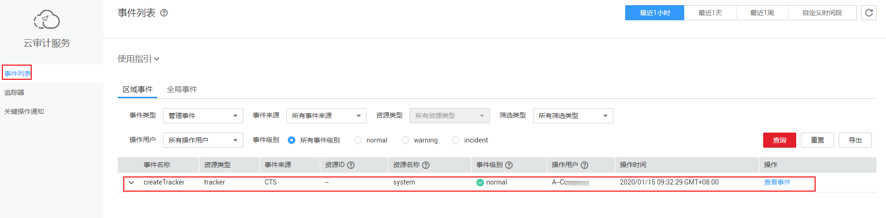
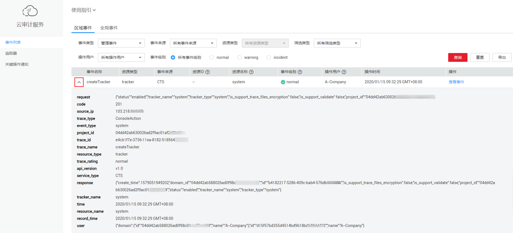
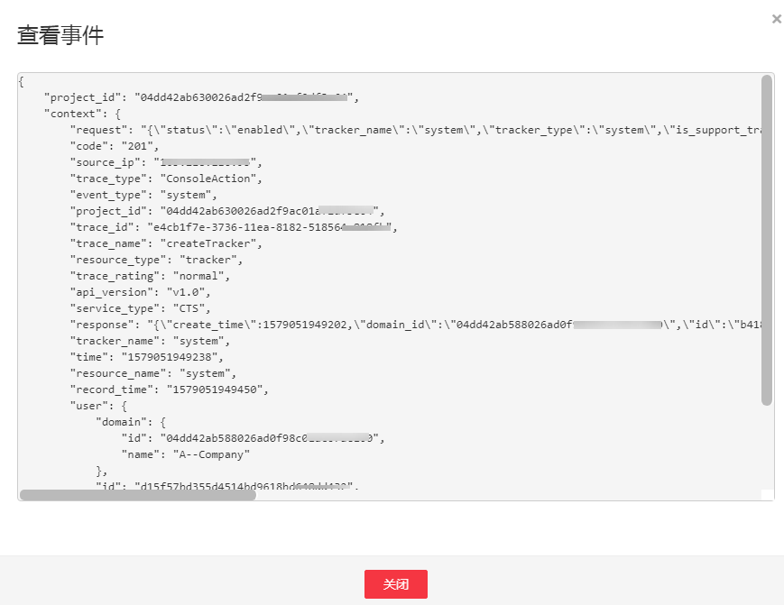

# 查看IAM的云审计日志

开通云审计服务后，云审计服务开始记录操作事件，包括IAM以及其他服务的操作事件，云审计服务保存最近7天的操作记录。

## 操作步骤

1.  管理员在IAM控制台进行操作，例如创建一个用户“CTS-Test”。
2.  进入云审计服务控制台，查看IAM的操作记录。

    **图 1**  查看IAM的操作记录  
    

    > **说明：** 
    >IAM为全局级服务，CTS默认记录“华北-北京四”区域的IAM操作记录，进入CTS控制台后，如果默认区域不是“华北-北京四”，请先切换区域，否则无法查看IAM的操作记录。

3.  单击，可以查看事件的基本信息。

    **图 2**  查看事件基本信息  
    

4.  单击“查看事件“，可以查看事件的结构，事件结构的详细信息，请参见：[云审计 用户指南](https://support.huaweicloud.com/usermanual-cts/cts_03_0010.html)。

    **图 3**  查看事件详情  
    

