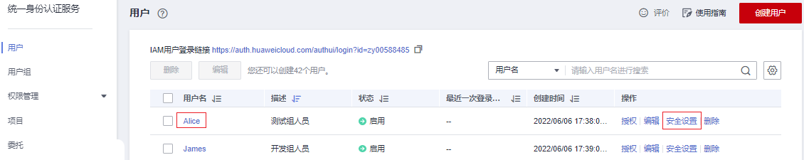
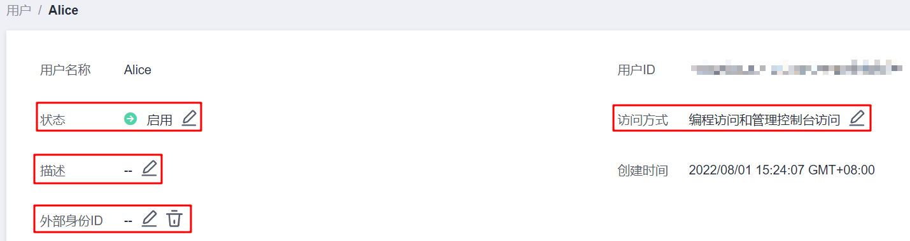
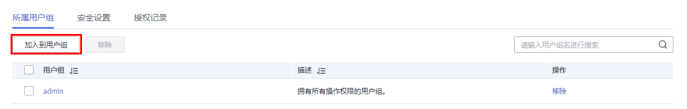
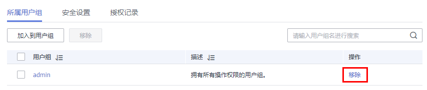
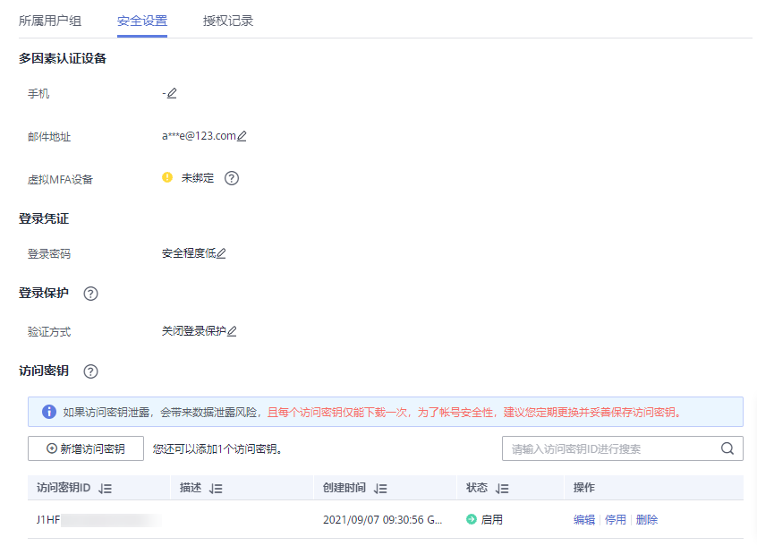
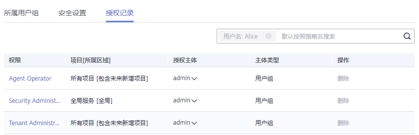
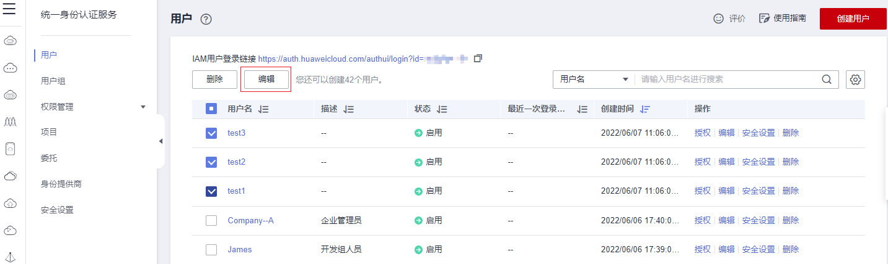
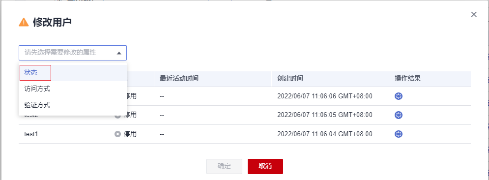
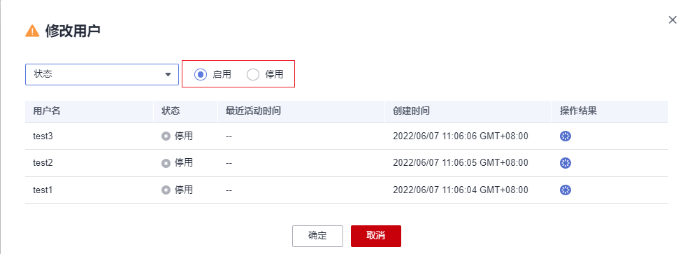

# 查看或修改IAM用户信息

管理员在IAM用户列表中，单击用户名，或者单击右侧的“安全设置”，可以查看或修改IAM用户的基本信息、所属用户组、安全设置，并查看或删除授权记录。

**图 1**  进入IAM用户安全设置页面  

管理员单击搜索框右侧的“”，可以修改用户列表展示项目，用户名、操作为默认展示项目。必选项目：状态。可选项目：描述、最近一次登录时间、创建时间、访问方式、MFA（状态）、密码使用时长、访问密钥状态、外部身份ID。

## 基本信息

只能修改IAM用户的基本信息，不能修改帐号的基本信息。用户名称、用户ID、创建时间仅支持查看，不支持修改。

**图 2**  修改IAM用户状态、访问方式、描述、外部身份ID  

-   状态：修改IAM用户的状态，IAM用户的状态默认为启用，如果需要停止使用该IAM用户，可以将IAM用户的状态设置为“停用“。停用后，该IAM用户将无法通过任一方式访问华为云，包括管理控制台访问和编程访问。
-   访问模式：修改iam用户的访问方式。

    > **说明：** 
    >-   请参考如下说明，修改访问模式：
    >    -   如果IAM用户**仅需登录管理控制台访问云服务**，建议访问方式选择**管理控制台访问**，凭证类型为**密码**。
    >    -   如果IAM用户**仅需编程访问华为云服务**，建议访问方式选择**编程访问**，凭证类型为**访问密钥**。
    >    -   如果IAM用户**需要使用密码作为编程访问的凭证**（部分API要求），建议访问方式选择**编程访问**，凭证类型为**密码**。
    >    -   如果IAM用户使用部分云服务时，需要在其**控制台验证访问密钥**（由IAM用户输入），建议访问方式选择**编程访问和管理控制台访问**，凭证类型为**密码和访问密钥**。例如IAM用户在控制台使用云数据迁移CDM服务创建数据迁移，需要通过访问密钥进行身份验证。
    >-   如果当前IAM用户的访问模式为**编程访问**或**编程访问和管理控制台访问**，取消编程访问可能会使IAM用户无法访问华为云服务，请谨慎修改。

-   描述：修改IAM用户的描述信息。
-   外部身份ID：IAM SSO类型的联邦用户单点登录中，与当前实体IAM用户对接的，企业自身用户的身份ID值。

## 所属用户组

所属用户组表示用户具备的权限，**通过修改IAM用户的所属用户组可以修改用户的权限**。如需修改用户所属用户组权限，请参见：[查看或修改用户组](查看或修改用户组.md)。

只能修改IAM用户的所属用户组，帐号属于默认用户组“admin”，不能修改。

-   单击“加入到用户组”，在“配置用户组”中选择需要加入的用户组。一个用户可以加入一个或是多个用户组。用户加入用户组后，拥有用户组的所有权限。

    **图 3**  将IAM用户加入用户组  
    

-   单击IAM用户所属用户组右侧的“移除”，单击“是”，退出选中的用户组，用户将不再拥有该用户组权限。

    **图 4**  将IAM用户移出用户组  
    

## 安全设置

管理员可以该页面修改IAM用户的多因素认证设备、登录凭证、登录保护和访问密钥。IAM用户如需修改自己的手机号、邮件地址、虚拟MFA设备，请参考[安全设置概述](安全设置概述.md)。

**图 5**  IAM用户安全设置  

-   多因素认证设备，只能修改IAM用户的多因素认证设备，不能修改帐号的多因素认证设备。
    -   修改用户的手机、邮件地址。

        > **说明：** 
        >修改IAM用户绑定手机号和邮件地址不可与帐号、其他IAM用户重复。

    -   虚拟MFA设备：给用户重置虚拟MFA设备。更多有关多因素认证以及MFA的介绍，详情请参见：[多因素认证与虚拟MFA](多因素认证与虚拟MFA.md)。

-   登录凭证：修改IAM用户的登录密码，详情请参见：[修改IAM用户密码](修改IAM用户密码.md)。
-   登录保护：修改IAM用户的登录验证方式，支持虚拟MFA、手机和邮箱。

    登录保护表示用户登录控制台时，除了在登录页面输入用户名和密码（第一次身份认证），还需要在“登录验证”页面输入验证码（第二次身份验证），该功能默认关闭。

-   访问密钥：管理IAM用户的访问密钥，详情请参见：[管理IAM用户访问密钥](管理IAM用户访问密钥.md)。

## 授权记录

管理员可以查看或删除IAM用户所拥有的权限。如需修改该IAM用户的权限，请参考[所属用户组](#section1388814374718)。

**图 6**  IAM用户授权记录  

如需查看帐号下所有授权记录，请参考：[查看授权记录](查看授权记录.md)。

> **说明：** 
>删除授权记录，将删除该IAM用户所属用户组的权限，该用户组中所有IAM用户不再拥有该权限，请谨慎操作。

## 批量修改IAM用户信息

IAM支持批量修改IAM用户**状态**、**访问方式**和**验证方式**，修改方式类似，以修改IAM用户状态为例，说明批量修改IAM用户信息的方法。

1.  进入IAM控制台，在左侧导航栏选择“用户”页签。
2.  在用户列表中，勾选需要修改的用户。勾选完成后，单击用户列表上方的“编辑”。

    

3.  选择需要修改的IAM用户属性，以修改IAM用户状态为例，选择“状态”。

    

4.  选择要给IAM用户配置的目标状态，若要停用IAM用户则选择“停用”，启用IAM用户则选择“启用”。

    

    > **说明：** 
    >请排查用户是否有其他服务或场景在使用，停用正在使用的用户可能会对业务产生影响。

5.  单击“确定”，确定IAM用户配置。
6.  单击“确认”，完成所选IAM用户状态的修改。

