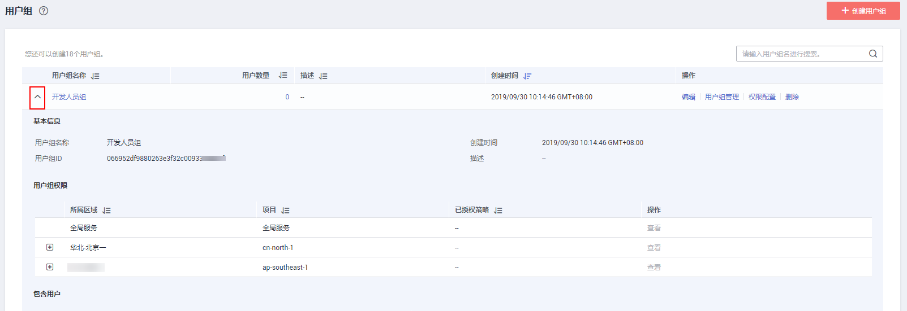
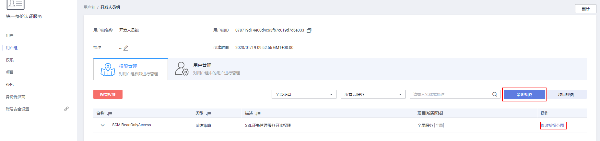

# 查看或修改用户组

## 查看用户组信息

管理员在用户组列表中，单击用户组左侧的，可以查看用户组的基本ID、权限和包含用户。

## 修改用户组权限

您可以选择“策略视图”或“项目视图”修改当前的用户组权限，包括新增或移除权限，请根据您的需求选择合适的视图。

-   **策略视图：对用户组已有权限的授权范围进行修改。**
    1.  在“用户组\>权限配置”的“权限管理”页签中，选择“策略视图”。
    2.  单击需要修改权限右侧的“修改授权范围”。

        

    3.  在右侧弹窗中，勾选需要将此权限授予用户组的范围。
    4.  单击“确定”，完成授权范围修改。

-   **项目视图：对用户组的已有项目进行权限修改。**
    1.  在“用户组\>权限配置”的“权限管理”页签中，选择“项目视图”。
    2.  单击项目右侧的“修改权限”。
    3.  选择需要增加或移除的权限，单击“确定”。
    4.  完成项目权限修改。

## 修改用户组描述

管理员在用户组列表中，单击用户组右侧的“编辑”，修改用户组的描述信息。

> **说明：**   
>用户组的名称是联邦认证关联的凭证，因此用户组的名称允许修改，仅能修改描述。  

## 修改用户组中的用户

1.  管理员在用户组列表中，单击用户组右侧的“用户组管理”。
2.  在“可选用户”中选择需要添加的用户。
3.  在“已选用户”中选择移除对应用户。

> **说明：**   
>系统缺省用户组“admin”，只能修改其中包含的用户，不能修改描述信息与权限。  

