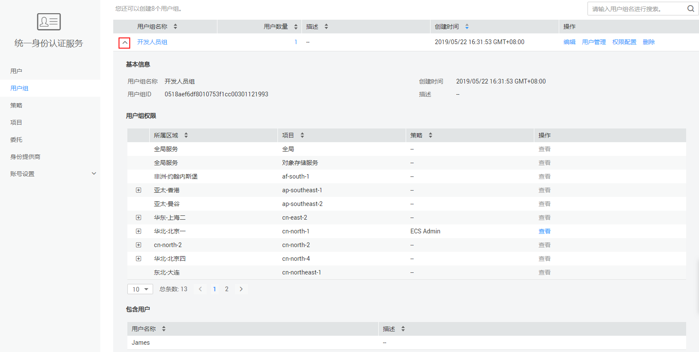

# 查看或修改用户组

## 查看用户组信息

管理员在用户组列表中，单击用户组左侧的，可以查看用户组的基本信息、权限和包含用户。

## 修改用户组描述

管理员在用户组列表中，单击用户组右侧的“编辑”，修改用户组的描述信息。

> **说明：**   
>用户组的名称是联邦认证关联的凭证，因此用户组的名称不允许修改，仅能修改描述。  

## 修改用户组权限

1.  管理员在用户组列表中，单击用户组右侧的“权限配置”。
2.  在用户组权限页签中，单击列表左上方的“配置权限”。
3.  在右侧滑窗中配置权限。
4.  单击“确定”，修改用户组权限。

## 修改用户组中的用户

1.  管理员在用户组列表中，单击用户组右侧的“用户管理”。
2.  在“可选用户”中选择需要添加的用户。
3.  在“已选用户”中选择删除对应用户。

> **说明：**   
>系统缺省用户组“admin”，只能修改其中包含的用户，不能修改描述信息与权限。  

