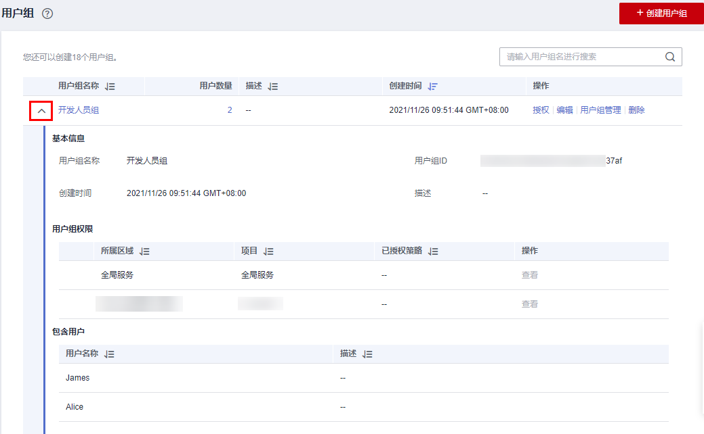
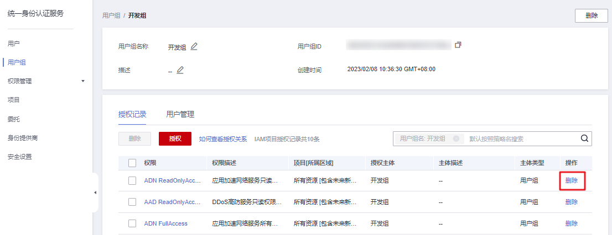
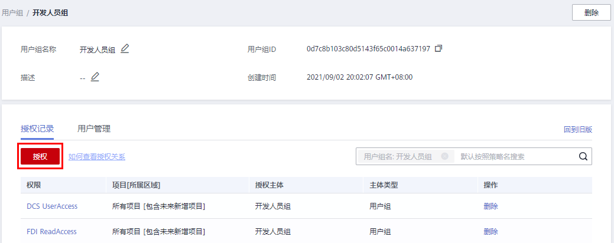
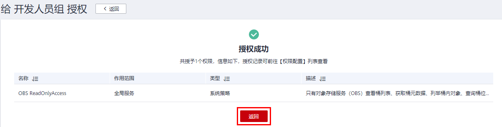

# 查看或修改用户组

## 查看用户组信息

管理员在用户组列表中，单击用户组左侧的，可以查看用户组的基本信息、权限和包含用户。

**图 1**  查看用户组信息  

## 修改用户组权限

您可以在“用户组\>权限配置”的“授权记录”页签查看或修改用户组已经拥有的权限。

> **说明：** 
>-   修改用户组权限，将影响该用户组中所有用户的权限，请谨慎操作。
>-   无法修改默认管理员用户组**admin**的权限。

1.  进入“用户组\>权限配置”的“授权记录”页签，查看用户组已拥有的权限。
2.  单击需要修改权限右侧的“删除”。

    **图 2**  删除授权记录  
    

3.  在确认弹窗中，单击“是”，删除当前授权。
4.  单击“授权记录”页签中的“授权”，进入给用户组授权页面。

    **图 3**  给用户组授权  
    

5.  在授权页面选择对应的作用范围、权限，单击“确定”，完成用户组权限修改。
6.  单击“返回”，跳转至“用户组\>授权记录”页签，确认修改后的用户组权限。

    **图 4**  单击返回  
    

## 修改用户组名称和描述

管理员在用户组列表中，单击用户组右侧的“编辑”，修改用户组名称和描述。

> **说明：** 
>如果该用户组名称已配置在身份提供商的身份转换规则中，修改用户组名称将导致对应身份转换规则失效，请谨慎操作。

## 修改用户组中的用户

1.  管理员在用户组列表中，单击用户组右侧的“用户组管理”。
2.  在“可选用户”中选择需要添加的用户。
3.  在“已选用户”中选择移除对应用户。

> **说明：** 
>系统缺省用户组“admin”，只能修改其中包含的用户，不能修改描述信息与权限。

