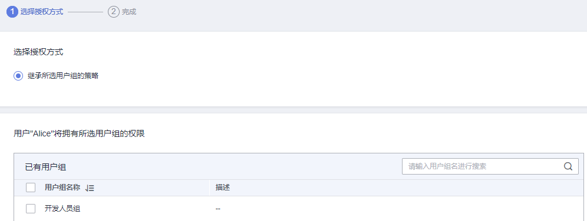

# 查看授权记录

如果您需要查看当前帐号下的所有授权关系，可以进入“权限\>授权管理”页面。IAM权限管理为您呈现帐号中的所有授权关系，支持使用**“策略名”**、**“用户名/用户组名/委托名”、“项目区域”**、**“主体类型”**为过滤条件查看指定授权关系。

-   如果您已开通并使用企业项目，可以选择IAM项目视图、企业项目视图，分别查看IAM项目、企业项目的授权关系。

    **图 1**  已开通并使用企业项目  
    

-   如果您暂未开通企业项目，将自动显示IAM项目视图。如需开通企业项目，请参见[开通企业项目](https://support.huaweicloud.com/usermanual-em/pm_topic_0002.html)。

    **图 2**  暂未开通企业项目  
    

## IAM项目视图

在IAM项目视图下，您可以选择如下过滤条件查看对应授权记录。

-   **策略名**：权限的名称。单击权限名称可以查看权限详情。

    如需查看指定权限的授权记录，选择过滤条件为“策略名”，输入指定权限名称，查看该权限的授权记录。如需查看所有云服务的系统权限，请参见：[系统权限](https://support.huaweicloud.com/usermanual-permissions/iam_01_0001.html)。

-   **用户名/用户组名/委托名**：IAM用户、用户组、委托的名称。

    如需查看指定IAM用户/用户组/委托的IAM项目授权记录，选择过滤条件为“用户名”、“用户组名”或“委托名”，输入指定对应名称，查看其授权记录。

    > **说明：** 
    >基于IAM项目授权，最小授权单位为用户组。查看IAM项目视图下指定IAM用户授权记录时，将显示该IAM用户所属用户组的授权记录。

-   **项目区域/企业项目**：IAM项目、区域或企业项目的名称，即权限的作用范围。如果您在IAM用户视图下，选择“企业项目”为过滤条件，并输入企业项目名称，将自动切换至[企业项目视图](#section17528344194215)。如需查看IAM项目授权情况，请选择：
    -   全局服务：查看所有全局服务授权记录。
    -   所有项目：查看基于所有项目授权的授权记录。基于“所有项目”授权，权限对所有项目都生效，包括全局服务和所有项目（包括未来创建的项目）。
    -   指定项目（如“cn-north-4”）：查看基于默认区域、子项目授权的授权记录。

-   **主体类型**：授权对象类型，可以选择用户、用户组、委托3种。IAM项目视图下，可以选择主体类型为“用户组”、“委托”，如果选择“用户”，筛选结果为空。

## 企业项目视图

在企业项目视图下，您可以选择如下过滤条件查看对应授权记录。

-   **策略名**：权限的名称。单击权限名称可以查看权限详情。

    如需查看指定权限的授权记录，选择过滤条件为“策略名”，输入指定权限名称，查看该权限的授权记录。如需查看企业项目支持的云服务权限，请参见：[云服务权限说明](https://support.huaweicloud.com/usermanual-em/zh-cn_topic_0129629471.html)。

-   **用户名/用户组名/委托名**：IAM用户、用户组、委托的名称。

    如需查看指定IAM用户/用户组的企业项目授权记录，选择过滤条件为“用户名”、“用户组名”，输入指定对应名称，查看其授权记录。

    > **说明：** 
    >-   企业项目不支持委托功能，请选择过滤条件为“用户名”、“用户组名”。
    >-   基于企业项目授权，最小授权单位为用户，查看企业项目视图下指定IAM用户授权记录时，显示该IAM用户及其所属用户组的授权记录。

-   **项目区域/企业项目**：IAM项目、区域或企业项目的名称，即权限的作用范围。如果您在企业项目视图下，选择“项目区域”为过滤条件，并选择指定项目，将自动切换至[IAM项目视图](#section159521631104211)。

    如需查看指定企业项目的授权记录，选择区域过滤条件为“企业项目”，输入企业项目名称，查看基于该企业项目的所有授权记录。

-   **主体类型**：授权对象类型，可以选择用户、用户组、委托3种。企业项目视图下，可以选择主体类型为“用户”、“用户组”；如果选择“委托”，筛选结果为空。

