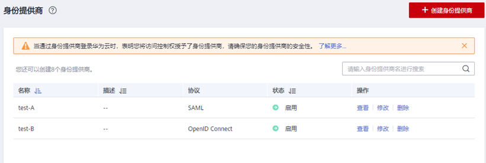
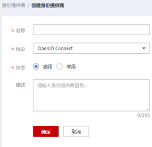
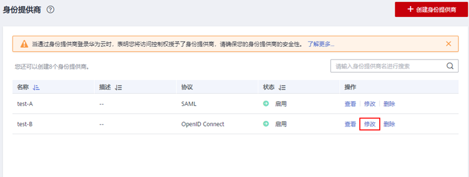
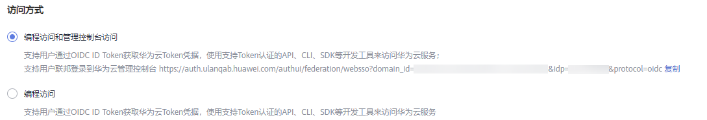
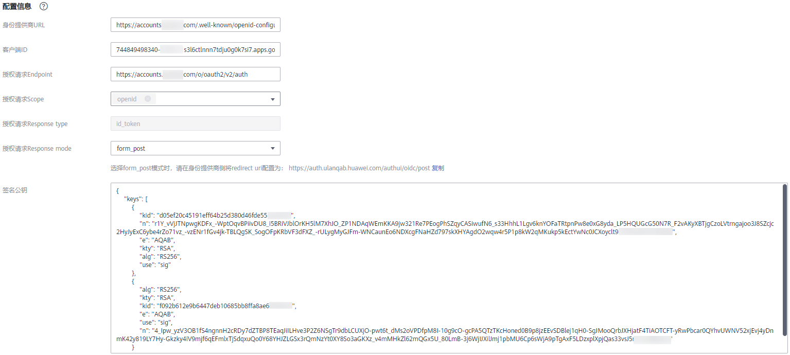
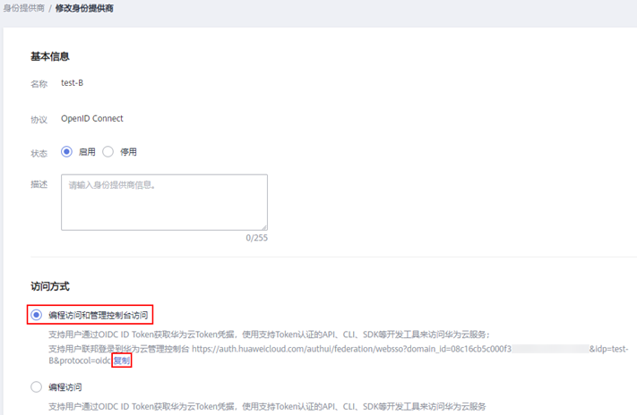

# 步骤1：创建身份提供商

配置联邦身份认证，需要在企业IdP通过浏览器将用户重定向到华为云OIDC身份提供商并创建OAuth 2.0凭据，在IAM控制台上创建身份提供商、配置授权信息，来建立两个系统之间的互信关系。

## 前提条件

-   企业管理员在华为云上注册了可用的帐号，并已在IAM中创建用户组并授权，具体方法请参见：[创建用户组并授权](创建用户组并授权.md)。在华为云IAM上创建的用户组是用于与企业IdP上的用户建立映射关系，使得IdP中的用户获取华为云IAM中用户组的权限。
-   企业管理员已获取企业IdP的帮助文档或了解企业IdP使用方法。由于不同的企业IdP的配置存在较大差异，华为云帮助文档对于企业IdP的配置不做详述，获取企业IdP的OAuth 2.0凭据等具体操作请参考企业IdP的帮助文档。

## 在企业IdP中创建OAuth 2.0凭据

1.  企业IdP通过浏览器将用户重定向到华为云OIDC身份提供商。设置授权定向URI为：https://auth.huaweicloud.com/authui/oidc/redirect和https://auth.huaweicloud.com/authui/oidc/post。
2.  获取企业IdP的OAuth 2.0凭据。

## 在华为云上创建身份提供商

在IAM控制台中创建身份提供商，通过配置授权信息，可以在IAM中建立对IdP的信任关系，使得企业用户可以直接访问华为云。

1.  进入IAM控制台，在左侧导航窗格中，选择“身份提供商”页签，单击右上方的“创建身份提供商”。

    **图 1**  创建身份提供商  
    

2.  在弹出的“创建身份提供商”窗口中填写“名称”，选择“协议”为“OpenID Connect”，选择“状态”为“启用”，单击“确定”，创建身份提供商成功。

    **图 2**  填写身份提供商参数  
    

    > **说明：** 
    >身份提供商名称不能重复，建议以域名唯一标识命名。

## 在华为云上配置授权信息

1.  单击身份提供商列表中“操作”列的“修改”，进入“修改身份提供商”页面。

    **图 3**  修改身份提供商  
    

2.  在修改身份提供商页面，选择“访问方式”。

    **图 4**  访问方式  
    

    **表 1**  访问方式

    
    <table><thead align="left"><tr id="row899311215915"><th class="cellrowborder" valign="top" width="30.04%" id="mcps1.2.3.1.1">
访问方式

    </th>
    <th class="cellrowborder" valign="top" width="69.96%" id="mcps1.2.3.1.2">
说明

    </th>
    </tr>
    </thead>
    <tbody><tr id="row99943121091"><td class="cellrowborder" valign="top" width="30.04%" headers="mcps1.2.3.1.1 ">
编程访问和管理控制台访问

    </td>
    <td class="cellrowborder" valign="top" width="69.96%" headers="mcps1.2.3.1.2 "><ul id="ul899418125915"><li>编程访问：可以使用支持访问密钥认证的API、CLI、SDK等开发工具来访问华为云。</li><li>管理控制台访问：用户可以使用帐号密码登录到管理控制台来访问华为云。
<strong id="b899411216912">如果您需要使用SSO方式访问华为云，应该选择此方式。</strong>

    </li></ul>
    </td>
    </tr>
    <tr id="row209945123915"><td class="cellrowborder" valign="top" width="30.04%" headers="mcps1.2.3.1.1 ">
编程访问

    </td>
    <td class="cellrowborder" valign="top" width="69.96%" headers="mcps1.2.3.1.2 ">
用户仅可以使用支持访问密钥认证的API、CLI、SDK等开发工具来访问华为云。

    </td>
    </tr>
    </tbody>
    </table>

3.  在修改身份提供商页面，填写“配置信息”。

    **图 5**  配置信息  
    

    **表 2**  配置信息

    
    <table><thead align="left"><tr id="row263411316342"><th class="cellrowborder" valign="top" width="25.1%" id="mcps1.2.3.1.1">
配置信息

    </th>
    <th class="cellrowborder" valign="top" width="74.9%" id="mcps1.2.3.1.2">
说明

    </th>
    </tr>
    </thead>
    <tbody><tr id="row1163553193412"><td class="cellrowborder" valign="top" width="25.1%" headers="mcps1.2.3.1.1 ">
身份提供商URL

    </td>
    <td class="cellrowborder" valign="top" width="74.9%" headers="mcps1.2.3.1.2 ">
OpenID Connect身份提供商标识。

    
对应企业IdP提供的Openid-configuration中"issuer"字段的值。

    
 说明： 

Openid-configuration是在OpenID Connect中定义的URL，它提供了有关身份提供程序（IdP）的配置信息。URL如下：<em id="i6632181435710">https://{base URL}/.well-known/openid-configuration</em>，其中<em id="i889718305563">base URL</em>由企业IdP定义，如Google提供的Openid-configuration为https://accounts.google.com/.well-known/openid-configuration.

    

    </td>
    </tr>
    <tr id="row10635113103410"><td class="cellrowborder" valign="top" width="25.1%" headers="mcps1.2.3.1.1 ">
客户端ID

    </td>
    <td class="cellrowborder" valign="top" width="74.9%" headers="mcps1.2.3.1.2 ">
在OpenID Connect身份提供商注册的客户端ID。即<a href="#section81252015115012">在企业IdP中创建的OAuth 2.0凭据</a>。

    </td>
    </tr>
    <tr id="row463512343415"><td class="cellrowborder" valign="top" width="25.1%" headers="mcps1.2.3.1.1 ">
授权请求Endpoint

    </td>
    <td class="cellrowborder" valign="top" width="74.9%" headers="mcps1.2.3.1.2 ">
OpenID Connect身份提供商授权地址。对应企业IdP提供的Openid-configuration中"authorization_endpoint"字段的值。

    
<strong id="b1798513199493">仅访问方式为“编程访问和管理控制台访问”时需要填写。</strong>

    </td>
    </tr>
    <tr id="row1563510314342"><td class="cellrowborder" valign="top" width="25.1%" headers="mcps1.2.3.1.1 ">
授权请求Scope

    </td>
    <td class="cellrowborder" valign="top" width="74.9%" headers="mcps1.2.3.1.2 ">
授权请求信息范围。默认必选openid。

    
<strong id="b10931145313491">仅访问方式为“编程访问和管理控制台访问”时需要填写。</strong>

    
枚举值：

    <ul id="ul182672313510"><li>openid</li><li>email</li><li>profile</li></ul>
    </td>
    </tr>
    <tr id="row563563193418"><td class="cellrowborder" valign="top" width="25.1%" headers="mcps1.2.3.1.1 ">
授权请求Response type

    </td>
    <td class="cellrowborder" valign="top" width="74.9%" headers="mcps1.2.3.1.2 ">
授权请求返回参数类型，默认必选id_token。

    
<strong id="b729075615496">仅访问方式为“编程访问和管理控制台访问”时需要填写。</strong>

    </td>
    </tr>
    <tr id="row1363513316349"><td class="cellrowborder" valign="top" width="25.1%" headers="mcps1.2.3.1.1 ">
授权请求Response mode

    </td>
    <td class="cellrowborder" valign="top" width="74.9%" headers="mcps1.2.3.1.2 ">
授权请求返回模式，form_post和fragment两种可选模式，推荐选择form_post模式。

    <ul id="ul19499343122017"><li>form_post：选择form_post模式时，请在身份提供商侧将redirect urI配置为：http://auth.huaweicloud.com/authul/oidc/post。</li><li>fragment：选择fragment模式时，请在身份提供商侧将redirect url配置为：https://auth.huaweicloud.com/authui/oidc/redirect。</li></ul>
    
<strong id="b6583115917494">仅访问方式为“编程访问和管理控制台访问”时需要填写。</strong>

    </td>
    </tr>
    <tr id="row063515353419"><td class="cellrowborder" valign="top" width="25.1%" headers="mcps1.2.3.1.1 ">
签名公钥

    </td>
    <td class="cellrowborder" valign="top" width="74.9%" headers="mcps1.2.3.1.2 ">
验证OpenID Connect身份提供商ID Token签名的公钥。为了您的帐号安全，建议您<strong id="b898213451339">定期轮换</strong>签名公钥。

    </td>
    </tr>
    </tbody>
    </table>

4.  单击“确定”，完成配置。

## 联邦用户登录验证

1.  检查登录链接是否可以跳转到企业的IdP服务器提供的登录界面。
    1.  在IAM控制台的“身份提供商”页面，单击“操作”列的“修改”，进入“修改身份提供商”页面。
    2.  在修改身份提供商页面，单击登录链接右侧的“复制”，并在浏览器中打开。

        **图 6**  复制登录链接  
        

    3.  检查浏览器页面是否跳转到IdP登录界面，如果跳转失败，请确认身份提供商配置信息以及企业IdP服务器配置是否正确。

2.  输入企业管理系统的用户名和密码验证是否可以登录到华为云。

    -   登录成功：表示单点登录验证成功，您可以将该地址以链接的形式配置到企业管理系统。
    -   登录失败：请检查您的用户名和密码。

    > **说明：** 
    >此时联邦用户只能访问华为云，没有任何权限。为联邦用户配置权限需要配置身份转换规则，具体说明请参见：[步骤2：配置身份转换规则](步骤2-配置身份转换规则-2.md)。

## 相关操作

-   查看身份提供商信息：在身份提供商列表中，单击“查看“，可查看身份提供商的基本信息、元数据详情、身份转换规则。

    > **说明：** 
    >单击“查看身份提供商“页面下方的“修改身份提供商“，可直接进入“修改身份提供商“界面。

-   修改身份提供商信息：在身份提供商列表中，单击“修改“进入“修改身份提供商“界面。可修改身份提供商的状态（“启用“或“停用“）、描述信息、元数据信息和身份转换规则。
-   删除身份提供商：在身份提供商列表中，单击“删除“，删除对应的身份提供商。

## 后续任务

-   配置身份转换规则，建立IdP中的用户与IAM中用户组间的映射关系，使得IdP用户获得用户组对应的华为云操作权限。身份转换规则详情请参见：[步骤2：配置身份转换规则](步骤2-配置身份转换规则-2.md)。
-   在企业管理系统中配置单点登录，使企业用户可以通过企业管理系统中的华为云登录入口直接访问华为云，方法请参考：[步骤3：配置企业管理系统登录入口](（可选）步骤3-配置企业管理系统登录入口-3.md)。

