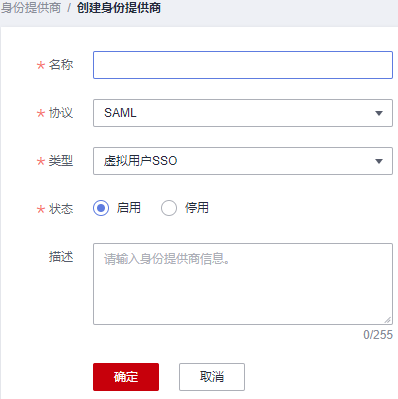
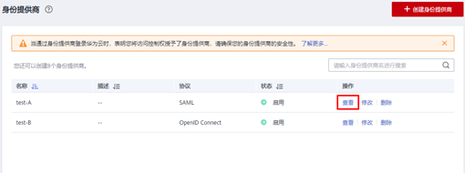
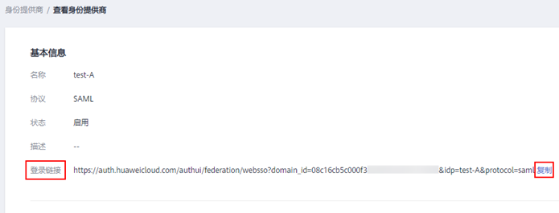

# 步骤1：创建身份提供商

配置联邦身份认证，需要在企业IdP上传华为云的元数据文件（Metadata文件），并在IAM控制台上创建身份提供商、上传企业IdP的元数据文件，来建立两个系统之间的互信关系。

## 前提条件

-   企业管理员在华为云上注册了可用的帐号，并已在IAM中创建用户组并授权，具体方法请参见：[创建用户组并授权](创建用户组并授权.md)。在华为云IAM上创建的用户组是用于与企业IdP上的用户建立映射关系，使得IdP中的用户获取华为云IAM中用户组的权限。
-   企业管理员已获取企业IdP的帮助文档或了解企业IdP使用方法。由于不同的企业IdP的配置存在较大差异，华为云帮助文档对于企业IdP的配置不做详述，获取企业IdP的元数据文件、华为云元数据上传至企业IdP等具体操作请参考企业IdP的帮助文档。

## 建立企业IdP对华为云的信任关系

在企业IdP中配置华为云的元数据文件，以建立企业IdP对华为云的信任。常用企业IdP，如Microsoft Active Directory（AD FS）和Shibboleth的配置步骤，请参见：[与华为云集成第三方IdP解决方案提供商示例](联邦身份认证配置概述.md#zh-cn_topic_0175818705_section620453919417)。

1.  下载华为云系统的元数据文件（metadata文件）。

    访问网址：[https://auth.huaweicloud.com/authui/saml/metadata.xml](https://auth.huaweicloud.com/authui/saml/metadata.xml)。下载华为云元数据文件，并设置文件名称，例如“SP-metadata.xml”。

2.  将上述文件上传到企业IdP服务器上。上传方法请参见企业IdP的帮助文档。
3.  获取企业IdP的元数据文件。获取方法请参见企业IdP的帮助文档。

## 在华为云上创建身份提供商

在IAM控制台上创建身份提供商，配置身份提供商的元数据文件后，可以在IAM中建立对企业IdP的信任关系，使得企业用户可以直接访问华为云。

1.  进入IAM控制台，在左侧导航窗格中，选择“身份提供商”页签，单击右上方的“创建身份提供商”。

    **图 1**  创建身份提供商  
    

2.  在“创建身份提供商”窗口中设置名称、协议、类型、状态、描述。

    **图 2**  填写身份提供商参数  
    

    **表 1**  身份提供商基本参数

    
    <table><thead align="left"><tr id="row15360181711151"><th class="cellrowborder" valign="top" width="16.79%" id="mcps1.2.3.1.1">
参数

    </th>
    <th class="cellrowborder" valign="top" width="83.21%" id="mcps1.2.3.1.2">
含义

    </th>
    </tr>
    </thead>
    <tbody><tr id="row12360117121518"><td class="cellrowborder" valign="top" width="16.79%" headers="mcps1.2.3.1.1 ">
名称

    </td>
    <td class="cellrowborder" valign="top" width="83.21%" headers="mcps1.2.3.1.2 ">
身份提供商的名称。身份提供商名称在全局范围内不能重复，建议以域名唯一标识命名。

    </td>
    </tr>
    <tr id="row14360617141513"><td class="cellrowborder" valign="top" width="16.79%" headers="mcps1.2.3.1.1 ">
协议

    </td>
    <td class="cellrowborder" valign="top" width="83.21%" headers="mcps1.2.3.1.2 ">
身份提供商协议。当前华为云支持基于SAML、OIDC的身份提供商，如需创建基于OIDC协议的联邦身份认证，请参考<a href="基于OIDC协议的联邦身份认证.md">基于OIDC协议的联邦身份认证</a>。

    </td>
    </tr>
    <tr id="row0360417131519"><td class="cellrowborder" valign="top" width="16.79%" headers="mcps1.2.3.1.1 ">
类型

    </td>
    <td class="cellrowborder" valign="top" width="83.21%" headers="mcps1.2.3.1.2 ">
身份提供商类型。一个帐号下只能存在一种类型的身份提供商。

    <ul id="ul157042172011"><li>虚拟用户SSO：该身份提供商中的用户登录华为云后，系统为其自动创建虚拟用户信息。一个帐号可以创建多个虚拟用户SSO类型的身份提供商。</li><li>IAM用户SSO：该身份提供商中的用户登录华为云后，系统根据您配置的身份转换规则为其映射实体IAM用户。一个帐号下只能创建一个IAM用户SSO类型的身份提供商。如果选择该类型，请确保您已为用户创建对应的IAM用户并设置外部身份ID，请参考<a href="创建IAM用户.md">创建IAM用户</a>。</li></ul>
    </td>
    </tr>
    <tr id="row2360141714155"><td class="cellrowborder" valign="top" width="16.79%" headers="mcps1.2.3.1.1 ">
状态

    </td>
    <td class="cellrowborder" valign="top" width="83.21%" headers="mcps1.2.3.1.2 ">
身份提供商的状态。默认设置为“启用”。

    </td>
    </tr>
    </tbody>
    </table>

3.  单击“确定”，创建身份提供商成功。

## 在华为云上配置元数据文件

配置元数据文件，即把企业IdP的Metadata文件配置到华为云。IAM支持“上传文件”和“手动编辑”两种配置，选择其中一种即可。如果元数据文件超过500KB，请通过“手动编辑”配置元数据。如果后续元数据有更新，需要用户重新上传或者编辑元数据，否则会影响联邦用户登录华为云。

> **说明：** 
>企业IdP的Metadata文件获取方法请参考企业IdP提供商的帮助文档。

-   **上传元数据**：
    1.  单击身份提供商列表中“操作”列的“修改”。

        **图 3**  修改身份提供商  
        

    2.  单击“上传文件”左侧的“添加文件”，选择获取的企业IdP的元数据文件。

        **图 4**  上传元数据文件  
        

    3.  单击“上传文件”。弹出页面显示系统提取到的元数据，单击“确定”。
        -   提示“系统发现您上传的文件中包含多个身份提供商，请选择您本次需要使用的身份提供商“，请在“Entity ID”下拉框中选择您本次需要使用的身份提供商。
        -   提示元数据文件中Entity ID为空、签名证书过期等内容时，需要您确认元数据文件的正确性后，重新上传或者通过手动编辑提取元数据。

    4.  单击“确定“，保存设置信息。

-   **手动编辑元数据**
    1.  单击“手动编辑“。

        **图 5**  手动编辑元数据  
        

    2.  在“手动编辑元数据“页面中，输入从企业IdP元数据文件中获取的“Entity ID“、“签名证书“和“SingleSignOnService“等参数。

        
        <table><thead align="left"><tr id="row6547182103814"><th class="cellrowborder" valign="top" width="28.08%" id="mcps1.1.4.1.1">
参数

        </th>
        <th class="cellrowborder" valign="top" width="9.69%" id="mcps1.1.4.1.2">
是否必选

        </th>
        <th class="cellrowborder" valign="top" width="62.23%" id="mcps1.1.4.1.3">
含义

        </th>
        </tr>
        </thead>
        <tbody><tr id="row45486218382"><td class="cellrowborder" valign="top" width="28.08%" headers="mcps1.1.4.1.1 ">
Entity ID

        </td>
        <td class="cellrowborder" valign="top" width="9.69%" headers="mcps1.1.4.1.2 ">
是

        </td>
        <td class="cellrowborder" valign="top" width="62.23%" headers="mcps1.1.4.1.3 ">
对应IdP元数据文件中“entityID”的值。

        
企业身份提供商的唯一标识，元数据文件中可能包含多个身份提供商，需要选择对应的身份提供商。

        </td>
        </tr>
        <tr id="row05481124386"><td class="cellrowborder" valign="top" width="28.08%" headers="mcps1.1.4.1.1 ">
支持的协议

        </td>
        <td class="cellrowborder" valign="top" width="9.69%" headers="mcps1.1.4.1.2 ">
是

        </td>
        <td class="cellrowborder" valign="top" width="62.23%" headers="mcps1.1.4.1.3 ">
企业IdP与服务提供商之间，通过SAML协议完成联邦身份认证。

        
<strong id="b5565182383111">选择协议后，系统自动生成。</strong>

        </td>
        </tr>
        <tr id="row554815273816"><td class="cellrowborder" valign="top" width="28.08%" headers="mcps1.1.4.1.1 ">
支持的NameIdFormat

        </td>
        <td class="cellrowborder" valign="top" width="9.69%" headers="mcps1.1.4.1.2 ">
否

        </td>
        <td class="cellrowborder" valign="top" width="62.23%" headers="mcps1.1.4.1.3 ">
对应IdP元数据文件中“NameIdFormat”的值。

        
身份提供商支持的用户名称标识格式。名称标识是身份提供商与联邦用户之间实现通信的一种方式。

        
<strong id="b4866412153011">支持配置多个，华为云默认使用第一个。</strong>

        </td>
        </tr>
        <tr id="row954816283817"><td class="cellrowborder" valign="top" width="28.08%" headers="mcps1.1.4.1.1 ">
签名证书

        </td>
        <td class="cellrowborder" valign="top" width="9.69%" headers="mcps1.1.4.1.2 ">
是

        </td>
        <td class="cellrowborder" valign="top" width="62.23%" headers="mcps1.1.4.1.3 ">
对应IdP元数据文件中“&lt;X509Certificate&gt;” 的值。

        
签名证书是一份包含公钥用于验证签名的证书，为了确保安全性，建议使用长度大于等于2048位的公钥。IAM通过元数据文件中的签名证书来确认联邦身份认证过程中断言消息的可信性、完整性。

        
<strong id="b27111184306">支持配置多个，华为云默认使用第一个。</strong>

        </td>
        </tr>
        <tr id="row125491029387"><td class="cellrowborder" valign="top" width="28.08%" headers="mcps1.1.4.1.1 ">
SingleSignOnService

        </td>
        <td class="cellrowborder" valign="top" width="9.69%" headers="mcps1.1.4.1.2 ">
是

        </td>
        <td class="cellrowborder" valign="top" width="62.23%" headers="mcps1.1.4.1.3 ">
对应IdP元数据文件中“SingleSignOnService” 的值。

        
单点登录过程中发送SAML请求的方式。元数据文件中的“SingleSignOnService”需要支持HTTP Redirect或HTTP POST方式。

        
<strong id="b196781403307">支持配置多个，华为云默认使用第一个。</strong>

        </td>
        </tr>
        <tr id="row17549821380"><td class="cellrowborder" valign="top" width="28.08%" headers="mcps1.1.4.1.1 ">
SingleLogoutService

        </td>
        <td class="cellrowborder" valign="top" width="9.69%" headers="mcps1.1.4.1.2 ">
否

        </td>
        <td class="cellrowborder" valign="top" width="62.23%" headers="mcps1.1.4.1.3 ">
对应IdP元数据文件中“SingleLogoutService” 的值。

        
服务提供商提供会话注销功能，联邦用户在IAM注销会话后返回绑定的地址。“SingleLogoutService” 需要支持HTTP Redirect或HTTP POST方式。

        
<strong id="b24077351300">支持配置多个，华为云默认使用第一个。</strong>

        </td>
        </tr>
        </tbody>
        </table>

        示例：以下为某企业IdP的元数据文件和手动编辑元数据信息时需要填入的内容。

        **图 6**  某企业IdP的元数据文件  
        

        **图 7**  根据企业IdP元数据文件手动编辑元数据  
        

    3.  单击“确定“，保存设置信息。

## 联邦用户登录验证

1.  检查登录链接是否可以跳转到企业的IdP服务器提供的登录界面。
    1.  在IAM控制台的“身份提供商”页面，单击“操作”列的“查看”（如[图8](#fig131471856114920)所示），进入“身份提供商基本信息”页面；单击“登录链接”右侧的“复制”，如[图9](#fig188861130154918)所示，并在浏览器中打开。

        **图 8**  查看身份提供商  
        

        **图 9**  复制登录链接  
        

    2.  检查浏览器页面是否跳转到IdP登录界面，如果跳转失败，请确认获取的企业元数据文件以及企业IdP服务器配置是否正确。

2.  输入企业IdP的用户名和密码验证是否可以登录到华为云。

    -   登录成功：表示单点登录验证成功，您可以将该地址以链接的形式配置到企业管理系统。
    -   登录失败：请检查您的用户名和密码。

    > **说明：** 
    >此时联邦用户只能访问华为云，没有任何权限。为联邦用户配置权限需要配置身份转换规则，具体说明请参见：[步骤2：配置身份转换规则](步骤2-配置身份转换规则.md)。

## 相关操作

-   查看身份提供商信息：在身份提供商列表中，单击“查看“，可查看身份提供商的基本信息、元数据详情、身份转换规则。

    > **说明：** 
    >单击“查看身份提供商“页面下方的“修改身份提供商“，可直接进入“修改身份提供商“界面。

-   修改身份提供商信息：在身份提供商列表中，单击“修改“进入“修改身份提供商“界面。可修改身份提供商的状态（“启用“或“停用“）、描述信息、元数据信息和身份转换规则。
-   删除身份提供商：在身份提供商列表中，单击“删除“，删除对应的身份提供商。

## 后续任务

-   在“身份转换规则“区域，配置身份转换规则，建立企业管理系统用户与IAM用户组间的映射关系，使得企业管理系统用户获得用户组对应的华为云操作权限。身份转换规则详情请参见：[步骤2：配置身份转换规则](步骤2-配置身份转换规则.md)。
-   在企业管理系统中配置单点登录，使企业用户可以通过企业管理系统中的华为云登录入口直接访问华为云，方法请参考：[步骤3：配置企业管理系统登录入口](（可选）步骤4-配置企业管理系统登录入口.md)。

