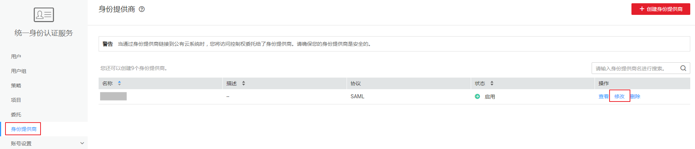

# 步骤2：配置身份转换规则

在IAM上创建身份提供商后，联邦用户在华为云中的用户名默认为“FederationUser”，且联邦用户仅能访问华为云，没有任何权限。您可以在IAM控制台配置身份转换规则，实现：

-   企业IdP用户在华为云中显示不同的用户名。
-   赋予企业IdP用户使用华为云资源的权限。由于华为云权限的最小授权单位是用户组，因此需要建立联邦用户与IAM用户组的映射关系，从而使得联邦用户获得对应用户组的权限，使用华为云上的资源。请确保已创建需要映射的IAM用户组，创建IAM用户组并授权请参见：[创建用户组并授权](https://support.huaweicloud.com/usermanual-iam/zh-cn_topic_0046611269.html)。

> **说明：**   
>-   修改身份转换规则后，对已登录的联邦用户不会即时生效，需重新登录后新规则才可生效。  
>-   如果需要修改用户的权限，修改用户所属用户组的权限即可，修改后，需要重启企业IdP系统使设置生效。  

## 操作步骤

您可以使用“创建规则”，IAM会将您填写的身份转换规则参数转换成JSON语言；也可以单击“编辑规则”直接编写JSON语言，编辑身份转换规则的详细说明和示例请参见：[身份转换规则详细说明](身份转换规则详细说明.md)。

-   **创建规则**
    1.  管理员登录华为云，进入IAM控制台，并在左侧导航窗格中，单击“身份提供商”。
    2.  在身份提供商列表中，选择您创建的身份提供商，单击“修改”。

        **图 1**  修改身份提供商  
        

    3.  在“身份转换规则”区域单击“创建规则”。

        **图 2**  创建规则  
        

        **表 1**  参数说明

        
        <table><thead align="left"><tr id="row199141446104119"><th class="cellrowborder" valign="top" width="14.34%" id="mcps1.2.4.1.1">
参数名

        </th>
        <th class="cellrowborder" valign="top" width="21.97%" id="mcps1.2.4.1.2">
描述

        </th>
        <th class="cellrowborder" valign="top" width="63.690000000000005%" id="mcps1.2.4.1.3">
说明

        </th>
        </tr>
        </thead>
        <tbody><tr id="row1391517468413"><td class="cellrowborder" valign="top" width="14.34%" headers="mcps1.2.4.1.1 ">
用户名

        </td>
        <td class="cellrowborder" valign="top" width="21.97%" headers="mcps1.2.4.1.2 ">
联邦用户在华为云中显示的用户名，以下简称“联邦用户名”。

        </td>
        <td class="cellrowborder" valign="top" width="63.690000000000005%" headers="mcps1.2.4.1.3 ">
为了区分华为云的用户与联邦用户，建议此处配置用户名为“FederationUser-IdP<em id="i109144461413">_</em>XXX”。其中“IdP”为身份提供商名称，如ADFS、Shibboleth等，用于区分不同身份提供商下的联邦用户；“XXX”为自定义的具体名称。

        
也可将联邦用户名设置为一个简单的表达式，如：FederationUser-IdP_{email}。身份转换规则创建成功后，{email}自动替换为联邦用户的邮箱。如果返回的SAML断言中没有用户邮箱，则该规则不生效。

        
 须知： 

同一账号中的联邦用户名需要确保其在本账号内唯一。如果同一账号内出现重复的联邦用户名（无论是在一个或是多个身份提供商下的联邦用户名），则重名的联邦用户在华为云中应用同一个IAM用户。

        

        </td>
        </tr>
        <tr id="row99154462410"><td class="cellrowborder" valign="top" width="14.34%" headers="mcps1.2.4.1.1 ">
用户组

        </td>
        <td class="cellrowborder" valign="top" width="21.97%" headers="mcps1.2.4.1.2 ">
联邦用户在华为云中所属的用户组

        </td>
        <td class="cellrowborder" valign="top" width="63.690000000000005%" headers="mcps1.2.4.1.3 ">
联邦用户拥有所属用户组的权限。

        </td>
        </tr>
        <tr id="row591644684114"><td class="cellrowborder" valign="top" width="14.34%" headers="mcps1.2.4.1.1 ">
本规则生效条件

        </td>
        <td class="cellrowborder" valign="top" width="21.97%" headers="mcps1.2.4.1.2 ">
联邦用户拥有所选用户组权限的生效条件。

        </td>
        <td class="cellrowborder" valign="top" width="63.690000000000005%" headers="mcps1.2.4.1.3 ">
当不满足生效条件时，该规则不生效，且不满足生效条件的用户无法访问华为云。一个身份转换规则最多可以创建10条生效条件。

        
“属性”、“值”为企业IdP通过SAML断言返回给华为云用户信息；“条件”可选择：empty、any_one_of、not_any_of，详细说明请参见：<a href="https://support.huaweicloud.com/usermanual-iam/zh-cn_topic_0079620340.html" target="_blank" rel="noopener noreferrer">身份转换规则详细说明</a>。

        
 说明： 
<ul id="ul149162466417"><li>一个规则可以创建多条生效条件，只要有一条生效条件满足，此规则即可生效。</li><li>一个身份提供商可以创建多条规则，规则共同作用。如果所有规则对某个联邦用户都不生效，那么该联邦用户禁止访问华为云。</li></ul>
        

        </td>
        </tr>
        </tbody>
        </table>

        示例：为企业系统管理员设定规则。

        -   用户名：FederationUser-IdP\_admin\_\{email\}
        -   用户组：“admin“
        -   生效条件：“属性“：“\_NAMEID\_“；“条件“：“any\_one\_of“；“值“：“ID1;ID2;ID3“。

            表示仅用户ID为ID1，ID2或ID3的用户具有华为云中的“admin“用户组的权限，该IdP的其他用户不具有“admin“用户组的权限。

    4.  在“创建规则“页面，单击“确定“。
    5.  在“修改身份提供商“页面，单击“确定“，使配置生效。

-   **编辑规则**
    1.  管理员登录华为云，进入IAM控制台，并在左侧导航窗格中，单击“身份提供商”。
    2.  在身份提供商列表中，选择您创建的身份提供商，单击“修改”。

        

    3.  在“身份转换规则”区域单击“编辑规则”。
    4.  在编辑框内输入JSON格式的身份转换规则，具体说明请参见：[身份转换规则详细说明](身份转换规则详细说明.md)。
    5.  单击“校验规则”，对已编辑的规则进行语法校验。
    6.  界面提示“规则正确”：在“编辑规则“页面，单击“确定“；在“修改身份提供商“页面，单击“确定“，使配置生效。

        界面提示“JSON文件格式不完整”：请修改JSON语句，或单击“取消”，取消本次修改内容。

## 验证联邦用户权限

配置身份转换规则后，查看联邦用户是否已有相应权限。

1.  联邦用户登录。

    在IAM控制台的“身份提供商”页面，单击“操作”列的“查看”，进入“身份提供商基本信息”页面；单击“登录链接”右侧的“复制”，在浏览器中打开，输入用户名和密码，登录成功。

    

2.  查看联邦用户是否具有所属用户组的权限。

    例如，配置身份转换规则时，使联邦用户“ID1”对应IAM用户组“admin”，拥有所有云服务的权限。进入控制台，选择任一云服务，查看是否可以访问此服务。

## 相关操作

查看规则：在“身份转换规则“区域单击“查看规则“。新创建的身份转换规则在JSON文件中显示。JSON文件内容说明请参考：[身份转换规则详细说明](身份转换规则详细说明.md)。

