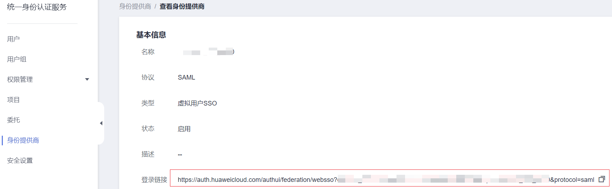

# 步骤3：登录验证

## 登录验证

按照登录请求发起方可将联邦用户登录方式分为两类：

-   Idp侧登录：用户从IdP侧（企业自己的身份提供商侧）发起登录请求，例如从Microsoft Active Directory（AD FS）、Shibboleth侧发起登录华为云控制台的请求。
-   SP侧登录：用户从SP侧（服务提供商侧）发起登录请求，在企业与华为云联邦身份认证的过程中，服务提供商指华为云，SP侧登录链接可在IAM控制台身份提供商详情页面获取。

不同的企业IdP发起Idp侧登录的方式差异较大，华为云帮助文档不做详述，具体操作请参考企业IdP的帮助文档。本节重点介绍SP侧发起登录的方法：

1.  联邦用户登录。

    在控制台的“身份提供商”页面，单击“操作”列的“查看”，进入“身份提供商基本信息”页面；单击“登录链接”右侧的“复制”，在浏览器中打开，输入企业管理系统用户名和密码，登录成功。

    

2.  查看联邦用户是否具有所属用户组的权限。

    例如，配置身份转换规则时，使联邦用户“ID1”对应IAM用户组“admin”，拥有所有云服务的权限。进入控制台，选择任一云服务，查看是否可以访问此服务。

## 跳转到指定区域或服务

如需指定联邦用户登录的目标页面，比如联邦用户登录时，指定跳转到北京四局点，云监控服务CES主页。有以下两种配置方式：

-   SP侧登录配置方法

    拼接控制台获取的登录链接与指定url，拼接格式为“**登录链接&service=指定url**”。例如：获取的登录地址为https://auth.huaweicloud.com/authui/federation/websso?domain\_id=XXX&idp=XXX&protocol=saml，指定跳转的控制台地址为[https://console.huaweicloud.com/ces/?region=cn-north-4](https://console.huaweicloud.com/ces/?region=cn-north-4)，按照拼接格式拼接得到的登录链接为：https://auth.huaweicloud.com/authui/federation/websso?domain\_id=XXX&idp=XXX&protocol=saml&service=[https://console.huaweicloud.com/ces/?region=cn-north-4](https://console.huaweicloud.com/ces/?region=cn-north-4)。

-   IdP侧登录配置方法

    在企业IdP的SAML 断言中配置IAM\_SAML\_Attributes\_redirect\_url声明，声明值为指定跳转的目标URL。

