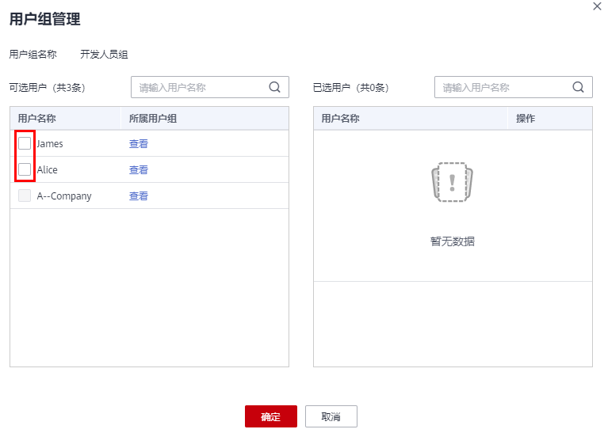
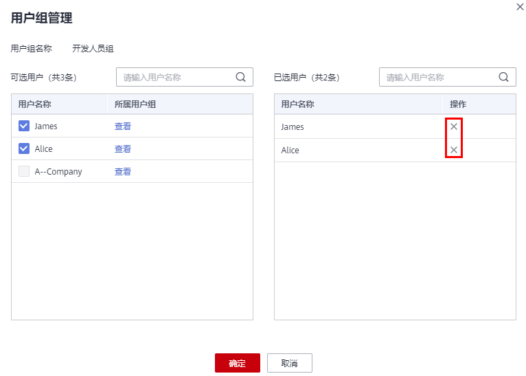

# 用户组添加/移除用户

管理员创建用户组并授权后，将用户加入用户组中，使用户具备用户组的权限，实现用户的授权。给已授权的用户组中添加或者移除用户，快速实现用户的权限变更。

## 用户组添加用户

1.  管理员在用户组列表中，单击新建用户组“开发人员组”，右侧的“用户组管理“。

    **图 1**  用户组管理  
    

2.  在“可选用户”中选择需要添加至用户组中的用户。

    **图 2**  选择用户  
    

3.  单击“确定”，完成用户授权。

## 用户组移除用户

1.  管理员在用户组列表中，单击新建用户组“开发人员组”，右侧的“用户组管理“。
2.  在“已选用户”中，单击用户名称右侧的删除图标，单击“确定”，完成移除用户。

    **图 3**  移除用户组中的用户  
    

