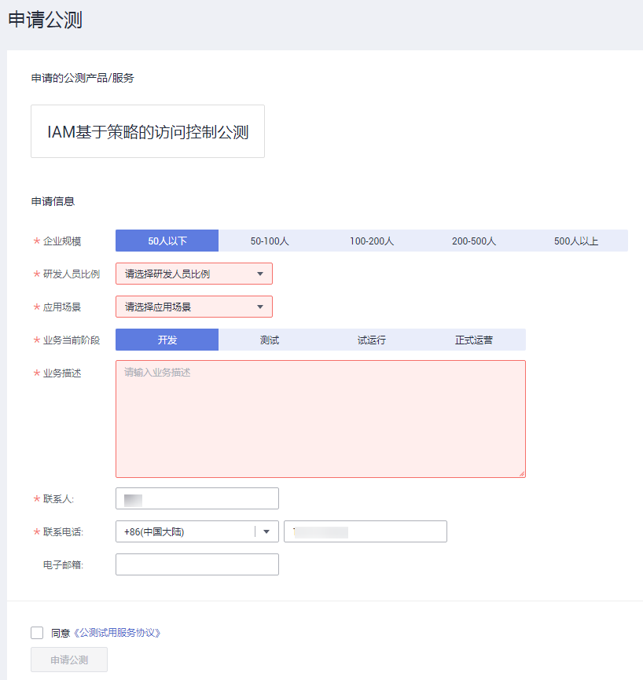

# 申请基于策略的访问控制公测

基于策略的访问控制是针对需要精细化控制权限的用户设计的一种授权方式，当前处于公测阶段，推荐您开通，开通后可永久免费使用。如果不开通基于策略的授权功能，将无法使用系统策略和自定义策略，只能使用基于角色的授权。

> **说明：**   
>申请基于策略的访问控制公测，需要先进行[实名认证](https://support.huaweicloud.com/usermanual-account/account_auth_00001.html)。  

## 操作步骤

1.  登录华为云，在右上角单击“控制台”。
2.  在控制台页面，鼠标移动至右上方的用户名，在下拉列表中选择“统一身份认证”。
3.  在统一身份认证服务的左侧导航窗格中，单击“权限“。
4.  单击“立即申请”，在“申请公测”页面，填写参数信息。

    

5.  单击“申请公测”。IAM会在5个工作日内将审核结果发送到您的手机和邮箱。

