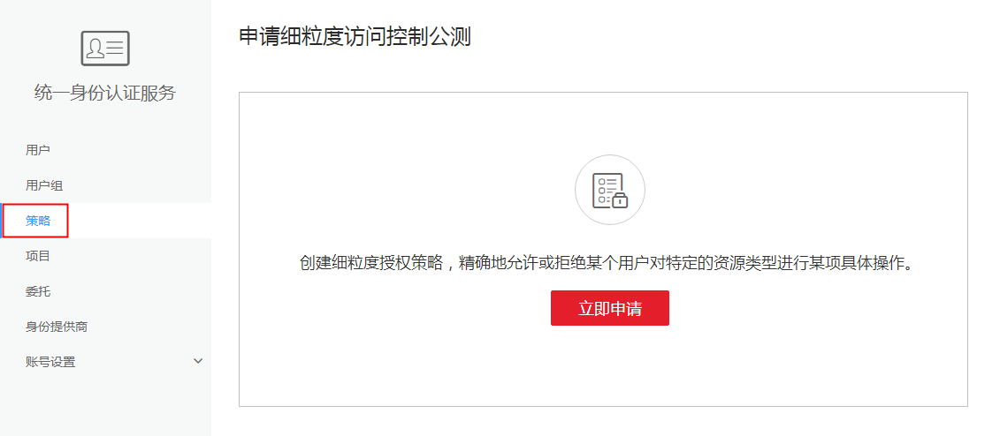
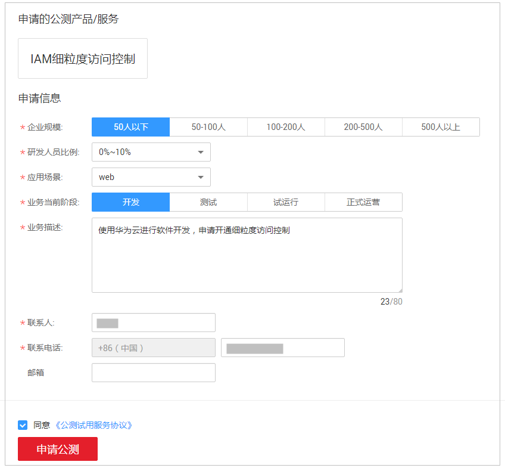

# 申请细粒度访问控制公测

细粒度策略是针对需要精细化控制权限的用户设计的一种授权方式，当前处于公测阶段，推荐您开通细粒度策略，开通后可免费使用。如果不开通细粒度策略功能，给用户组授权时，无法使用细粒度策略，只能使用RBAC策略。

## 操作步骤

1.  登录华为云，在右上角单击“控制台”。

    

2.  在控制台页面，鼠标移动至右上方的用户名，在下拉列表中选择“统一身份认证”。

    

3.  在统一身份认证服务的左侧导航窗格中，单击“策略“。

    

      

      

4.  单击“立即申请”，在“申请公测”页面，填写参数信息。

    

      

      

5.  单击“申请公测”。

    提交公测申请后，IAM将会在48小时内通过您的公测申请。

