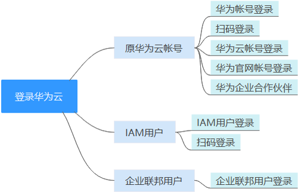
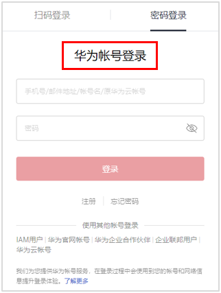
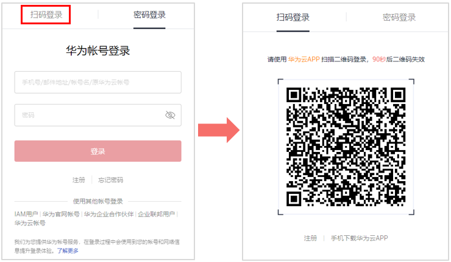
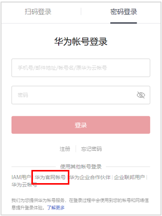
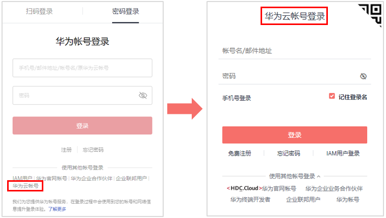
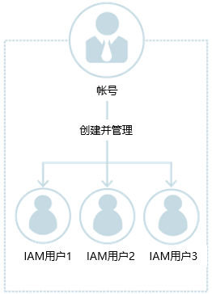
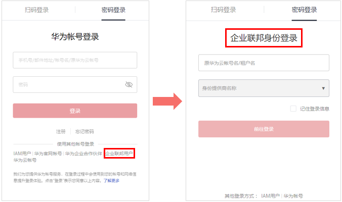

# 登录华为云

您可以通过以下方式登录华为云，如[图1](#fig19864205611155)所示。

-   **华为云帐号**：您首次使用华为云时创建的帐号，该帐号是您的华为云资源归属、资源使用计费的主体，对其所拥有的资源及云服务具有完全的访问权限。如果您需要以帐号身份登录华为云，请参考：
    -   [华为帐号登录](#section1464612712179)：华为帐号是您访问华为各网站的统一“身份标识”，您只需注册华为帐号，即可访问所有华为服务。[华为帐号和华为云帐号](https://support.huaweicloud.com/iam_faq/iam_01_0615.html)不同，请确认您已注册华为帐号。如果您暂未注册华为帐号，建议您先注册华为帐号并开通华为云，请参考[注册华为帐号并开通华为云](https://support.huaweicloud.com/usermanual-account/account_id_001.html)。
    -   [扫码登录](#section13703247175217)：如果您在华为云APP上登录了帐号或IAM用户，可以通过APP扫描界面二维码登录华为云。如需下载华为云APP，请点击：[下载华为云APP](https://www.huaweicloud.com/mobile_app/hwapp.html)。
    -   [华为云帐号登录](#section106621459191110)：使用您已注册的华为云帐号登录。如果您是首次使用华为云，建议您[注册华为帐号并开通华为云 ](https://support.huaweicloud.com/usermanual-account/account_id_001.html)。
    -   [其他帐号登录](#section19576249195312)：您可以通过**华为官网帐号、华为企业合作伙伴登录**华为云，首次登录时需要根据系统提示创建或绑定已有华为云帐号，后续可以通过该帐号自动跳转登录，也可以为创建的华为云帐号设置密码或绑定已有华为云帐号，通过帐号登录华为云。

-   **IAM用户**：由[管理员](使用前必读.md#section209491111991)在IAM中创建的用户，是云服务的使用人员，根据帐号授予的权限使用资源。如果您是IAM用户，登录方法请参考：
    -   [IAM用户登录](#section116614408305)：[帐号与IAM用户](https://support.huaweicloud.com/productdesc-iam/iam_01_0023.html#section2)可以类比为父子关系，IAM用户是由[管理员](使用前必读.md#section209491111991)在IAM中创建的用户，IAM用户登录后可根据权限使用云服务。
    -   [扫码登录](#section13703247175217)：如果您在华为云APP上登录了帐号或IAM用户，可以通过APP扫描界面二维码登录华为云。如需下载华为云APP，请点击：[下载华为云APP](https://www.huaweicloud.com/mobile_app/hwapp.html)。

-   **企业联邦用户**：由[管理员](使用前必读.md#section209491111991)在IAM中创建的企业身份提供商用户。

    -   [企业联邦用户登录](#section1578531670)：如果您已知创建该身份提供商的华为云帐号名称、身份提供商名称、企业管理系统的帐号和密码，可以通过此方式登录华为云。

    **图 1**  登录华为云  
    

## 华为帐号登录

华为帐号是用户访问华为各网站的统一“身份标识”，您只需注册一个华为帐号，即可访问所有华为服务。您可以在[华为帐号网站](https://id1.cloud.huawei.com/AMW/portal/homepage.html)注册和管理华为帐号或在华为云[注册华为帐号并开通华为云](https://support.huaweicloud.com/usermanual-account/account_id_001.html)。在通过华为帐号登录华为云控制台时，可使用“手机号/邮件地址/帐号名/原华为云帐号”方式。

**通过华为帐号登录方法如下：**

1.  在华为云的登录页面，输入手机号/邮件地址/帐号名/原华为云帐号、帐号密码，单击“登录”。

    **图 2**  华为帐号登录  
    

    > **说明：** 
    >-   如您输入的帐号信息为原华为云帐号或已经注册华为帐号并开通了华为云业务，可直接登录成功。
    >-   如您输入的帐号信息为华为帐号且该帐号使用的手机号/邮件地址开通了华为云业务，请参照[2](#li1922454233314)完成操作。
    >-   如您输入的帐号信息为华为帐号但该帐号使用的手机号/邮件地址未开通华为云业务，请参照[3](#li178792111076)完成操作。

2.  选择本次登录帐号。

    **系统根据您输入帐号信息进行检测，如您使用同一手机号或邮件地址分别注册过华为帐号和华为云帐号，需要选择任意一种进行登录。**

    -   选择华为帐号登录：单击“确定”，参照[3](#li178792111076)继续完成登录操作。
    -   选择原华为云帐号登录：单击“确定”，登录华为云成功。

3.  单击“获取验证码”并输入验证码，单击“确定”。

    如您注册时，同时绑定手机号和邮件地址，您还可以切换邮件地址进行身份验证。

4.  在“是否信任此浏览器？”弹框中，单击“信任”。
5.  在“帐号提醒”弹框中，单击“直接开通华为云”或“切换帐号登录”。
    -   直接开通华为云：为该华为帐号开通华为云业务。开通后，可以通过该华为帐号登录华为云。单击后，参照[6](#li1278224615255)继续完成操作。
    -   切换帐号登录：使用已注册的华为云帐号登录。单击后，跳转至“华为帐号登录”页面，参照[1](#li45828452016)通过其他帐号登录华为云。

6.  （如系统没有检测出注册过华为云帐号，无需执行此步骤）选择华为云帐号进行升级。

    > **说明：** 
    >系统会根据您华为帐号的手机号或邮件地址，检测您可能注册过的华为云帐号，您可以选其一升级成为华为帐号，即可使用一个统一帐号访问华为云、华为开发者联盟、华为商城等更多华为服务。

    -   选择华为云帐号进行升级
        1.  如您需要升级，请选择华为云帐号，并单击“下一步”。
        2.  输入原华为云帐号密码，单击“下一步”。
        3.  确认升级后的华为帐号信息，单击“确定”，系统提示升级成功。
        4.  单击“完成”，系统跳转至华为云页面。

            > **说明：** 
            >-   此时华为帐号已成功关联华为云业务，下次请使用华为帐号登录，原华为云帐号失效。
            >-   如果升级失败，请参考“常见问题\>帐号管理类\>升级华为帐号失败怎么办”。

    -   重新开通华为云

        单击“跳过此步，直接开通华为云”，请参照[7](#li207351055114312)继续完成操作。

7.  在“开通华为云”页面，勾选服务条款， 单击“开通”，系统提示开通成功。

    开通成功即可通过该华为帐号登录华为云。

## 扫码登录

华为云APP是华为云的手机客户端，通过华为云APP，您可以在手机上远程管理您的华为云服务资源。如果您在华为云APP上登录了帐号或IAM用户，通过APP扫描页面二维码即可登录华为云，无需重复输入帐号信息。

> **说明：** 
>如需下载华为云APP，请点击：[下载华为云APP](https://www.huaweicloud.com/mobile_app/hwapp.html)。

**通过华为云APP扫码登录方法如下：**

1.  在华为云的登录页面，单击右上角的二维码，进入“扫码登录”页面。

    **图 3**  扫码登录  
    

2.  使用华为云APP扫描页面二维码，登录华为云。

## 其他帐号登录

如果您已有“[华为官网帐号](https://www.huawei.com/cn/)”、“[华为企业合作伙伴帐号](https://e.huawei.com/cn/)”，可以通过此方式登录华为云，无需记录多套身份信息。

下面以“华为官网帐号”为例，为您介绍使用其他帐号登录华为云的操作步骤。

1.  单击“华为官网帐号”，如下图所示。

    **图 4**  华为官网帐号  
    

2.  根据界面指引登录华为官网帐号。

    -   首次登录时：页面自动跳转至创建或关联华为云帐号页面，输入帐号名和手机号、验证码。单击“创建并绑定”，登录华为云控制台。
    -   后续登录时：直接跳转至华为云控制台。

    首次登录成功后，后续可以使用[步骤2](#li188834331531)中设置的帐号名或手机号，通过华为云帐号登录华为云控制台。

## 华为云帐号登录

如果您已注册华为云帐号，可以通过该帐号直接登录华为云。该帐号是您的华为云资源归属、资源使用计费的主体，对其所拥有的资源及云服务具有完全的访问权限，可以重置用户密码、分配用户权限等。所有IAM用户产生的费用账单由帐号统一接收并付费。帐号在登录华为云控制台时，可使用“帐号名/邮件地址”或“手机号登录”方式。

> **说明：** 
>已升级华为帐号的华为云帐号暂不支持登录，请使用[华为帐号登录](#section1464612712179)。

**通过华为云帐号登录方法如下：**

1.  单击“华为云帐号”，如[图5](#fig264612122574)所示。

    **图 5**  华为云帐号  
    

2.  输入您的帐号信息，单击“登录”。
    -   帐号名/邮件地址：华为云帐号名/与帐号绑定的邮件地址。

        > **说明：** 
        >帐号名不区分大小写。

    -   密码：帐号密码，如果您忘记了帐号的登录密码，可以单击“忘记密码”进行重置，重置方法请参见：[忘记帐号密码](https://support.huaweicloud.com/iam_faq/iam_01_0314.html#section0)。
    -   手机号登录：如果您忘记了华为云帐号，可以单击“手机号登录”，可以通过已绑定的手机号、帐号密码登录华为云。

## IAM用户登录

IAM用户是由华为云帐号或[管理员](使用前必读.md#section209491111991)在IAM中创建的用户，是云服务的使用人员，具有独立的身份凭证（密码和访问密钥），根据帐号授予的权限使用资源。IAM用户不进行独立的计费，由所属帐号统一付费。

帐号与IAM用户可以类比为父子关系，如下图所示。

**图 6**  帐号与IAM用户  

**IAM用户登录方法如下：**

1.  在华为云的登录页面，单击登录下方的“IAM用户”，在“IAM用户登录”页面，输入帐号名，IAM用户名/邮件地址和密码。

    **图 7**  IAM用户登录  
    

    -   租户名/原华为云帐号：IAM用户所属的帐号，即华为云[帐号](使用前必读.md#section570831416230)。如果不知道帐号名，请向[管理员](使用前必读.md#section209491111991)获取。
    -   IAM用户名/邮件地址：在IAM创建用户时，输入的[IAM用户](使用前必读.md#section108144194235)名/邮件地址。如果不知道用户名及初始密码，请向[管理员](使用前必读.md#section209491111991)获取。
    -   IAM用户密码：IAM用户的密码，非帐号密码。

2.  单击“登录”，登录华为云。

## 企业联邦用户登录

企业联邦用户是在企业管理系统中创建的用户，帐号在IAM控制台创建[身份提供商](身份提供商.md)后，企业联邦用户可以登录华为云并根据对应权限使用云服务。详情请参考：[身份提供商概述](身份提供商概述.md)。

如果您已知创建该身份提供商的华为云帐号名称、身份提供商名称、企业管理系统的帐号和密码，可以通过此方式登录华为云。

1.  在华为云的登录页面，单击登录下方的“企业联邦用户”，在“企业联邦身份登录”页面，输入帐号名，选择身份提供商名称。

    **图 8**  企业联邦身份登录  
    

    -   原华为云帐号名/租户名：创建身份提供商的华为云帐号名称。如果不知道帐号名，请向[管理员](使用前必读.md#section209491111991)获取。
    -   身份提供商名称：[管理员](使用前必读.md#section209491111991)创建身份提供商时，设置的名称。如果不知道身份提供商名称，请向[管理员](使用前必读.md#section209491111991)获取。

2.  单击“前往登录”，跳转至企业管理系统登录页面。
3.  在企业管理系统登录页面，输入企业管理系统用户名、密码。
4.  单击“登录”，登录华为云。

