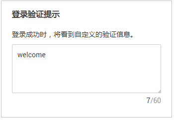
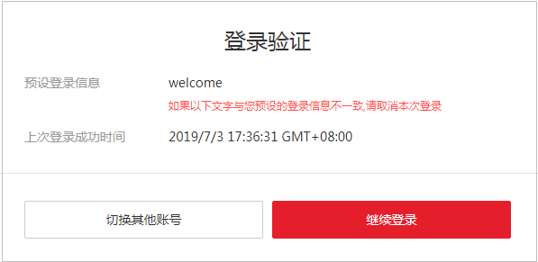

# 登录验证策略

[进入账号安全设置](账号安全设置概述.md#zh-cn_topic_0179263545_section113256158575)后，选择“登录验证策略”页签，可以对[会话超时策略](#zh-cn_topic_0176803438_section10968105732412)、[账号锁定策略](#zh-cn_topic_0176803438_section13189358)、[账号停用策略](#zh-cn_topic_0176803438_section1694311288250)、[最近登录提示](#zh-cn_topic_0176803438_section446533912253)、[登录验证提示](#zh-cn_topic_0176803438_section733474592515)进行修改。

只有[管理员](使用前必读.md)可以设置登录验证策略，普通IAM用户只有查看权限，不能对其进行设置，如需修改，请联系管理员为您操作或添加权限。

## 会话超时策略

如果用户超过设置的时长未操作界面，会话将会失效，需要重新登录。

会话超时策略默认开启，不能关闭，管理员可以设置会话超时的时长，会话超时时长默认为1个小时，可以在15分钟\~24小时之间进行设置，该策略对账号以及账号下的IAM用户都生效。

下图表示：用户在设置的会话时长内没有操作界面，会话失效，需要重新登录。

## 账号锁定策略

如果在限定时间长度内达到登录失败次数后，用户会被锁定一段时间，锁定时间结束后，才能重新登录。

账号锁定策略默认开启，不能关闭，管理员可以进行设置，该策略对账号以及账号下的IAM用户都生效。

-   限定时间长度（分钟）：默认为15分钟，可以在15\~60分钟之间进行设置。
-   限定时间内登录失败次数：默认为5次，可以在3\~10次之间进行设置。
-   账号锁定时长（分钟）：默认为15分钟，可以在15\~30分钟之间进行设置。

下图表示：如果在15分钟内连续5次登录失败，用户会被锁定15分钟。15分钟后可以尝试再次登录。

## 账号停用策略

如果IAM用户在设置的有效期内没有通过界面控制台或者API访问华为云，将会被停用。

账号停用策略默认关闭，管理员可以选择开启，并在1\~240天之间进行设置。该策略仅对账号下的IAM用户生效，对账号本身不生效，IAM用户被停用后，可以联系管理员重新启用。

## 最近登录提示

如果开启最近登录提示，用户登录成功后，将在“登录验证“页面中看到上次登录成功时间，最近登录提示可以帮助用户查看是否存在异常登录信息，如果存在不是本人的登录信息，建议立即修改密码。

最近登录提示默认关闭，管理员可以选择开启，该策略对账号以及账号下的IAM用户都生效。

## 登录验证提示

管理员可以在最近登录提示中进行公告，例如欢迎语，或者提示用户谨慎删除资源等。

登录验证提示默认关闭，管理员可以选择开启，该策略对账号以及账号下的用户都生效。

开启后，用户将在“登录验证”页面中看到公告信息。

