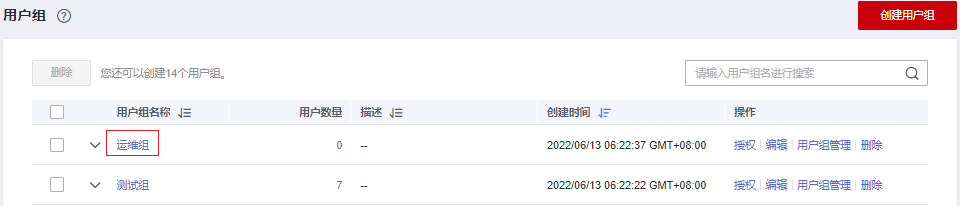
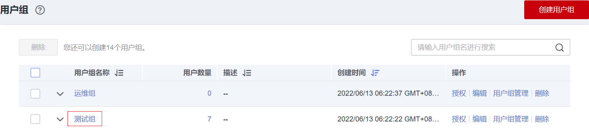

# 移除用户组权限

## 操作步骤

当您需要移除用户组中的某个权限，请参考以下操作：

1.  进入IAM控制台，在左侧导航栏选择“用户组”页签。
2.  单击用户组名称，进入用户组详情页面。

    **图 1**  单击用户组名称  
    

3.  在“授权记录”页签下，单击需要移除权限最右侧的“删除”。

    **图 2**  移除策略  
    

4.  在弹窗中，单击“是”，移除用户组权限。

## 批量移除用户组权限

当您需要移除用户组中多个权限，请参考以下操作：

1.  进入IAM控制台，在左侧导航栏选择“用户组”页签。
2.  单击用户组名称，进入用户组详情页面。

    

3.  在“授权记录”页签下，勾选需要移除的权限，单击权限列表上方的“删除”。

    

4.  在弹窗中，单击“是”，移除用户组权限。

