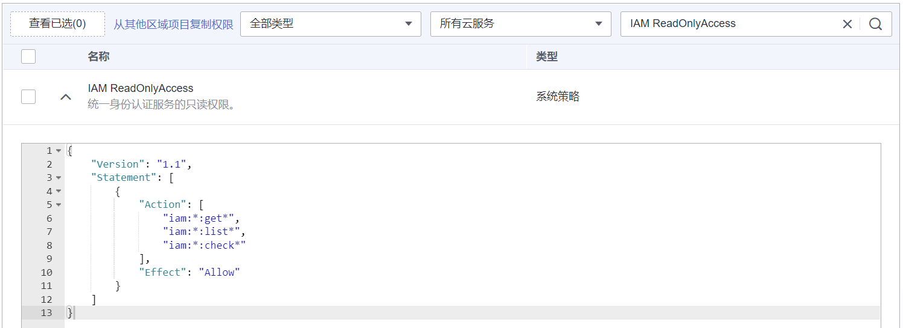

# 策略内容<a name="iam_01_0018"></a>

给用户组选择策略时，单击策略前面的，可以查看策略的详细内容，以系统策略“IAM ReadOnlyAccess”为例。

**图 1**  IAM ReadOnlyAccess策略内容<a name="fig3437184793719"></a>  


```
{
    "Version": "1.1",
    "Statement": [
        {
            "Action": [
                "iam:*:get*",
                "iam:*:list*",
                "iam:*:check*"
            ],
            "Effect": "Allow"
        }
    ]
}
```

