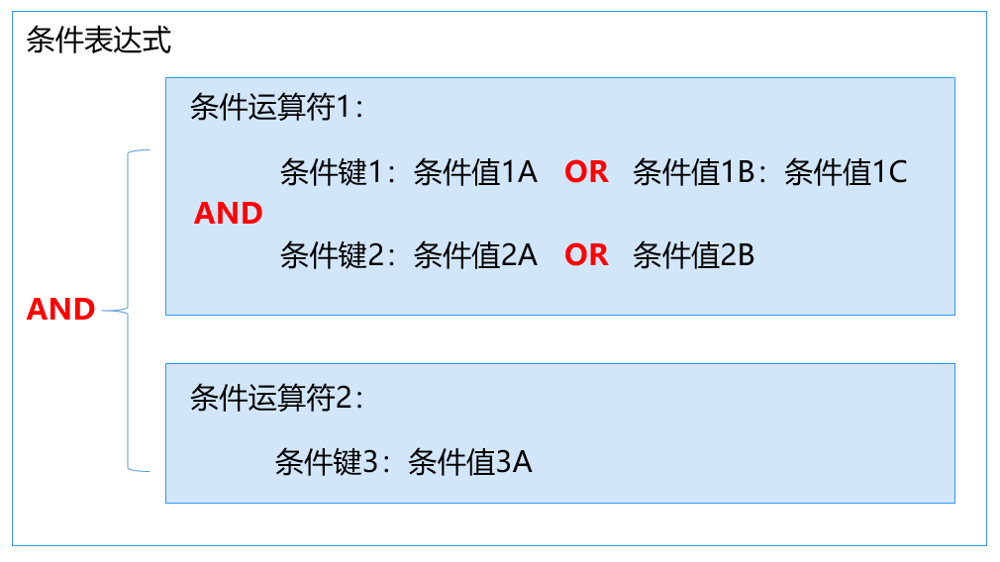

# 策略语法<a name="iam_01_0019"></a>

下面以OBS的自定义策略为例，说明策略的语法。

```
{
    "Version": "1.1",
    "Statement": [
        {
            "Effect": "Allow",
            "Action": [
                "obs:bucket:ListAllMyBuckets",
                "obs:bucket:HeadBucket",
                "obs:bucket:ListBucket",
                "obs:bucket:GetBucketLocation"
            ],
            "Condition": {
                "StringEndWithIfExists": {
                    "g:UserName": [
                        "specialCharactor"
                    ]
                },
                "Bool": {
                    "g:MFAPresent": [
                        "true"
                    ]
                }
            },
            "Resource": [
                "obs:*:*:bucket:*"
            ]
        }
    ]
}
```

## 策略结构<a name="section725321915453"></a>

策略结构包括Version（策略版本号）和Statement（策略权限语句）两部分，其中Statement可以有多个，表示不同的授权项。

**图 1**  策略结构<a name="fig5199186144"></a>  


## 策略参数<a name="section168441547184511"></a>

策略参数包含Version和Statement两部分，下面介绍策略参数详细说明。了解策略参数后，您可以根据场景自定义策略，如[自定义策略使用样例](自定义策略使用样例.md)。

**表 1**  策略参数说明

<a name="table1628145613425"></a>
<table><thead align="left"><tr id="row18281356154218"><th class="cellrowborder" colspan="2" valign="top" id="mcps1.2.5.1.1"><p id="p18808201154318"><a name="p18808201154318"></a><a name="p18808201154318"></a>参数</p>
</th>
<th class="cellrowborder" valign="top" id="mcps1.2.5.1.2"><p id="p9808817432"><a name="p9808817432"></a><a name="p9808817432"></a>含义</p>
</th>
<th class="cellrowborder" valign="top" id="mcps1.2.5.1.3"><p id="p88088112434"><a name="p88088112434"></a><a name="p88088112434"></a>值</p>
</th>
</tr>
</thead>
<tbody><tr id="row152811656154214"><td class="cellrowborder" colspan="2" valign="top" headers="mcps1.2.5.1.1 "><p id="p1169964815313"><a name="p1169964815313"></a><a name="p1169964815313"></a>Version</p>
</td>
<td class="cellrowborder" valign="top" headers="mcps1.2.5.1.2 "><p id="p2080814113433"><a name="p2080814113433"></a><a name="p2080814113433"></a>策略的版本。</p>
</td>
<td class="cellrowborder" valign="top" headers="mcps1.2.5.1.3 "><p id="p148081111433"><a name="p148081111433"></a><a name="p148081111433"></a>1.1：代表基于策略的访问控制。</p>
</td>
</tr>
<tr id="row1428175614422"><td class="cellrowborder" rowspan="4" valign="top" width="15%" headers="mcps1.2.5.1.1 "><p id="p78081014439"><a name="p78081014439"></a><a name="p78081014439"></a>Statement：</p>
<p id="p780871104313"><a name="p780871104313"></a><a name="p780871104313"></a>策略的授权语句</p>
</td>
<td class="cellrowborder" valign="top" width="15%" headers="mcps1.2.5.1.1 "><p id="p168089114434"><a name="p168089114434"></a><a name="p168089114434"></a>Effect：作用</p>
</td>
<td class="cellrowborder" valign="top" width="25%" headers="mcps1.2.5.1.2 "><p id="p18808913433"><a name="p18808913433"></a><a name="p18808913433"></a>定义Action中的操作权限是否允许执行。</p>
</td>
<td class="cellrowborder" valign="top" width="45%" headers="mcps1.2.5.1.3 "><a name="ul18085113439"></a><a name="ul18085113439"></a><ul id="ul18085113439"><li>Allow：允许执行。</li><li>Deny：不允许执行。</li></ul>
<div class="note" id="note58087154315"><a name="note58087154315"></a><a name="note58087154315"></a><span class="notetitle"> 说明： </span><div class="notebody"><p id="p78081213435"><a name="p78081213435"></a><a name="p78081213435"></a>当同一个Action的Effect既有Allow又有Deny时，遵循Deny优先的原则。</p>
</div></div>
</td>
</tr>
<tr id="row428105664210"><td class="cellrowborder" valign="top" headers="mcps1.2.5.1.1 "><p id="p1580815116435"><a name="p1580815116435"></a><a name="p1580815116435"></a>Action：授权项</p>
</td>
<td class="cellrowborder" valign="top" headers="mcps1.2.5.1.1 "><p id="p2080881204317"><a name="p2080881204317"></a><a name="p2080881204317"></a>操作权限。</p>
</td>
<td class="cellrowborder" valign="top" headers="mcps1.2.5.1.2 "><p id="p780811194313"><a name="p780811194313"></a><a name="p780811194313"></a>格式为“服务名:资源类型:操作”。授权项支持通配符号*，通配符号*表示所有。</p>
<p id="p128081134313"><a name="p128081134313"></a><a name="p128081134313"></a>示例：</p>
<p id="p148081115434"><a name="p148081115434"></a><a name="p148081115434"></a>"obs:bucket:ListAllMybuckets"：表示查看OBS桶列表权限，其中obs为服务名，bucket为资源类型，ListAllMybuckets为操作。</p>
<p id="p3500223114318"><a name="p3500223114318"></a><a name="p3500223114318"></a>您可以在对应服务“API参考”资料中查看该服务所有授权项，如<a href="https://support.huaweicloud.com/api-obs/obs_04_0110.html" target="_blank" rel="noopener noreferrer">OBS授权项</a>。</p>
</td>
</tr>
<tr id="row728145644218"><td class="cellrowborder" valign="top" headers="mcps1.2.5.1.1 "><p id="p480871194314"><a name="p480871194314"></a><a name="p480871194314"></a>Condition：条件</p>
</td>
<td class="cellrowborder" valign="top" headers="mcps1.2.5.1.1 "><p id="p1993574620531"><a name="p1993574620531"></a><a name="p1993574620531"></a>使策略生效的特定条件，包括<a href="#li165215516347">条件键</a>和<a href="#li152161669418">运算符</a>。</p>
</td>
<td class="cellrowborder" valign="top" headers="mcps1.2.5.1.2 "><p id="p13121113515415"><a name="p13121113515415"></a><a name="p13121113515415"></a>格式为“条件运算符:{条件键：[条件值1,条件值2]}”。</p>
<p id="p9808813435"><a name="p9808813435"></a><a name="p9808813435"></a>如果您设置多个条件，同时满足所有条件时，该策略才生效。</p>
<p id="p380811111437"><a name="p380811111437"></a><a name="p380811111437"></a>示例:</p>
<p id="p1380812114431"><a name="p1380812114431"></a><a name="p1380812114431"></a>"StringEndWithIfExists":{"g:UserName":["specialCharactor"]}：表示当用户输入的用户名以"specialCharactor"结尾时该条statement生效。</p>
</td>
</tr>
<tr id="row19281656114220"><td class="cellrowborder" valign="top" headers="mcps1.2.5.1.1 "><p id="p980811114317"><a name="p980811114317"></a><a name="p980811114317"></a>Resource: 资源类型</p>
</td>
<td class="cellrowborder" valign="top" headers="mcps1.2.5.1.1 "><p id="p780811115435"><a name="p780811115435"></a><a name="p780811115435"></a>策略所作用的资源。</p>
</td>
<td class="cellrowborder" valign="top" headers="mcps1.2.5.1.2 "><p id="p108081118435"><a name="p108081118435"></a><a name="p108081118435"></a>格式为“服务名:region:domainId:资源类型:资源路径”, 资源类型支持通配符号*，通配符号*表示所有。支持资源粒度授权的云服务和资源类型参见：<a href="https://support.huaweicloud.com/usermanual-iam/iam_01_0610.html" target="_blank" rel="noopener noreferrer">支持IAM资源粒度授权的云服务</a>。</p>
<p id="p58084114433"><a name="p58084114433"></a><a name="p58084114433"></a>示例：</p>
<a name="ul1980814164316"></a><a name="ul1980814164316"></a><ul id="ul1980814164316"><li>"obs:*:*:bucket:*": 表示所有的OBS桶。</li><li>"obs:*:*:object:my-bucket/my-object/*": 表示my-bucket桶my-object目录下的所有对象。</li></ul>
</td>
</tr>
</tbody>
</table>

-   <a name="li165215516347"></a>**条件键**

    条件键表示策略语句的 Condition 元素中的键值。根据适用范围，分为全局条件键和服务条件键。

    -   全局级条件键（前缀为g:）适用于所有操作，IAM提供两种全局条件键：**通用全局条件键**和**其他全局条件键**。
        -   通用全局条件键：在鉴权过程中，云服务不需要提供用户身份信息，IAM将自动获取并鉴权。详情请参见：[通用全局条件键](#table155228511342)。
        -   其他全局条件键：在鉴权过程中，IAM通过云服务获取条件信息并鉴权。

    -   服务级条件键（前缀为服务缩写，如obs:）仅适用于对应服务的操作，详情请参见对应云服务的用户指南，如[OBS请求条件](https://support.huaweicloud.com/usermanual-obs/obs_03_0155.html)。

    **表 2**  通用全局条件键

    <a name="table155228511342"></a>
    <table><thead align="left"><tr id="row652214523418"><th class="cellrowborder" valign="top" width="24.39%" id="mcps1.2.4.1.1"><p id="p85220573420"><a name="p85220573420"></a><a name="p85220573420"></a>全局条件键</p>
    </th>
    <th class="cellrowborder" valign="top" width="12.58%" id="mcps1.2.4.1.2"><p id="p15221351349"><a name="p15221351349"></a><a name="p15221351349"></a>类型</p>
    </th>
    <th class="cellrowborder" valign="top" width="63.029999999999994%" id="mcps1.2.4.1.3"><p id="p75225516348"><a name="p75225516348"></a><a name="p75225516348"></a>说明</p>
    </th>
    </tr>
    </thead>
    <tbody><tr id="row1652255103419"><td class="cellrowborder" valign="top" width="24.39%" headers="mcps1.2.4.1.1 "><p id="p4523259340"><a name="p4523259340"></a><a name="p4523259340"></a>g:CurrentTime</p>
    </td>
    <td class="cellrowborder" valign="top" width="12.58%" headers="mcps1.2.4.1.2 "><p id="p152314533414"><a name="p152314533414"></a><a name="p152314533414"></a>时间</p>
    </td>
    <td class="cellrowborder" valign="top" width="63.029999999999994%" headers="mcps1.2.4.1.3 "><p id="p852313533415"><a name="p852313533415"></a><a name="p852313533415"></a>接收到鉴权请求的时间。以 ISO 8601 格式表示，例如：2012-11-11T23:59:59Z</p>
    </td>
    </tr>
    <tr id="row45238523414"><td class="cellrowborder" valign="top" width="24.39%" headers="mcps1.2.4.1.1 "><p id="p18523105143417"><a name="p18523105143417"></a><a name="p18523105143417"></a>g:DomainName</p>
    </td>
    <td class="cellrowborder" valign="top" width="12.58%" headers="mcps1.2.4.1.2 "><p id="p18523165133418"><a name="p18523165133418"></a><a name="p18523165133418"></a>字符串</p>
    </td>
    <td class="cellrowborder" valign="top" width="63.029999999999994%" headers="mcps1.2.4.1.3 "><p id="p152312563415"><a name="p152312563415"></a><a name="p152312563415"></a>请求者的帐号名称</p>
    </td>
    </tr>
    <tr id="row35231655342"><td class="cellrowborder" valign="top" width="24.39%" headers="mcps1.2.4.1.1 "><p id="p20523356345"><a name="p20523356345"></a><a name="p20523356345"></a>g:MFAPresent</p>
    </td>
    <td class="cellrowborder" valign="top" width="12.58%" headers="mcps1.2.4.1.2 "><p id="p1552312533415"><a name="p1552312533415"></a><a name="p1552312533415"></a>布尔值</p>
    </td>
    <td class="cellrowborder" valign="top" width="63.029999999999994%" headers="mcps1.2.4.1.3 "><p id="p1652314518349"><a name="p1652314518349"></a><a name="p1652314518349"></a>是否使用MFA多因素认证方式获取Token</p>
    </td>
    </tr>
    <tr id="row45236515342"><td class="cellrowborder" valign="top" width="24.39%" headers="mcps1.2.4.1.1 "><p id="p4523159347"><a name="p4523159347"></a><a name="p4523159347"></a>g:MFAAge</p>
    </td>
    <td class="cellrowborder" valign="top" width="12.58%" headers="mcps1.2.4.1.2 "><p id="p15523125143412"><a name="p15523125143412"></a><a name="p15523125143412"></a>数值</p>
    </td>
    <td class="cellrowborder" valign="top" width="63.029999999999994%" headers="mcps1.2.4.1.3 "><p id="p17523457340"><a name="p17523457340"></a><a name="p17523457340"></a>通过MFA多因素认证方式获取的Token的生效时长。该条件需要和g:MFAPresent一起使用</p>
    </td>
    </tr>
    <tr id="row105233583419"><td class="cellrowborder" valign="top" width="24.39%" headers="mcps1.2.4.1.1 "><p id="p135238513415"><a name="p135238513415"></a><a name="p135238513415"></a>g:ProjectName</p>
    </td>
    <td class="cellrowborder" valign="top" width="12.58%" headers="mcps1.2.4.1.2 "><p id="p35231855345"><a name="p35231855345"></a><a name="p35231855345"></a>字符串</p>
    </td>
    <td class="cellrowborder" valign="top" width="63.029999999999994%" headers="mcps1.2.4.1.3 "><p id="p752435143411"><a name="p752435143411"></a><a name="p752435143411"></a>项目名称</p>
    </td>
    </tr>
    <tr id="row195246593416"><td class="cellrowborder" valign="top" width="24.39%" headers="mcps1.2.4.1.1 "><p id="p145246553412"><a name="p145246553412"></a><a name="p145246553412"></a>g:ServiceName</p>
    </td>
    <td class="cellrowborder" valign="top" width="12.58%" headers="mcps1.2.4.1.2 "><p id="p452419519343"><a name="p452419519343"></a><a name="p452419519343"></a>字符串</p>
    </td>
    <td class="cellrowborder" valign="top" width="63.029999999999994%" headers="mcps1.2.4.1.3 "><p id="p35245511347"><a name="p35245511347"></a><a name="p35245511347"></a>服务名称</p>
    </td>
    </tr>
    <tr id="row1452412503411"><td class="cellrowborder" valign="top" width="24.39%" headers="mcps1.2.4.1.1 "><p id="p1152475123417"><a name="p1152475123417"></a><a name="p1152475123417"></a>g:UserId</p>
    </td>
    <td class="cellrowborder" valign="top" width="12.58%" headers="mcps1.2.4.1.2 "><p id="p8524135163417"><a name="p8524135163417"></a><a name="p8524135163417"></a>字符串</p>
    </td>
    <td class="cellrowborder" valign="top" width="63.029999999999994%" headers="mcps1.2.4.1.3 "><p id="p652414510342"><a name="p652414510342"></a><a name="p652414510342"></a>IAM用户ID</p>
    </td>
    </tr>
    <tr id="row1052455133419"><td class="cellrowborder" valign="top" width="24.39%" headers="mcps1.2.4.1.1 "><p id="p55243513347"><a name="p55243513347"></a><a name="p55243513347"></a>g:UserName</p>
    </td>
    <td class="cellrowborder" valign="top" width="12.58%" headers="mcps1.2.4.1.2 "><p id="p2524195153419"><a name="p2524195153419"></a><a name="p2524195153419"></a>字符串</p>
    </td>
    <td class="cellrowborder" valign="top" width="63.029999999999994%" headers="mcps1.2.4.1.3 "><p id="p18524055346"><a name="p18524055346"></a><a name="p18524055346"></a>IAM用户名</p>
    </td>
    </tr>
    </tbody>
    </table>

    -   多值条件键
        1.  ForAllValues：测试请求集的每个成员的值是否为条件键集的子集。如果请求中的每个键值均与策略中的至少一个值匹配，则条件返回true。
        2.  ForAnyValue：测试请求值集的至少一个成员是否与条件键值集的至少一个成员匹配。如果请求中的任何一个键值与策略中的任何一个条件值匹配，则条件返回true。对于没有匹配的键或空数据集，条件返回false。

    **条件键运算逻辑**

    **图 2**  条件键运算逻辑示意图<a name="fig12567174216221"></a>  
    

    1.  对于同一条件键的多个条件值，采用OR运算逻辑，即请求值按照条件运算符匹配到任意一个条件值则返回true。

        > **须知：** 
        >当运算符表示否定含义的时候（例如：StringNotEquals），则请求值按照条件运算符不能匹配到所有的条件值。

    2.  同一运算符下的不同条件键之间，采用AND运算逻辑。不同运算符之间，采用AND运算逻辑。


-   <a name="li152161669418"></a>**运算符**

    运算符与条件键、条件值一起构成完整的条件判断语句，当请求信息满足该条件时，策略才能生效。运算符可以增加后缀“IfExists”，表示对应请求值为空或满足条件的请求值均使策略生效，如“StringEqualsIfExists”表示请求值为空或请求值等于条件值均使策略生效。运算符为字符串型运算符，表格中如未增加说明，不区分大小写。

    -   String类型

        **表 3**  String类型运算符

        <a name="table183741923617"></a>
        <table><thead align="left"><tr id="row16375162169"><th class="cellrowborder" valign="top" width="16.72167216721672%" id="mcps1.2.4.1.1"><p id="p18375021167"><a name="p18375021167"></a><a name="p18375021167"></a>类型</p>
        </th>
        <th class="cellrowborder" valign="top" width="33.31333133313331%" id="mcps1.2.4.1.2"><p id="p5375921469"><a name="p5375921469"></a><a name="p5375921469"></a>运算符</p>
        </th>
        <th class="cellrowborder" valign="top" width="49.96499649964996%" id="mcps1.2.4.1.3"><p id="p0375121365"><a name="p0375121365"></a><a name="p0375121365"></a>说明</p>
        </th>
        </tr>
        </thead>
        <tbody><tr id="row13375122615"><td class="cellrowborder" rowspan="6" valign="top" width="16.72167216721672%" headers="mcps1.2.4.1.1 "><p id="p515917452610"><a name="p515917452610"></a><a name="p515917452610"></a>String</p>
        </td>
        <td class="cellrowborder" valign="top" width="33.31333133313331%" headers="mcps1.2.4.1.2 "><p id="p1531915301667"><a name="p1531915301667"></a><a name="p1531915301667"></a>StringEquals</p>
        </td>
        <td class="cellrowborder" valign="top" width="49.96499649964996%" headers="mcps1.2.4.1.3 "><p id="p1931943010614"><a name="p1931943010614"></a><a name="p1931943010614"></a>请求值与任意一个条件值相同（区分大小写）。</p>
        </td>
        </tr>
        <tr id="row9375182667"><td class="cellrowborder" valign="top" headers="mcps1.2.4.1.1 "><p id="p032015301617"><a name="p032015301617"></a><a name="p032015301617"></a>StringNotEquals</p>
        </td>
        <td class="cellrowborder" valign="top" headers="mcps1.2.4.1.2 "><p id="p16320930963"><a name="p16320930963"></a><a name="p16320930963"></a>请求值与所有条件值都不同（区分大小写）。</p>
        </td>
        </tr>
        <tr id="row3375821612"><td class="cellrowborder" valign="top" headers="mcps1.2.4.1.1 "><p id="p13205306611"><a name="p13205306611"></a><a name="p13205306611"></a>StringEqualsIgnoreCase</p>
        </td>
        <td class="cellrowborder" valign="top" headers="mcps1.2.4.1.2 "><p id="p103201730862"><a name="p103201730862"></a><a name="p103201730862"></a>请求值与任意一个条件值相同。</p>
        </td>
        </tr>
        <tr id="row1637615216612"><td class="cellrowborder" valign="top" headers="mcps1.2.4.1.1 "><p id="p832018304618"><a name="p832018304618"></a><a name="p832018304618"></a>StringNotEqualsIgnoreCase</p>
        </td>
        <td class="cellrowborder" valign="top" headers="mcps1.2.4.1.2 "><p id="p73201301067"><a name="p73201301067"></a><a name="p73201301067"></a>请求值与所有条件值都不同。</p>
        </td>
        </tr>
        <tr id="row1737612210619"><td class="cellrowborder" valign="top" headers="mcps1.2.4.1.1 "><p id="p732003013615"><a name="p732003013615"></a><a name="p732003013615"></a>StringMatch</p>
        </td>
        <td class="cellrowborder" valign="top" headers="mcps1.2.4.1.2 "><p id="p10320123016610"><a name="p10320123016610"></a><a name="p10320123016610"></a>请求值符合任意一个条件值的正则表达式（区分大小写，正则表达式仅支持*和?）。</p>
        </td>
        </tr>
        <tr id="row637613216611"><td class="cellrowborder" valign="top" headers="mcps1.2.4.1.1 "><p id="p23202304618"><a name="p23202304618"></a><a name="p23202304618"></a>StringNotMatch</p>
        </td>
        <td class="cellrowborder" valign="top" headers="mcps1.2.4.1.2 "><p id="p532016305612"><a name="p532016305612"></a><a name="p532016305612"></a>请求值不符合所有条件值的正则表达式（区分大小写，正则表达式仅支持*和?）。</p>
        </td>
        </tr>
        </tbody>
        </table>

        示例：指定用户名为ZhangSan的请求者才能够获取对象内容、获取对象元数据。

        ```
        {
            "Version": "1.1",
            "Statement": [
                {
                    "Effect": "Allow",
                    "Action": [
                        "obs:object:GetObject"
                    ],
                    "Condition": {
                        "StringEquals": {
                            "g:DomainName": [
                                "ZhangSan"
                            ]
                        }
                    }
                }
            ]
        }
        ```

    -   Number类型

        **表 4**  Number类型运算符

        <a name="table1691655843120"></a>
        <table><thead align="left"><tr id="row16917165833118"><th class="cellrowborder" valign="top" width="21.122112211221122%" id="mcps1.2.4.1.1"><p id="p891725833116"><a name="p891725833116"></a><a name="p891725833116"></a>类型</p>
        </th>
        <th class="cellrowborder" valign="top" width="35.823582358235825%" id="mcps1.2.4.1.2"><p id="p179171558113112"><a name="p179171558113112"></a><a name="p179171558113112"></a>运算符</p>
        </th>
        <th class="cellrowborder" valign="top" width="43.05430543054305%" id="mcps1.2.4.1.3"><p id="p17917135853111"><a name="p17917135853111"></a><a name="p17917135853111"></a>说明</p>
        </th>
        </tr>
        </thead>
        <tbody><tr id="row6917135883115"><td class="cellrowborder" rowspan="6" valign="top" width="21.122112211221122%" headers="mcps1.2.4.1.1 "><p id="p24301747143210"><a name="p24301747143210"></a><a name="p24301747143210"></a>Number</p>
        </td>
        <td class="cellrowborder" valign="top" width="35.823582358235825%" headers="mcps1.2.4.1.2 "><p id="p131082355322"><a name="p131082355322"></a><a name="p131082355322"></a>NumberEquals</p>
        </td>
        <td class="cellrowborder" valign="top" width="43.05430543054305%" headers="mcps1.2.4.1.3 "><p id="p1910820352322"><a name="p1910820352322"></a><a name="p1910820352322"></a>请求值等于任意一个条件值。</p>
        </td>
        </tr>
        <tr id="row1891755823110"><td class="cellrowborder" valign="top" headers="mcps1.2.4.1.1 "><p id="p910833514321"><a name="p910833514321"></a><a name="p910833514321"></a>NumberNotEquals</p>
        </td>
        <td class="cellrowborder" valign="top" headers="mcps1.2.4.1.2 "><p id="p1108435183213"><a name="p1108435183213"></a><a name="p1108435183213"></a>请求值不等于所有条件值。</p>
        </td>
        </tr>
        <tr id="row10917185883114"><td class="cellrowborder" valign="top" headers="mcps1.2.4.1.1 "><p id="p1810810350322"><a name="p1810810350322"></a><a name="p1810810350322"></a>NumberLessThan</p>
        </td>
        <td class="cellrowborder" valign="top" headers="mcps1.2.4.1.2 "><p id="p7108153516324"><a name="p7108153516324"></a><a name="p7108153516324"></a>请求值小于任意一个条件值。</p>
        </td>
        </tr>
        <tr id="row49179584316"><td class="cellrowborder" valign="top" headers="mcps1.2.4.1.1 "><p id="p9108935143216"><a name="p9108935143216"></a><a name="p9108935143216"></a>NumberLessThanEquals</p>
        </td>
        <td class="cellrowborder" valign="top" headers="mcps1.2.4.1.2 "><p id="p1310923523219"><a name="p1310923523219"></a><a name="p1310923523219"></a>请求值小于或任意一个等于条件值。</p>
        </td>
        </tr>
        <tr id="row209171258153117"><td class="cellrowborder" valign="top" headers="mcps1.2.4.1.1 "><p id="p110963514326"><a name="p110963514326"></a><a name="p110963514326"></a>NumberGreaterThan</p>
        </td>
        <td class="cellrowborder" valign="top" headers="mcps1.2.4.1.2 "><p id="p11109103517328"><a name="p11109103517328"></a><a name="p11109103517328"></a>请求值大于任意一个条件值。</p>
        </td>
        </tr>
        <tr id="row5917195812313"><td class="cellrowborder" valign="top" headers="mcps1.2.4.1.1 "><p id="p3109335183210"><a name="p3109335183210"></a><a name="p3109335183210"></a>NumberGreaterThanEquals</p>
        </td>
        <td class="cellrowborder" valign="top" headers="mcps1.2.4.1.2 "><p id="p91091835103216"><a name="p91091835103216"></a><a name="p91091835103216"></a>请求值大于或等于任意一个条件值。</p>
        </td>
        </tr>
        </tbody>
        </table>

        示例：请求者一次最多可以在example\_bucket桶中列出10个对象。

        ```
        {
            "Version": "1.1",
            "Statement": [
                {
                    "Effect": "Allow",
                    "Action": [
                        "obs:bucket:ListBucket"
                    ],
                    "Resource": [
                        "OBS:*:*:bucket:example_bucket"
                    ],
                    "Condition": {
                        "NumberLessThanEquals": {
                            "obs:max-keys": [
                                "10"
                            ]
                        }
                    }
                }
            ]
        }
        ```

    -   Date类型

        **表 5**  Date类型运算符

        <a name="table1748514561568"></a>
        <table><thead align="left"><tr id="row194865564568"><th class="cellrowborder" valign="top" width="23.25232523252325%" id="mcps1.2.4.1.1"><p id="p18486356145611"><a name="p18486356145611"></a><a name="p18486356145611"></a>类型</p>
        </th>
        <th class="cellrowborder" valign="top" width="34.703470347034695%" id="mcps1.2.4.1.2"><p id="p6486115625611"><a name="p6486115625611"></a><a name="p6486115625611"></a>运算符</p>
        </th>
        <th class="cellrowborder" valign="top" width="42.04420442044204%" id="mcps1.2.4.1.3"><p id="p148695695618"><a name="p148695695618"></a><a name="p148695695618"></a>说明</p>
        </th>
        </tr>
        </thead>
        <tbody><tr id="row13486155665619"><td class="cellrowborder" rowspan="4" valign="top" width="23.25232523252325%" headers="mcps1.2.4.1.1 "><p id="p555217567578"><a name="p555217567578"></a><a name="p555217567578"></a>Date</p>
        </td>
        <td class="cellrowborder" valign="top" width="34.703470347034695%" headers="mcps1.2.4.1.2 "><p id="p57861050105716"><a name="p57861050105716"></a><a name="p57861050105716"></a>DateLessThan</p>
        </td>
        <td class="cellrowborder" valign="top" width="42.04420442044204%" headers="mcps1.2.4.1.3 "><p id="p1378685019574"><a name="p1378685019574"></a><a name="p1378685019574"></a>请求值早于任意一个条件值。</p>
        </td>
        </tr>
        <tr id="row17486195695620"><td class="cellrowborder" valign="top" headers="mcps1.2.4.1.1 "><p id="p15786850195713"><a name="p15786850195713"></a><a name="p15786850195713"></a>DateLessThanEquals</p>
        </td>
        <td class="cellrowborder" valign="top" headers="mcps1.2.4.1.2 "><p id="p4786150135713"><a name="p4786150135713"></a><a name="p4786150135713"></a>请求值早于或等于任意一个条件值。</p>
        </td>
        </tr>
        <tr id="row1248685619564"><td class="cellrowborder" valign="top" headers="mcps1.2.4.1.1 "><p id="p0786350155716"><a name="p0786350155716"></a><a name="p0786350155716"></a>DateGreaterThan</p>
        </td>
        <td class="cellrowborder" valign="top" headers="mcps1.2.4.1.2 "><p id="p1378619506578"><a name="p1378619506578"></a><a name="p1378619506578"></a>请求值晚于任意一个条件值。</p>
        </td>
        </tr>
        <tr id="row17486155618562"><td class="cellrowborder" valign="top" headers="mcps1.2.4.1.1 "><p id="p5786165055711"><a name="p5786165055711"></a><a name="p5786165055711"></a>DateGreaterThanEquals</p>
        </td>
        <td class="cellrowborder" valign="top" headers="mcps1.2.4.1.2 "><p id="p207861850175710"><a name="p207861850175710"></a><a name="p207861850175710"></a>请求值晚于或等于任意一个条件值。</p>
        </td>
        </tr>
        </tbody>
        </table>

        示例：请求者只能在2022年8月1日前创建桶资源。

        ```
        {
            "Version": "1.1",
            "Statement": [
                {
                    "Effect": "Allow",
                    "Action": [
                        "obs:bucket:CreateBucket"
                    ],
                    "Condition": {
                        "DateLessThan": {
                            "g:CurrentTime": [
                                "2022-08-01T00:00:00Z"
                            ]
                        }
                    }
                }
            ]
        }
        ```

    -   Bool类型

        **表 6**  Bool类型运算符

        <a name="table66171242404"></a>
        <table><thead align="left"><tr id="row8617942100"><th class="cellrowborder" valign="top" width="33.33333333333333%" id="mcps1.2.4.1.1"><p id="p1617342705"><a name="p1617342705"></a><a name="p1617342705"></a>类型</p>
        </th>
        <th class="cellrowborder" valign="top" width="33.33333333333333%" id="mcps1.2.4.1.2"><p id="p1061712421409"><a name="p1061712421409"></a><a name="p1061712421409"></a>运算符</p>
        </th>
        <th class="cellrowborder" valign="top" width="33.33333333333333%" id="mcps1.2.4.1.3"><p id="p1461719423011"><a name="p1461719423011"></a><a name="p1461719423011"></a>说明</p>
        </th>
        </tr>
        </thead>
        <tbody><tr id="row1261712422004"><td class="cellrowborder" valign="top" width="33.33333333333333%" headers="mcps1.2.4.1.1 "><p id="p146174421207"><a name="p146174421207"></a><a name="p146174421207"></a>Bool</p>
        </td>
        <td class="cellrowborder" valign="top" width="33.33333333333333%" headers="mcps1.2.4.1.2 "><p id="p16617144218015"><a name="p16617144218015"></a><a name="p16617144218015"></a>Bool</p>
        </td>
        <td class="cellrowborder" valign="top" width="33.33333333333333%" headers="mcps1.2.4.1.3 "><p id="p5617104213015"><a name="p5617104213015"></a><a name="p5617104213015"></a>条件值可选值：true、false。请求值等于条件值。</p>
        </td>
        </tr>
        </tbody>
        </table>

        示例：请求者必须使用开启了MFA认证的凭证才能修改指定永久访问密钥。

        ```
        {
            "Version": "1.1",
            "Statement": [
                {
                    "Effect": "Allow",
                    "Action": [
                        "iam:credentials:updateCredential"
                    ],
                    "Condition": {
                        "Bool": {
                            "g:MFAPresent": [
                                "true"
                            ]
                        }
                    }
                }
            ]
        }
        ```

    -   Null类型

        **表 7**  Null类型运算符

        <a name="table1080624442016"></a>
        <table><thead align="left"><tr id="row68071447201"><th class="cellrowborder" valign="top" width="23.75237523752375%" id="mcps1.2.4.1.1"><p id="p178072044132013"><a name="p178072044132013"></a><a name="p178072044132013"></a>类型</p>
        </th>
        <th class="cellrowborder" valign="top" width="27.302730273027304%" id="mcps1.2.4.1.2"><p id="p1680764472010"><a name="p1680764472010"></a><a name="p1680764472010"></a>运算符</p>
        </th>
        <th class="cellrowborder" valign="top" width="48.94489448944894%" id="mcps1.2.4.1.3"><p id="p88071644142012"><a name="p88071644142012"></a><a name="p88071644142012"></a>说明</p>
        </th>
        </tr>
        </thead>
        <tbody><tr id="row080715441205"><td class="cellrowborder" valign="top" width="23.75237523752375%" headers="mcps1.2.4.1.1 "><p id="p7740191114219"><a name="p7740191114219"></a><a name="p7740191114219"></a>Null</p>
        </td>
        <td class="cellrowborder" valign="top" width="27.302730273027304%" headers="mcps1.2.4.1.2 "><p id="p27406111213"><a name="p27406111213"></a><a name="p27406111213"></a>Null</p>
        </td>
        <td class="cellrowborder" valign="top" width="48.94489448944894%" headers="mcps1.2.4.1.3 "><p id="p074021115213"><a name="p074021115213"></a><a name="p074021115213"></a>条件值可选值：true、false。条件值为true，要求请求值不存在或者值为null；条件值为false，要求请求值必须存在且值不为null。</p>
        </td>
        </tr>
        </tbody>
        </table>

        示例：请求者的创建桶请求必须来源于VPC。

        ```
        {
            "Version": "1.1",
            "Statement": [
                {
                    "Effect": "Allow",
                    "Action": [
                        " obs:bucket:CreateBucket"
                    ],
                    "Condition": {
                        "Null": {
                            "obs:SourceVpc": [
                                "false"
                            ]
                        }
                    }
                }
            ]
        }
        ```

    -   “IfExists”运算符后缀

        除Null运算符以外，您可以在任何条件运算符名称的末尾添加IfExists，例如：StringEqualsIfExists。如果请求的内容中存在条件键，则依照策略所述来进行匹配。如果该键不存在，则该条件元素的匹配结果将为true。


